# 7. 최단경로 알고리즘

> 💡 동빈나 님의 [이코테 2021 강의 몰아보기](https://www.youtube.com/watch?v=m-9pAwq1o3w\&list=PLRx0vPvlEmdAghTr5mXQxGpHjWqSz0dgC\&index=1) 를 보면서 공부한 내용을 정리하고 있습니다. 더 자세한 내용은 [**이것이 취업을 위한 코딩 테스트다 with 파이썬**](http://www.yes24.com/Product/goods/93519145) **을 참고해주세요** 😊 학습 도구로는 [리플렛](https://replit.com/) 을 사용하고 있고 원본 소스코드는 동빈님의 [Github](https://github.com/ndb796/python-for-coding-test) 에서 확인할 수 있고 스스로 공부한 소스코드는 [Github](https://github.com/Miniminis/algorithm-study-note-python) 에서 확인할 수 있습니다.

### 최단경로문제

* 가장 짧은 경로를 찾는 알고리즘을 의미한다.
* 다양한 문제상황
  * 한 지점 -> 다른 한 지점까지의 최단 경로
  * 한 지점 -> 다른 모든 지점까지의 최단 경로
  * 모든 지점에서 다른 모든 지점까지의 최단 경로
* 각 지점은 그래프에서 노드로 표현하고
* 지점 간 연결된 도로는 그래프에서 간선으로 표현한다.

### 다익스트라 최단경로 알고리즘

* 특정한 노드에서 출발하여 다른 모든 노드로 가는 최단 경로를 계산한다.
* 다익스트라 최단 경로 알고리즘은 음의 간선이 없을 때 정상적으로 동작함
  * 현실 세계의 도로(간선)은 음의 간선으로 표현되지 않는다.
  * 현실 세계의 길찾기 문제에서 사용될 수 있다!
* 다익스트라 최단경로 알고리즘은 그리디 알고리즘으로 분류된다.
  * 매 상황에서 가장 비용이 적은 노드를 선택해 임의의 과정을 반복한다.
  * 기본적으로 길찾기 문제는 다익스트라 알고리즘을 이용하는 셈이다.

#### 동작과정

1. 출발 노드를 설정한다.
2. 최단 거리 테이블을 초기화한다.
   * 자기 자신은 0으로 초기화
3. 방문하지 않은 노드 중에서 최단 거리가 가장 짧은 노드를 선택한다.
   * 그리디 알고리즘의 유형으로 분류한다.
4. 해당 노드를 거쳐 다른 노드로 가는 비용을 계산하여 최단 거리 테이블을 갱신한다.
5. 위 과정에서 3번과 4번을 반복한다.

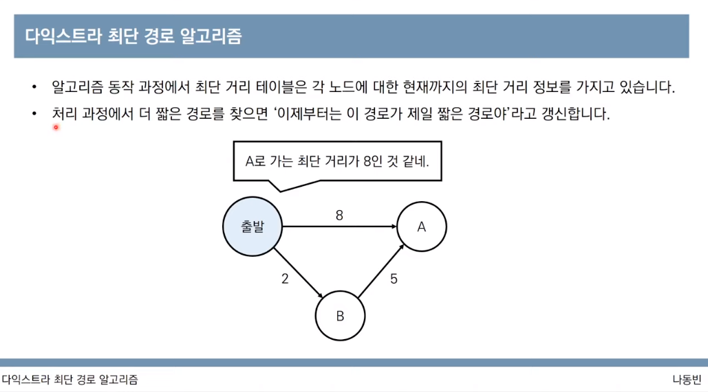 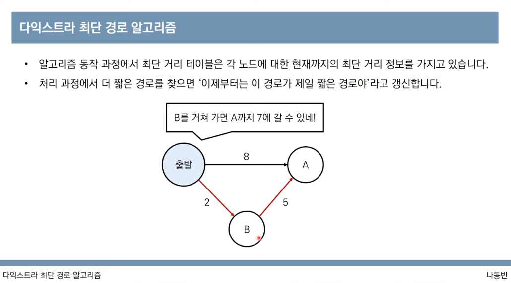

#### 동작과정 살펴보기

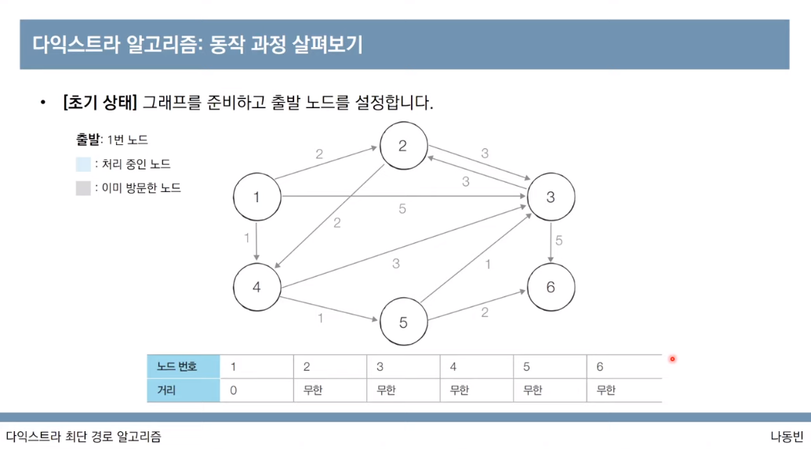

* 초기 상태
  * 그래프를 준비하고 출발노드를 설정한다.
  * 거리가 짧은 노드인 1을 선택
  * 나머지는 무한으로 초기화

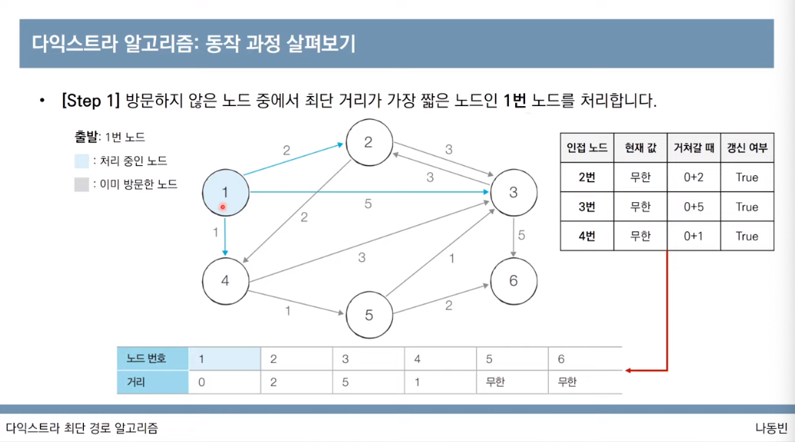

* 가장 거리가 짧은 1번 노드부터 방문하지 않은 노드까지의 최단거리값을 계산해본다.
* 현재값과 1번노드를 거쳐서 갈때의 최소값을 비교해서 갱신할지 말지 여부를 정한다.
  * 2 : 무한대 > 0+2 = 갱신!
  * 3 : 무한대 > 0+5 = 갱신!
  * 4 : 무한대 > 0+1 = 갱신!

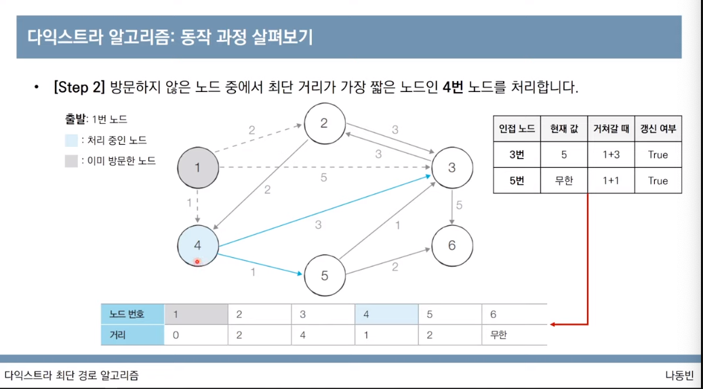

* 같은 방법으로 현재 노드 중에서 가장 최단 거리가 짧은 4를 선택한다.
* 4번을 거쳐서 가는 3번과 5번 노드의 최단거리값을 비교한다.
  * 3번 : 5 > 1+3 = 갱신!
  * 5번 : 무한 > 1+1 = 갱신!
* 3번과 5번 모두 1->4를 거쳐서 가는 값이 최단경로에 가까우므로 값을 갱신한다.

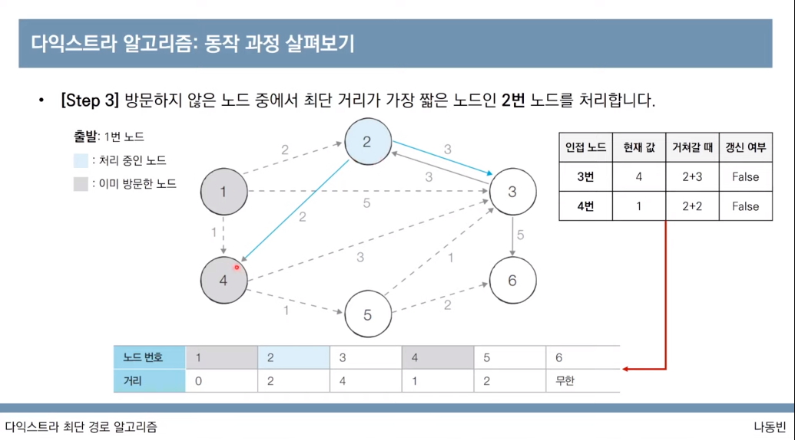

* 현재 노드들 중 가장 거리가 짧은 노드는 2와 5이다.
  * 어느 노드를 선택해도 상관 없지만, 일반적으로 수가 작은 노드를 선택한다.
  * 2번을 선택한다.
* 2번노드를 거쳐 갈 수 있는 노드는 3번과 4번이다.
  * 3번 : 4 < 2+3 -> 갱신안함!
  * 4번 : 1 < 2+2 -> 갱신안함!

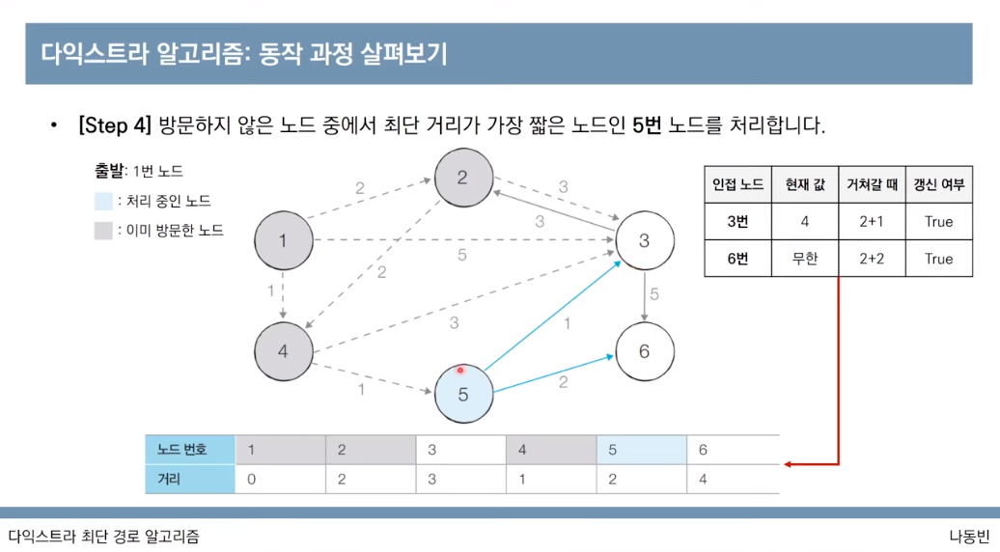

* 이제 가장 짧은 노드는 5이다.
* 5에서는 3번과 6번을 갈 수 있다.
  * 3번 : 4 > 1+1+1 = 갱신!
  * 6번 : 무한 > 1+1+2 = 갱신!
* 3번과 6번 모두 갱신된다.

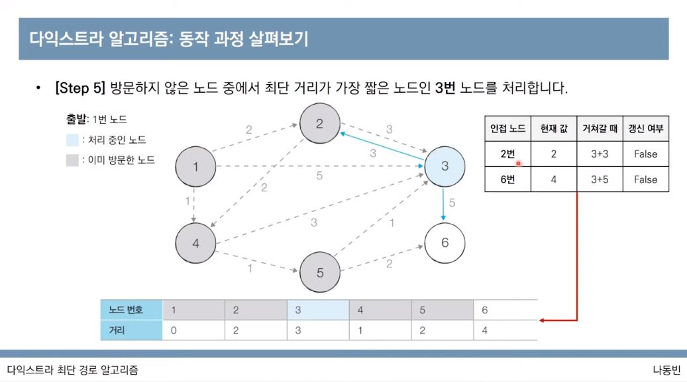

* 남아있는 3번을 선택한다.
* 3번에서는 2번과 6번을 갈 수 있는데 두 경우 모두 계산결과 이미 최단거리값을 가지고 있다. 따라서 갱신되지 않는다.

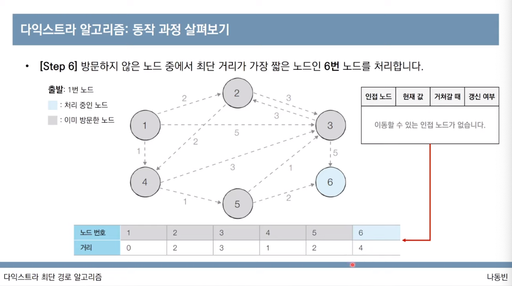

* 마지막 노드는 나아갈 수 있는 노드가 없기 때문에 처리하지 않아도 된다.

#### 특징

* 그리디 알고리즘 : 매 상황에서 장문하지 않은 가장 비용이 적은 노드를 선택해 임의의 과정을 반복
* 단계를 거치면서 한번 처리된 노드의 최단 거리는 고정되어 더이상 바뀌지 않는다.
  * 한 단계당 하나의 노드에 대한 최단 거리를 확실히 찾는 것으로 이해할 수 있다.
* 다익스트라 알고리즘을 수행한 뒤에 테이블에 각 노드까지의 최단거리 정보가 저장된다.
  * 완벽한 형태의 최단 경로를 구하려면 소스코드에 추가적인 기능을 더 넣어야 한다.

#### 간단한 구현방법

* 단계마다 방문하지 않은 노드 중에서 최단 거리가 가장 짧은 노드를 선택하기 위해서 매 단계마다 1차원 테이블의 모든 원소를 확인(순차탐색) 합니다.

```python
import sys
input = sys.stdin.readline
INF = int(1e9)

n, m = map(int, input().split())
start = int(input())
graph = [ [] for i in range(n+1) ]
visited = [False] * (n+1)
distance = [INF] * (n+1)


for _ in range(m):
  a, b, c = map(int, input().split())
  graph(a).append((b, c))

def get_smallest_node():
  min_value = INF
  index = 0

  for i in range(1, n+1):
    if distance[i] < min_value and not visited[i]:
      min_value = distance[i]
      index = i
  
  return index

def dijkstra(start):
  distance[start] = 0
  visited[start] = True

  for i in graph[start]:
    distance[i[0]] = i[1]
  
  for j in range(n-1):
    now = get_smallest_node()
    visited[now] = True

    for k in graph[now]:
      cost = distance[now] + j[1]
    if cost < distance[j[0]]:
      distance[j[0]] = cost

dijkstra(start);

for i in range(1, n+1):
  if distance[i] == INF:
    print('INFINITY')
  else:
    print(distance[i])
```

### 다익스트라 알고리즘의 성능분석

* 총 O(V)번에 걸쳐서 최단 거리가 가장 짧은 노드를 매번 선형 탐색해야한다. (여기서 V는 ㅌ)
* 전체 시간 복잡도는 O(V^2)이 된다.
* 일반적으로 코딩 테스트의 최단 경로 문제에서 전체 노드의 개수가 5,000개 이하라면 이 코드로 문제를 해결할 수 있다.
  * 5000 \* 5000 = 25,000,000
  * python 에서 1초당 연산횟수 평균 : 20,000,000
  * 하지만 노드의 개수가 10,000개를 넘어가는 문제라면 어떻게 해야할까?

### 우선순위 큐 자료구조

* 우선순위가 가장 높은 데이터를 가장 먼저 삭제하는 자료구조
* 예를 들어서 여러개의 물건 데이터를 자료구조에 넣었다가 가치가 높은 물건 데이터부터 꺼내서 확인해야하는 경우에 우선순위 큐를 이용할 수 있다.
  * python, C++, Java 를 포함한 대부분의 프로그래밍 언어에서 표준 라이브러리 형태로 지원한다.
  * 자료구조 : 추출되는 데이터
  * stack : 가장 나중에 삽입된 데이터
  * queue : 가장 먼저 삽입된 데이터
  * priority queue : 가장 우선순위가 높은 데이터
    * heap

#### 힙 Heap

* 우선순위 큐를 구현하기 위해서 사용하는 자료구조 중 하나이다.
* 최소 힙과 최대 힙이 있다.
* 다익스트라 최단경로 알고리즘을 포함해서 다양한 알고리즘에서 사용된다.
* 구현방식
  * 리스트
    * 삽입시간 : O(1)
    * 삭제시간 : O(N)
  * 힙 :
    * 삽입시간 : O(logN)
    * 삭제시간 : O(logN)

```python
# 최소 힙
import heapq

def heapsort(iterable):
  h = []
  result = []

  for i in iterable:
    heapq.heappush(h, i)

  for i in range(len(h)):
    result.append(heapq.heappop(h))

  return result

array = [1, 3, 5, 7, 9, 2, 4, 6, 8, 0]
result = heapsort(array)
print(result)
# [0, 1, 2, 3, 4, 5, 6, 7, 8, 9]
```

```python
# 최대 힙
import heapq

def max_heap(iterable):
  h = []
  result = []

  for i in iterable:
    heapq.heappush(h, -i)

  for i in range(len(h)):
    result.append(-heapq.heappop(h))

  return result

array = [1, 3, 5, 7, 9, 2, 4, 6, 8, 0]
result = max_heap(array)
print(result)
# [9, 8, 7, 6, 5, 4, 3, 2, 1, 0]
```

#### 다익스트라 알고리즘의 개선된 구현방법 (feat. heap)

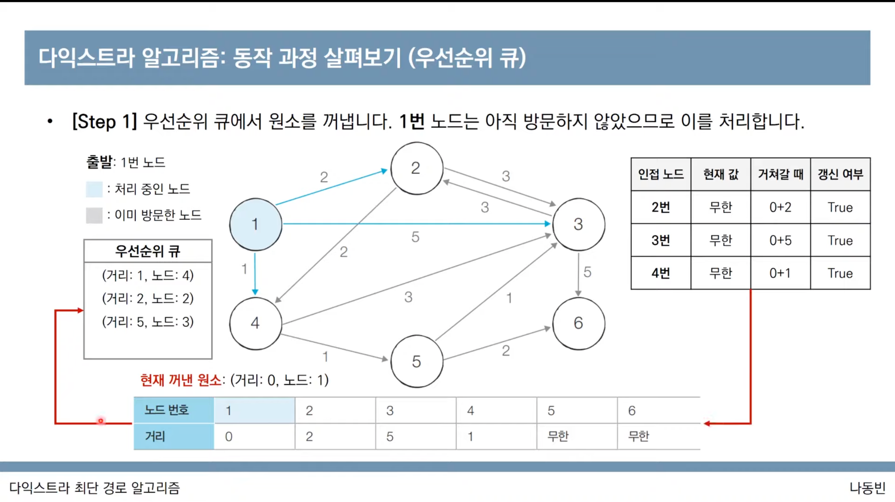

* 단계마다 방문하지 않은 노드 중에서 최단 거리가 가장 짧은 노드를 선택하기 위해서 힙(heap) 자료구조를 이용함
* 다익스트라 알고리즘이 동작하는 기본 원리는 동일
  * 현재 가장 가까운 노드를 저장해놓기 위해서 힙 자료구조를 추가적으로 이용한다.
  * 현재의 최단 거리가 가장 짧은 노드를 선택해야 하므로 최소 힙을 사용한다.
* [자세한 설명 참고하기](https://youtu.be/acqm9mM1P6o?list=PLRx0vPvlEmdAghTr5mXQxGpHjWqSz0dgC\&t=1658)
* java
  * priority queue library 이용하기
  * offer(), poll()

```python
import sys
import heapq

input = sys.stdin.readline
INF = int(1e9)

n, m = map(int, input().split())
start = int(input())
graph = [[] for i in range(n+1)]
distance = [INF] * (n+1)

for _ in range(m):
  a, b, c = map(int, input().split())
  graph[a].append((b, c))

def dijkstra(start):
  q = []

  heapq.heappush(q, (0, start))
  distance[start] = 0

  while q:
    dist, now = heapq.heappop(q)

    if distance[now] < dist:
      continue

    for i in graph[now]:
      cost = dist + i[1]
      if cost < distance[i[0]]:
        distance[i[0]] = cost
        heapq.heappush(q, (cost, i[0]))

dijkstra(start)

for i in range(1, n+1):
  if distance[i] == INF:
    print('INFINITY')
  else:
    print(distance[i])
```

### 개선된 구현방법의 성능분석

* 힙 자료구조를 이용하는 다 익스트라 알고리즘의 시간 복잡도는 O(ElogV)
* 노드를 하나씩 꺼내 검사하는 반복문은 노드 개수 V이상의 횟수로는 처리되지 않는다.
  * 결과적으로 현재 우선순위 큐에서 꺼낸 노드와 연결된 다른 노드들을 확인하는 총 횟수는 최대 간선의 개수(E)만큼 연산이 수행될 수 있다.
* 직관적으로 전체 과정은 E개의 원소를 우선순위 큐에 넣었다가 모두 빼내는 연산과 매우 유사함
  * 시간 복잡도를 O(ElogV) 로 판단할 수 있다.
  * 중복 간선을 포함하지 않는 경우에 이를 O(ElogV) 로 정리할 수 있다.
    * O(ElogE) -> O(ElogV^2) -> O(2ElogV) -> O(ElogV)

### 플로이드 워셜 알고리즘 개요

* 모든 노드에서 다른 모든 노드까지의 최단 경로를 모두 계산한다
* 플로이드 워셜 알고리즘은 다익스트라 알고리즘과 마찬가지로 단계별로 거쳐 가는 노드를 기준으로 알고리즘을 수행한다.
  * 다만 매 단계마다 방문하지 않은 노드 중에서 최단 거리를 갖는 노드를 찾는 과정이 필요하지 않다.
* 플로이드 워셜은 2차원 테이블에 최단 거리 정보를 저장함
* 플로이드 워셜 알고리즘은 다이나믹 프로그래밍 유형에 속한다.
* 각 단계마다 특정한 노드 K를 거쳐 가는 경우를 확인한다.
  * a->b로 가는 최단 거리보다 a->k->b 가 더 짧은지 검사한다.

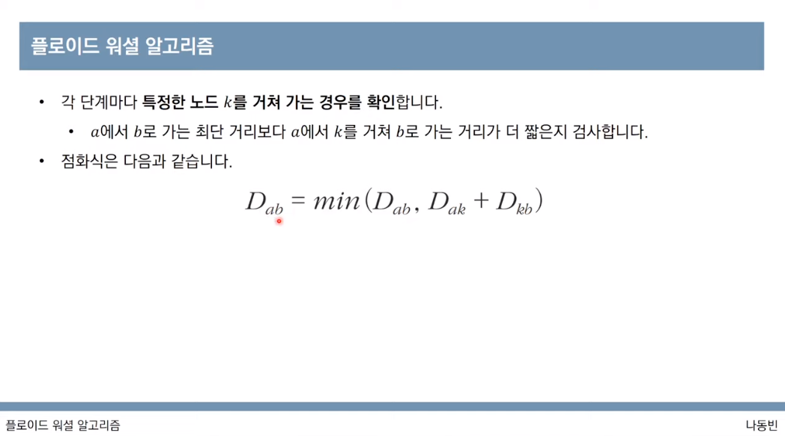

### 플로이드 워셜 알고리즘 동작과정 살펴보기

* [자세히 설명보기](https://youtu.be/acqm9mM1P6o?list=PLRx0vPvlEmdAghTr5mXQxGpHjWqSz0dgC\&t=2746)

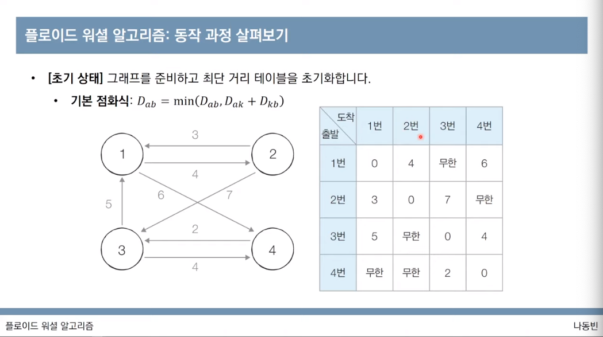

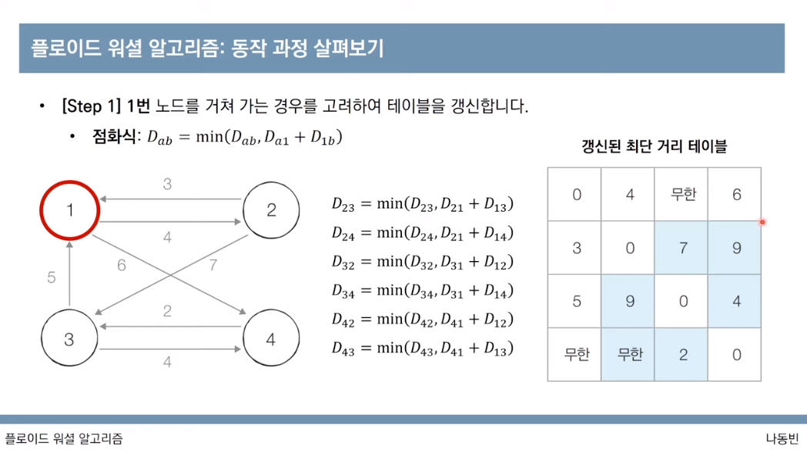

* 현재 1번 노드를 거쳐가는 경우를 고려하기에 1번행, 1번열과 자기 자신으로 향하는 케이스들은 모두 갱신대상에서 제외된다.

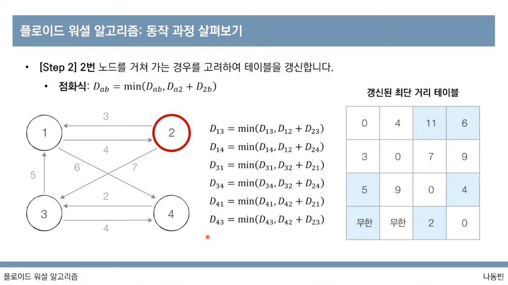

* 2번, 3번, 4번의 경우를 모두 같은 방식으로 고려한다.

```python
INF = int(1e9)

n, m = map(int, input().split())
graph = [[INF] * (n+1) for _ in range(n+1)]

# 자기 자신에게 가는 비용은 0으로 초기화
for a in range(1, n+1):
  for b in range(1, n+1):
    if a == b:
      graph[a][b] = 0

# 간선정보 입력받기
for _ in range(m):
  a, b, c = map(int, input().split())
  graph[a][b] = c


for k in range(1, n+1):
  for a in range(1, n+1):
    for b in range(1, n+1):
      graph[a][b] = min(graph[a][b], graph[a][k]+graph[k][b])


for a in range(1, n+1):
  for b in range(1, n+1):
    if graph[a][b] == INF:
      print('INFINITY', end=" ")
    else:
      print(graph[a][b], end=" ")
  print()
```

### 플로이드 워셜 알고리즘 성능 분석

* 노드 개수가 N개일 때 알고리즘상으로 N번의 단계를 수행
  * 각 단계마다 O(N^2) 의 연산을 통해 현재 노드를 거쳐 가는 모든 경로를 고려한다.
* 따라서 플로이드 워셜 알고리즘의 총 시간 복잡도는 O(N^3)
  * 노드의 개수가 적을때에 주로 사용하고 (500개 이하)
  * 노드 개수가 많을 때는 다익스트라 알고리즘을 사용한다.

### 전보 문제

문제

* 어떤 나라에 N개의 도시가 있음. 도시 간에는 통로로 연결되어있어서 메시지를 보내고 받을 수 있음
* 어느날 C도시에서 위급상황이 발생했다. 도시 C의 위급사항을 최대한 많은 도시에 알리고자 한다.
* 이 도시에서 출발하여 각 도시 사이에 설치된 경로를 거쳐 최대한 많이 퍼져나가도록 한다.
* 이때 도시 C에서 보낸 메시지를 받게 되는 도시는 총 몇 개이며 모든 도시들이 메시지를 받는 데 걸리는 시간은 얼마인지 구하라!
* 입력조건
  * 첫째줄
    * 도시 개수 N (1이상 30,000 이하)
    * 통로개수 M (1이상 200,000 이하)
    * 메시지 보내고자 하는 도시 C (1이상 N이하)
  * 둘째줄 \~ M+1
    * X, Y, Z 공백으로 나뉘어 입력됨
    * 각각 출발도시, 도착도시, 메시지가 전달되는 시간
* 출력조건
  * 도시 C의 메시지를 받는 총 도시의 개수
  * 총 걸리는 시간을 공백으로 구분하여 출력하도록 함

해결방법

* 한 도시에서 다른 도시까지의 최단 거리 문제
* N, M의 범위가 꽤 크므로 우선순위큐 활용한 다익스트라 알고리즘으로 구현을 해야한다!

```python
import heapq
import sys

input = sys.stdin.readline
INF = int(1e9)

n, m, c = map(int, input().split())
graph = [[] for _ in range(n+1)]
distance = [INF] * (n+1)

for _ in range(m):
  x, y, z = map(int, input().split())
  graph[x].append((y, z))

def dijkstra(start):
  q = []

  heapq.heappush(q, (0, start))
  distance[start] = 0

  while q:
    dist, now = heapq.heappop(q)

    if distance[now] < dist:
      continue
    
    for i in graph[now]:
      cost = dist + i[1]
      if cost < distance[i[0]]:
        distance[i[0]] = cost
        heapq.heappush(q, (cost, i[0]))

dijkstra(c)

print(distance)

total_num_of_cities = 0
max_distance = 0

for i in distance:
  if i == INF:
    continue
  
  total_num_of_cities += 1
  max_distance = max(max_distance, i)

# 출발지인 C를 제외하고 출력
print(total_num_of_cities -1, max_distance)

# 3 2 1
# 1 2 4
# 1 3 2
# distance = [1000000000, 0, 4, 2]
# 2 4
```

### 미래도시 문제

문제

* 미래도시에는 1번부터 N번까지의 회사가 있다.
* 특정 회사끼리는 서로 도로를 통해서 연결되어있고 연결된 두 회사는 양방향으로 이동이 가능하다.
* 도시 간의 거리는 1이다.
* 판매원 A씨는 1번회사에 있으며 X번 회사에 방문해 물건을 판매하고자 한다.
* 가는 길에 소개팅 상대를 만나기 위하여 K번 회사를 들렀다가 가려고 한다. (1 -> K -> X)
* 판매원 A씨가 가능한 한 빠르게 이동하고자 할 때, 이동하게 되는 최소 시간을 계산해라!
* 입력조건
  * 첫째줄
    * N, M 공백 구분 (N과 M은 1이상 100이하)
  * 둘째줄 \~ M+1
    * 연결된 두 회사의 정보가 공백으로 구분되어 나열됨
  * M+2 째 줄
    * X 와 K가 공백으로 구분되어 나열됨
* 출력조건
  * 최소 이동시간을 출력한다.
  * 도달할 수 없다면 -1 출력

해결

* N이 최대 100이하이므로 플로이드 워셜 알고리즘을 이용하여 효율적으로 계산할 수 있다.
* 플로이드 알고리즘 수행 후 1~~K 최단거리 + K~~X 까지의 최단거리 출력하면 정답인정!

```python
INF = int(1e9)

n, m = map(int, input().split())
graph = [[INF] * (n+1) for _ in range(n+1)]

for a in range(1, n+1):
  for b in range(1, n+1):
    if a == b:
      graph[a][b] = 0

for _ in range(m):
  a, b = map(int, input().split())
  graph[a][b] = 1
  graph[b][a] = 1

x, k = map(int, input().split())

for k in range(1, n+1):
  for a in range(1, n+1):
    for b in range(1, n+1):
      graph[a][b] = min(graph[a][b], graph[a][k]+graph[k][b])
  
distance = graph[1][k] + graph[k][x]

if distance == INF:
  print(-1)
else:
  print(distance)

# 5 7
# 1 2
# 1 3
# 1 4
# 2 4
# 3 4
# 3 5
# 4 5
# 4 5
# 3
```
