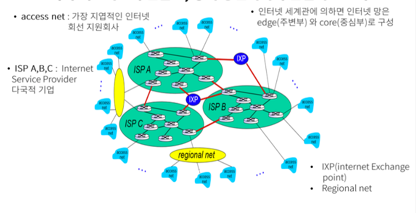

# 컴퓨터의 역사

> [패스트캠퍼스에서 컴퓨터 구조 강의](https://storage.googleapis.com/static.fastcampus.co.kr/prod/uploads/202104/161058-24/\[%ED%8C%A8%EC%8A%A4%ED%8A%B8%EC%BA%A0%ED%8D%BC%EC%8A%A4]-%EA%B5%90%EC%9C%A1%EA%B3%BC%EC%A0%95%EC%86%8C%EA%B0%9C%EC%84%9C-%EC%98%AC%EC%9D%B8%EC%9B%90-%ED%8C%A8%ED%82%A4%EC%A7%80---%EC%BB%B4%ED%93%A8%ED%84%B0-%EA%B3%B5%ED%95%99-%EC%A0%84%EA%B3%B5-%ED%95%84%EC%88%98.pdf) 를 듣고 스스로 공부한 내용을 정리하고 있습니다.

### 컴퓨터의 역사

사학과라고 말하기 부끄러울 정도로 전공과목 공부를 게을리 했지만, 그래도 나는 여전히 어떤 대상을 이해하는데에는 그 대상이 겪어온 역사를 살펴보는 것만큼 좋은 방법이 없다고 생각한다. 오늘날, 우리가 알고있는 컴퓨터는 도대체 어떤 역사를 거쳐서 지금의 모습으로 우리와 마주하고 있는 것일까?

#### 계산기 시절의 컴퓨터

`사실 컴퓨터는 계산기이다` 라는 말은 내가 개발을 시작하기 전에도 종종 들어왔던 것 같다. 흔히 컴퓨터의 역사를 말할 때는 계산기 시절과 컴퓨터 시절로 나누어서 말을 하는 것 같다.

* 컴퓨터가 계산기였을 시절부터 알아본다면, 계산기의 시초는 역시 주판일 수 밖에.
* 초기의 주판을 거쳐, 1642년에 파스칼의 계산기가 등장했고
* 1671년에는 라이프니츠의 계산기가 나왔다.
* 1822년에는 찰스 배비지의 차분기관, 해석기관이 등장했는데, 이것이 오늘날 컴퓨터의 모체가 되었다고 한다.
* 1944년에는 에이킨의 MARK-1 이 등장하였다. 이때까지만해도 컴퓨터가 데이터와 프로그램을 같이 처리하지 못하여, 사람이 데이터와 프로그램간의 중간자 역할을 했다고 한다.

#### 근/현대의 컴퓨터

* 최초의 컴퓨터는 바로 1946년 머클리와 에커트가 만든 ENIAC 이다. 이때부터 데이터와 프로그램이 같이 컴퓨터에 들어가기 시작했다고 한다.
* 그 이후에 이제 애플에서 개인용 컴퓨터가 등장하였고,
* 1981년 IBM PC 가 등장하면서 컴퓨터 대중화의 시대가 개막하게 되었다고 한다.
* 그 이후, 스마트폰이 등장했고 이제는 어디에서나 언제나 바로 컴퓨터에 접근할 수 있게 되었다.
* 그리고, 우리는 이제 대 AI 인공지능의 시대를 맞이하고 있다.

\

### 패러다임의 변화

컴퓨터는 발명되었고 대중화 되었지만, 그 컴퓨터를 대하는 인간의 인식도 시대마다 굉장히 달랐던 것 같다.

#### 계산기 혹은 사무기계

* 최초의 컴퓨터가 계산기 정도로 인식되었다면,
* 그 이후 개인용 컴퓨터로 쓰면서 컴퓨터는 단순히 `회사에서 사무를 자동화할 수 있는 기계` 정도로 인식되어있었다.

#### 네트워크 단말의 발전으로 통신기기로 자리매김

\
_출처: 패스트 캠퍼스 컴퓨터 구조 강의 이승주 강사님 강의자료_

#### 유비쿼터스의 시대

* 그러한 컴퓨터는 인터넷에 의해서 그 지위와 역할이 완전히 바뀌게 된다. 업무에서 컴퓨터를 사용하는 것은 물론이고, 컴퓨터는 독서, 운동, 사무, 취미, 소통, 언터테인먼트까지 우리가 살아가는데 필요한 영역 전부에서 사용되고 있다.
* 컴퓨터는 이제 어디에나 존재한다.

#### 모바일과 무선시대, 그리고 IOT 시대

* 스마트폰이 발전하면서 주변 기기들이 점차 무선화되는 방식으로 발전해간다.
* 그리고 이제는 우리가 접하는 모든 사물, 사람, 공간, 데이터가 연결되는 사물인터넷의 시대에서 우리는 살아가고 있다.

#### 앞으로는?

앞으로도 컴퓨터는 우리가 지금 인지하는 모니터, 키보드 와 같은 하드웨어에 종속되지 않을 것이다. 이미 스마트폰 없이도 애플워치로 통화를 하고 운동 기록을 측정할 수 있고, 자동차 내에서도 운전을 자동차에게 맡기고 영화를 보거나 일을 할 수 있는 세상이다. 앞으로 컴퓨터가 어떻게 발전해갈지, 또 어떤 모습으로 우리 앞에 나타날지 기대가 된다.
