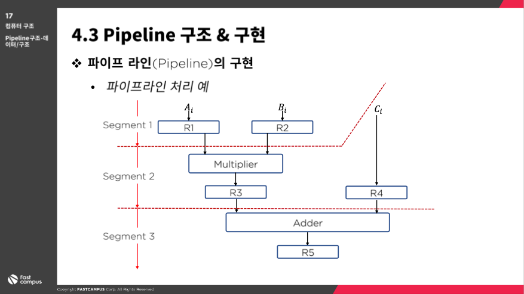

# 파이프라인과 벡터처리 - 파이프라인 구조 - 데이터/구조

> [패스트캠퍼스에서 컴퓨터 구조 강의](https://storage.googleapis.com/static.fastcampus.co.kr/prod/uploads/202104/161058-24/\[%ED%8C%A8%EC%8A%A4%ED%8A%B8%EC%BA%A0%ED%8D%BC%EC%8A%A4]-%EA%B5%90%EC%9C%A1%EA%B3%BC%EC%A0%95%EC%86%8C%EA%B0%9C%EC%84%9C-%EC%98%AC%EC%9D%B8%EC%9B%90-%ED%8C%A8%ED%82%A4%EC%A7%80---%EC%BB%B4%ED%93%A8%ED%84%B0-%EA%B3%B5%ED%95%99-%EC%A0%84%EA%B3%B5-%ED%95%84%EC%88%98.pdf) 를 듣고 스스로 공부한 내용을 정리하고 있습니다.

### 파이프라인 구조 & 구현

#### 파이프라인 구조

* 하나의 프로세스를 서로 다른 기능을 가진 여러 개의 서브 프로세스로 나누어 각 프로세스가 동시에 서로 다른 데이터를 취급하도록 하는 기법
* 아무리 처리속도가 빠르더라도 한줄보다는 두줄, 두줄보다는 세줄이 빠른법!
* 각 세그먼트에서 수행된 연산의 결과는 다음 세그먼트로 연속적으로 넘어가게 됨
* 데이터가 마지막 세그먼트를 통과하게 되면, 최종적인 연산 결과를 얻게 된다.

#### 왜 이전까지는 이런 개념을 생각해내지 못했을까?

* 하나의 프로세스 -> 다양한 연산으로 중복시킬 수 있는 근간은 각 세그먼트마다의 `레지스터`이다.
* 각 세그먼트마다 레지스터를 장착시켜서 clock pulse 라는 시그널을 주어 기억하고 있는 정보를 다음 세그먼트로 전달시킬 수 있게 됨!

#### 파이프라인 구현으로 이해하기 - 곱셈과 덧셈이 섞여있는 다항식의 연산

곱셈과 덧셈이 섞여있는 다항식의 연산을 파이프라인으로 구현해보자.

문제조건

* 숫자는 1- 7까지 있다.
* 식 : Ai \* Bi = Ci

 

* Segment1 에서는 계산할 A1 과 B1 숫자를 각각의 레지스터 R1, R2 에 넣는다.
* Segment2 에서는 R1 \* R2 의 계산결과값을 R3 에 넣는다. 동시에, C1의 값을 레지스터 R4에 넣는다.
* Segment3 에서는 R3 + R4 의 값을 R5 에 넣는다. -> 결과값!
* 클럭펄스 3번째 이후부터 연산결과값을 얻을 수 있다는 것을 알 수 있다.

### 파이프라인 구조 & 데이터처리

#### 그렇다면, 파이프라인을 적용하면 무조건 좋은 것일까?

1. 계산하는 로직들이 동일한 복잡도를 가지고 있다면 파이프라인 프로세서에 의해서 구현될 수 있다.

* 공동 클럭의 제어에 의해서 정보가 다음 세그먼트로 이동된다 -> 클락펄스를 줄 때 R1, R2, ... 동시에 전달된다.
* 여기서 중요한 점은, 각각의 연산들이 복잡도가 비슷해야 효과적이다. 안그러면 중간에서 다음 결과값을 대기하고 있는 경우가 발생할 수 있음

1. 매번 다른 데이터 집합을 동일한 태스크에 적용시켜 여러번 반복하는 응용에 효과적이다.

* 사실 컴퓨터가 잘 할 수 있는 일은 대부분 이런 동일한 작업에 대한 반복이다.

#### 네 세그먼트 파이프라인의 예시

* 네 개의 세그먼트 파이프라인이 있다고 가정해보면,
* S1, S2, S3, S4 는 각각 처리해야할 부 연산들이 담겨있는 조합회로이고
* R1, R2, R3, R4 는 각각의 부연산 결과들이 담기는 레지스터이다.
* 이때 클럭펄스가 신호를 주면, 각각의 레지스터에서 계산결과값들이 동시에 다음 세그먼트로 이동하게 된다.

#### 파이프라인 VS. 비파이프라인 속도비교

* 각각의 세크먼트에서 연산 Sn을 수행하는데 드는 시간 tp = 20ns
* 파이프라인 k = 4 개의 세그먼트로 이루어짐
* n = 100개의 작업이 있다고 가정한다면
* 파이프라인 구조를 활용할 경우, 총 데이터 처리 소요시간 : `(k + n - 1) *tp = (4 + 100 - 1) * 20ns = 103 * 20ns = 2060ns`
* 비파이프라인 구조를 활용할 경우
  * 각 작업 완료 시간 : tn = k\*tp = 4 \* 20ns = 80ns
  * 작업 개수 : 100
  * 전체 작업 완료 시간 : 100 \* 80ns = 8000ns
* 비파이프라인 -> 파이프라인 속도 증가율 : 8000/2060 = 3.88 -> **4배 가까이 속도 효율이 상승함**

위의 내용은 가정과 수학적 계산으로 이루어져 이론적인 내용이고 실제 사용에서는 다를 수 있지만, 그래도 어느정도의 효율이 상승하는지를 대략적이나마 수치로 이해할 수 있다는 점에서 의미가 있다.
