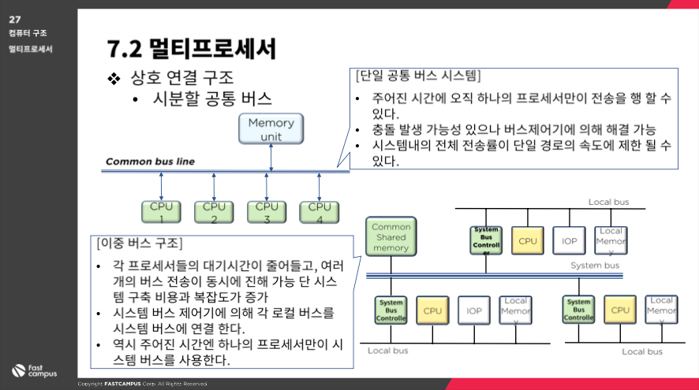
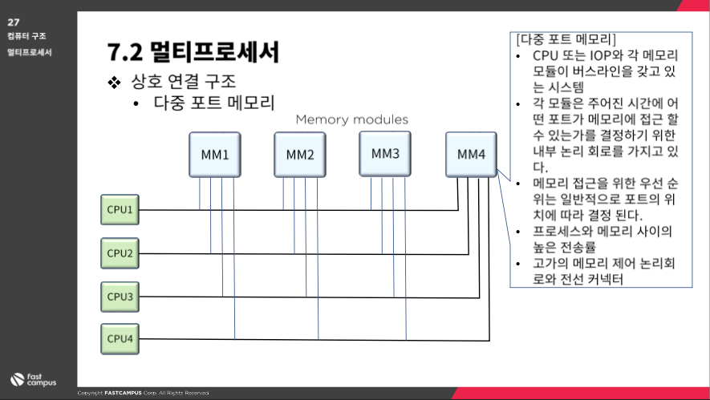
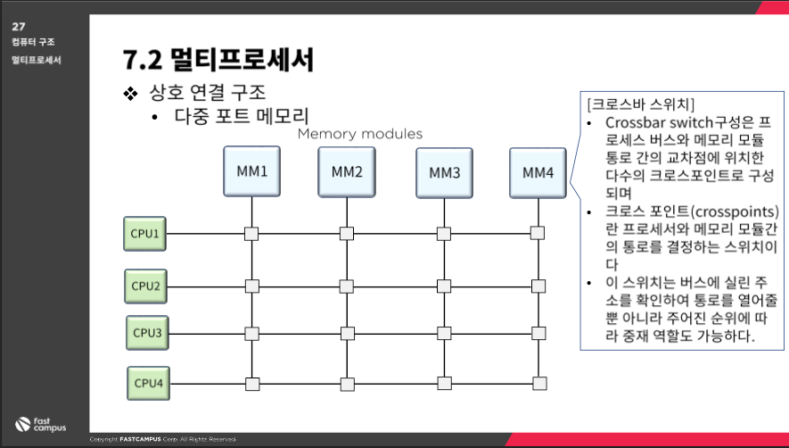

# 병렬컴퓨터 구조와 성능분석 - 멀티 프로세서

> [패스트캠퍼스에서 컴퓨터 구조 강의](https://fastcampus.co.kr/dev\_online\_computer) 를 듣고 스스로 공부한 내용을 정리하고 있습니다.

### 병렬처리

#### serial process system

* CPU 가 하나뿐인 시스템
* 과학, 계산, 영상, 네트워크 등 컴퓨터의 처리 전 분야에 걸쳐서 더 나은 성능에 대한 요구가 나오고 있는 상황이다.
* 성능상으로는 병렬처리 시스템보다 못하겠지만, 기계적, 논리적 프로세싱으로는 가장 효율적이라고 할 수 있다.

#### parallel process system

* 동시에 여러 명령이나 여러 작업을 실행할 수 있는 병렬처리 시스템이다.
* 병렬처리 시스템이 가능한 시스템을 병렬 구조라고 한다.
* 병렬처리 소프트웨어 (병렬운영체제, 병렬 컴파일러, 메모리 공유 등)가 과거에 비해 발전하고 있어서 병렬구조개발 여건을 제공해주고 있다.

**다중장치 구조**

* 다수의 CPU 로 동시에 여ㅓ개의 작업을 병렬로 처리할 수 있는 시스템이다.
* 공간적인 병렬성

**파이프라인 구조**

* 다수의 작업을 각기 다른 실행 단계에서 병렬로 처리할 수 있도록 지원되는 구조
* 시간적인 병렬성

### 멀티프로세서

* 메모리와 IO 장치를 공유하는 두개 이상의 CPU 를 갖는 시스템
* 다중명령어 흐름과 다중 데이터 흐름 시스템으로 분류된다.
* 멀티 프로세서 시스템에서는 하나의 운영체제에 의해서 프로세서와 시스템의 다른 요소들 사이의 상호 동작이 제어된다.
* 동일한 문제의 해결을 위해서 모든 요소들이 협력한다.
* 멀티 컴퓨터와는 엄연히 다른 개념!
* 멀티 프로세서의 동작원리
  * 다수의 독립적인 작업들이 병렬적으로 처리될 수 있다.
  * 하나의 작업이 여러부분으로 나뉘어 각각이 병렬적으로 처리될 수 있다.

#### 방법

1. 사용자(여기서는 개발자)가 명시적으로 병렬실행이 가능한 작업을 선언

* 전제조건 : 프로그램 실행의 병렬성을 구현할 수 있는 프로그래밍 언어가 제공되어야 한다.

1. 컴파일러가 자동적으로 프로그램의 병렬성을 감지해서 처리
   * 데이터 의존성을 검사하여 수행 순서나 병렬성을 찾아낸다.

#### 분류

* 연관관계가 높을 때 : 프로공유메모리 shared-memory 또는 밀착결합 멀티프로세서
* 연관관계가 낮을 때
  * distributed memory
    * 프로세서 마다 모든 기능을 가지고 있는 것
    * 분산 운영체제
  * loosely coupled
    * 프로세서가 돌아다니면서 작업을 검사
    * 분리 운영체제

#### 상호 연결 구조

* 멀티 프로세서 시스템은 CPU, IO 프로세서, 여러모듈로 분리된 메모리 장치에 의해서 구성이 된다.
* 공유메모리 시스템
  * 프로세스 - 메모리 사이의 경로 수에 따라서 결정된다.
  * 모든 리소스가 작업을 같이 할 수 있고 연관관계가 높음
* 느슨히 결합된 시스템
  * 프로세싱 요소들 사이의 전송 경로 수에 따라서 여러가지 물리적으로 다른 구성을 할 수 있다.

**시분할 공통 버스**

1. 단일 공통 버스 시스템
   1. 주어진 시간에 오직 하나의 프로세서만 전송을 할 수 있다.
   2. 충돌 발생 가능성이 있지만 버스 제어기에 의해서 해결이 가능!
   3. 시스템 내부의 전체 전송률이 단일경로의 속도에 제한될 수 있다.
2. 이중 버스 구조 시스템
   1. 각 프로세서들의 대기 시간이 줄어든다.
   2. 여러개의 버스를 동시에 전송할 수 있다.
   3. 시스템 구축 비용가 복잡도가 증가할 수 있다.
   4. 시스템 버스 제어기에 의해서 각 로컬버스를 시스템 버스에 연결한다.
   5. 주어진 시간엔 하나의 프로세서만이 시스템 버스를 사용한다.

 3. 다중 포트 메모리 시스템

1. CPU 나 IOP와 각 메모리 모듈이 버스 라인을 갖고 있는 시스템
2. 각 모듈은 주어진 시간에 어떤 포트가 메모리에 접근할 수 있는지 결정할 수 있는 내부 논리 회로를 가지고 있다.
3. 메모리 접근을 위한 우선순위는 일반적으로 포트의 위치에 따라 결정이 된다.
4. 프로세스와 메모리 사이의 전송률이 높으며
5. 메모리 제어 논리회로와 전선 커넥터의 가격이 비싸다는 단점이 있다.

 4. 다중 포트 메모리 시스템

1. 크로스바 스위치 시스템이라고도 함
2. 프로세스 버스와 메모리 모듈 통로간의 교차점 여러 개의 크로스 포인트를 구성한 것인데
   1. 크로스 포인트란, 프로세서와 메모리모듈 간의 통로를 결정하는 스위치라고 할 수 있다.
3. 이 스위치는 버스에 실린 주소를 확인해서 통로를 열러줄 뿐만 아니라
4. 주어진 순위에 따라서 중재 역할도 수행할 수 있다.
5. 다단 교환망
   1. 기본요소는 : 2입력 + 2출력 상호 교환 스위치
   2. 2개의 입력 중 하나만 선택해서 전체 경로를 연결해주는 역할
   3. 충돌을 중재하는 기능도 수행
   4. 입력과 출력 단자를 연결할 수 잇는 제어 신호도 있어야 한다.
6. 하이퍼큐브 상호연결
   1. 2^n 개의 프로세서가 n차원 이진 큐브로 연결된 느슨히 결합된 시스템을 의미한다.
   2. 각 프로세서는 큐브의 노드를 형성하는데 노드에는 CPU 뿐만 아니라 로컬 메모리나 IO 인터페이스도 포함된다.
