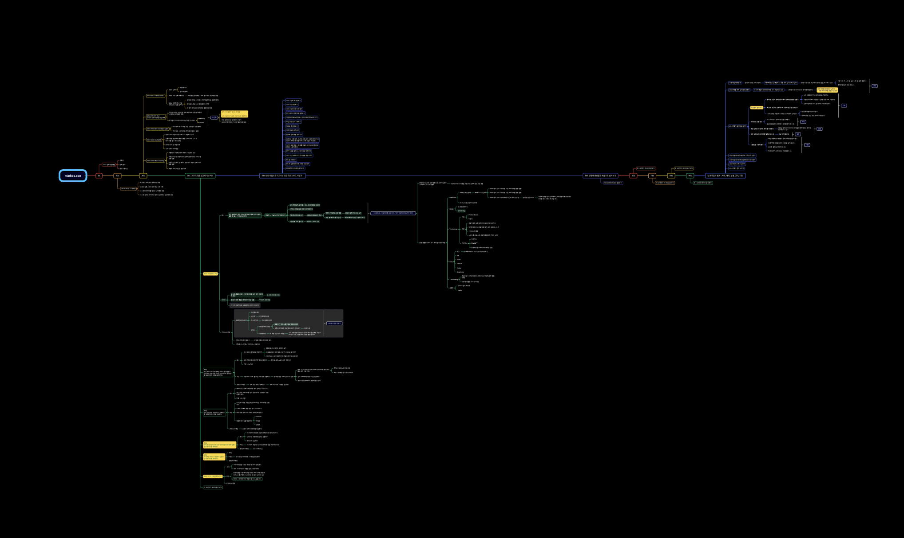

# 🧠 운영체제 Operating System



### 강의소개

운영체제는 컴퓨터 하드웨어 바로 위에 설치되는 소프트웨어 계층으로 모든 컴퓨터 시스템의 필수적인 부분이다.

###

### 목차

1. 운영체제 개요
2. 컴퓨터 시스템의 구조
3. 프로세스 관리
4. CPU 스케줄링
5. 병행제어
6. 데드락
7. 메모리 관리
8. 가상 메모리
9. 파일 시스템
10. 입출력 시스템
11. 디스크 관리

### 운영체제란 무엇인가?

<figure><figcaption></figcaption></figure>

* 운영체제
  * 컴퓨터 하드웨어 바로 위에 설치되어 사용자 및 다른 모든 소프트웨어와 하드웨어를 연결하는 소프트웨어 계층
* 운영체제의 기능
  * 컴퓨터 하드웨어와의 인터렉션
  * 다른 소프트웨어 및 사용자와의 인터렉션

<figure><figcaption></figcaption></figure>

* 운영체제의 목표
  * 컴퓨터 시스템을 편리하게 사용할 수 있는 환경을 제공한다. (다른 소프트웨어 및 사용자와의 인터렉션)
    * 동시 사용자, 프로그램들이 각자 독자적 컴퓨터에서 수행되는 것 같은 착각을 제공한다.
    * 하드웨어를 직접 다루는 복잡한 부분을 운영체제가 대행한다.
  * 컴퓨터 시스템의 자원을 효율적으로 관리한다. (컴퓨터 하드웨어와의 인터렉션)
    * 프로세서, 기억장치, 입출력 장치 등의 효율적 관리
    * 실행중인 프로그램들에게 짧은 시간씩 CPU 를 번갈아 할당한다.
    * 실행중인 프로그램들에 메모리 공간을 적절히 분배한다.
