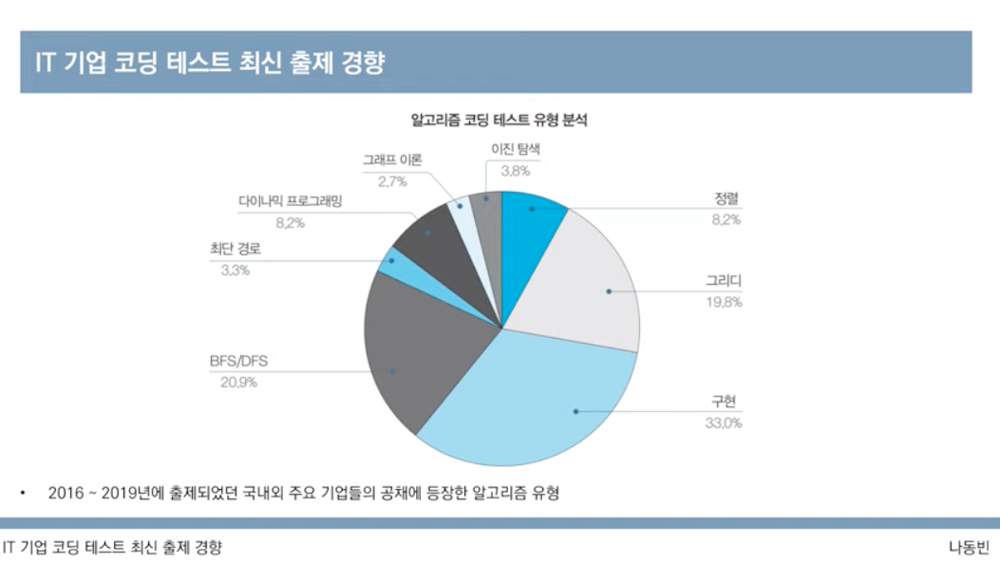
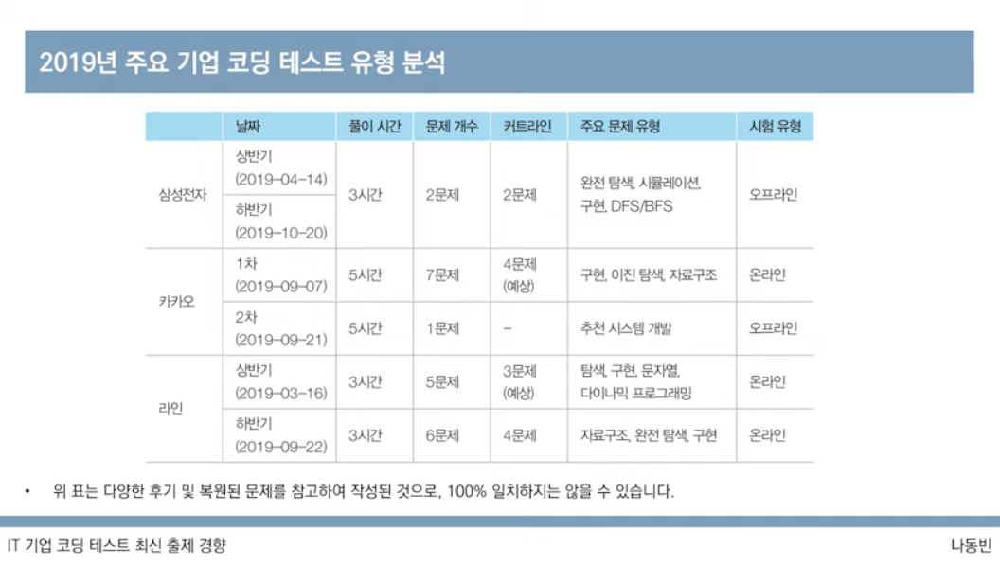
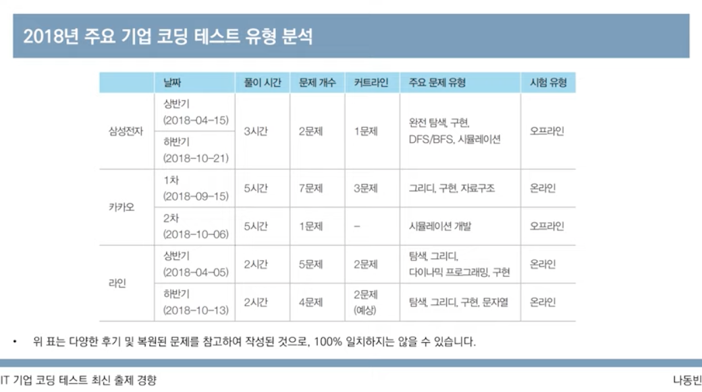
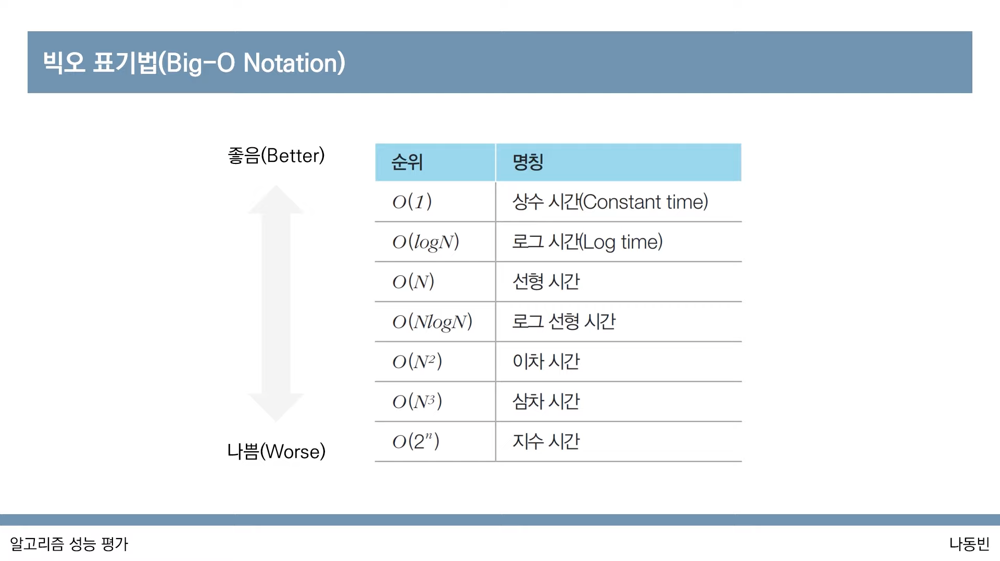
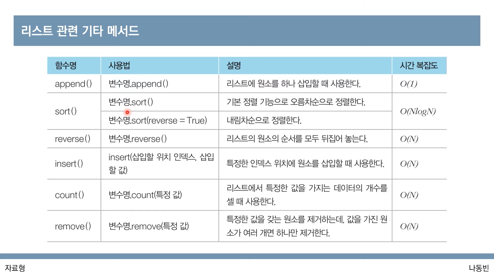

# 1. 출제 경향 & 파이썬 문법 부수기

> 💡 동빈나 님의 [이코테 2021 강의 몰아보기](https://www.youtube.com/watch?v=m-9pAwq1o3w\&list=PLRx0vPvlEmdAghTr5mXQxGpHjWqSz0dgC\&index=1) 를 보면서 공부한 내용을 정리하고 있습니다. 더 자세한 내용은 [**이것이 취업을 위한 코딩 테스트다 with 파이썬**](http://www.yes24.com/Product/goods/93519145) **을 참고해주세요** 😊 학습 도구로는 [리플렛](https://replit.com/) 을 사용하고 있고 원본 소스코드는 동빈님의 [Github](https://github.com/ndb796/python-for-coding-test) 에서 확인할 수 있고 스스로 공부한 소스코드는 [Github](https://github.com/Miniminis/algorithm-study-note-python) 에서 확인할 수 있습니다.

## 출제경향

### 온라인 저지 종류

#### 해외

* 코드포스
* 탑코더
* 릿코드
* 코드셰프

#### 국내

* 백준
* 코드업
  * 다양한 초급문제들 접할 수 있음
* 프로그래머스
  * 인기 IT 대기업 기출문제들
* SW expert academy

### 언어의 선택

* 문제풀이방식(빠르게 푸는 것이 중요할 때) : C++ > python > Java > C > 기타
* 개발방식 : 파이썬 > 자바 > C++ > C# > C > kotlin > 자바스크립트 > 기타
  * python 은 기본 표준 라이브러리가 너무 편리하기 때문에 유리하다.

### 개발환경

* 온라인
  * [리플릿](https://replit.com/languages/python3) : 온라인 개발환경
  * [파이썬 튜터](https://pythontutor.com/visualize.html#mode=edit) : 파이썬 코딩을 할 때,
* 오프라인
  * 파이참
* 추천
  * 온라인 환경을 이용하되, 자신의 코드를 블로그를 통해 포스팅하면서 공부를 해나가는 것을 추천

### 자신만의 소스코드 관리하기

* 팀노트를 만들어서 자신이 자주 사용하는 알고리즘 코드를 라이브러리화 해서 관리한다.
* 평소에 만들어두면 온라인 코테에서 이 노트만 확인하면서 빠르게 참고할 수 있다.

### 최신 출제 경향

* 2-5시간 동안 몇 가지의 문제를 풀도록 알고리즘 문제들 제출
* 가장 출제 빈도가 높은 알고리즘 유형
  * 그리디 - 쉬운 난이도
  * 구현
  * DFS/BFS 를 활용한 탐색

#### 실제 유형 분석



2019년 주요 기업 코딩 테스트 유형 분석 

* 카카오 기술블로그
  * 기출문제 풀이를 참고할 것
* 카카오/라인은 절반정도 문제를 풀면 통과한다고 알려져있음

2018년도 주요 기업 코테 유형 분석 

\


***

## 알고리즘의 성능 평가

### 복잡도

> 복잡도 = 알고리즘의 성능을 나타내는 척도

* 시간복잡도 : 특정한 크기의 입력에 대해서 알고리즘의 수행시간을 분석
* 공간복잡도 : 특정한 크기의 입력에 대해서 알고리즘의 메모리 사용량을 분석
* 동일한 기능을 수행하는 알고리즘이 있다면, 일반적으로 복잡도가 낮을수록 좋은 알고리즘!
* 단순한 코드의 복잡도를 의미하는 것이 아니다.
* 특정한 함수의 성능적 측면에서의 복잡도를 의미한다.
  * 복잡도가 높다 = 수행시간이 길고 메모리 샤용량이 많다.
  * 복잡도가 낮다 = 수행시간이 짧고 메모리 사용향이 적다.

### 빅오 표기법 (Big-O Notation)

> 그렇다면, 복잡도는 어떻게 표기, 비교할 수 있을까?

* 가장 빠르게 증가하는 항만을 고려하는 표기법
  * 함수의 상한만을 나타내게 된다.
* 예) 연산횟수 = 3N^3 + 5N^2 + 1,000,000 인 알고리즘이 있다고 가정한다면,
  * 빅오 표기법에서는 차수가 가장 큰 항만 남기니까 O(N^3) 으로 표현이 된다.
* N이 굉장히 큰 값으로 올라간다면 최고차항을 제외하고 나머지는 의미가 없다고 생각하는 것



#### 시간복잡도 계산해보기

**1. N개의 데이터의 합을 계산하는 프로그램**

* 1\~5 까지 숫자를 반복문을 통해서 합을 구한다.
* N 개의 숫자가 5 -> 1,000,000 으로 늘어나면 합의 값 이외의 나머지는 큰 의미가 없게됨
* 따라서 시간복잡도는 N이 된다.

**2. 2중반복문을 이용하는 예제**

* 5개의 데이터가 array 로 담겨있음
* 2중 for 문에서 array 를 각각 참조함
* 이때의 시간 복잡도는 O(N^2) 가 된다.
* 하지만 모든 이중 반복문의 시간복잡도가 O(N^2)인것은 아님
  * 반복문 내에서 다른 함수를 호출한다면 그 함수의 시간 복잡도까지 고려를 해야한다.

#### 알고리즘 설계의 팁!

* 일반적으로 CPU 기반의 개인 컴퓨터나 채점용 컴퓨터에서 연산 횟수가 5억을 넘어가는 경우
  * C언어를 기준으로 통상 1-3초가 소요되고
  * python 을 기준으로 통상 5-15초가 소요된다.
    * Pypy의 경우는 때때로 C언어 보다 빠르게 동작하기도 한다.
* O(N^3) 의 알고리즘을 설계한 경우, N의 값이 5,000을 넘는다면 얼마나 걸리느냐?
  * 연산횟수 = 1250억
  * 파이썬이 1초에 5000만번의 연산을 처리할 수 있다고 가정한다면
  * 수행시간 = 1250억 / 5000만 = 2500초
  * 실제 코테에서는 파이썬의 1초당 수행시간이 2000만번 정도라고 가정하고 푸는 것이 좋다.
* 코테에서 시간제한은 보통 1 - 5초 임!
  * 문제에서 명시되어있지 않은 경우는 대략 5초정도로 가정하는 것이 좋다.

### 요구사항에 따라 적절한 알고리즘 설계하기

* 가장 먼저 확인해야할 내용 : 시간제한 (수행시간 요구사항)
* 시간제한이 1초인 문제, 일반적 기준은
  * N의 범위가 500 : 시간복잡도가 O(N^3)인 알고리즘을 설계하면 문제를 풀 수 있다.
  * N의 범위가 2,000 : 시간복잡도가 O(N^2)인 알고리즘을 설계하면 문제를 풀 수 있다.
  * N의 범위가 100,000 : 시간복잡도가 O(NlogN)인 알고리즘을 설계하면 문제를 풀 수 있다.
  * N의 범위가 10,000,000 : 시간복잡도가 O(N)인 알고리즘을 설계하면 문제를 풀 수 있다.

> 이 부분은 문제를 풀면서 스스로 감을 찾아 나가야 한다. (아직 잘 이해 안됨)

### 일반적인 알고리즘 문제 해결 과정

1. 지문 읽기 + 컴퓨터적 사고
2. 요구사항(복잡도) 분석
3. 문제 해결을 위한 아이디어 찾기
4. 소스코드 설계 및 코딩

* 일반적으로 출제자들은 핵심 아이디어를 캐치한다면, 간결하게 소스코드를 작성할 수 있는 형태로 출제한다.
* 때문에 문제를 온전히 이해하고 코딩을 시작하는 것이 좋다.

```python
import time
start_time = time.time() # 측정 시작

# 프로그램 소스코드
end_time = time.time() # 측정 종료
print("time:", end_time - start_time) # 수행 시간 출력
```

\


***

## 자료형

* 모든 프로그래밍은 결국 데이터를 다루는 행위
  * 자료형에 대한 이해는 프로그래밍의 길에 있어서의 첫걸음!
* 파이썬의 자료형은 매우 편리하고 강력하다.
  * 정수형, 실수형, 복소수형, 문자열, 리스트, 튜플, 사전 등이 존재
  * 자료형은 필수로 알아야 하는 지식임!

### 정수형

* 정수를 다루는 자료형
  * 양의정수
  * 음의정수
  * 0
* 코테에서 많이 사용되는 자료형!

```python
# 양의정수
a = 1000
print(a)  # 1000

# 음의정수
a = -7
print(a)  # -7

# 0 
a = 0
print(a)  # 0
```

### 실수형

* 소수점 아래의 데이터를 포함하는 수 자료형
* 소수부가 0 or 정수부가 0 인 소수는 생략 가능

#### 지수표현방식

* 파이썬에서는 e 나 E를 이용하여 지수 표현 방식을 이용할 수 있다.
* 예) 1e9 = 10의 9제곱
* 임의의 큰 수를 표현하기 위해서 자주 사용된다.
* 최단경로 알고리즘에서는 도달할 수 없는 노드에 대해서 최단 거리를 무한(INF) 로 설정하곤 한다.
* 이때 가능한 값이 10억 미만이라면, 무한(INF) = 1e9 가 되는 셈

```python
# 실수 
a = 1e9
print (a) # 실수형으로 표현된다. 

a = int(1e9)
print (a) # 정수형으로 표현된다. 
```

#### 실수형 더 알아보기

* 오늘날 가장 널리 쓰이는 IEEE754 표준에서는 실수형을 저장하기 위해서 4바이트, 8바이트의 고정된 크기의 메모리를 할당
* 컴퓨터 시스템은 실수 정보를 표현하는 정확도에 한꼐를 가진다.
* 예를들어서 10진수 체계에서는 0.3 + 0.6 = 0.9 로 딱 떨어지는 결과값을 가지지만
  * 2진수 체계에서는 0.9 를 정확하게 표현할 수 있는 방법이 없다.
  * 컴퓨터는 최대한 가깝게 표현하려고 노력하겠지만, 미세한 오차가 발생할 수 밖에 없다.

```python
## 0.9 값의 정확도 체크
a = 0.3 + 0.6
print(a)

if a == 0.9:
  print(True)
else:
  print(False) 
  
# result
0.8999999999999999
False
```

> 이러한 표현상 한계를 해결하기 위해서는 어떻게 하지?

#### round() 함수 이용하기

* 권장되는 방법임
* 예) 123.456 -> round(123.456, 2) = 123.456

### 수 자료형의 연산

* 사칙연산과 나머지 연산자가 자주 사용되는데
* 나누기 연산자 (/) 는 나눠진 결과를 실수형으로 반환!
* 나머지 연산자 (%) 는 나머지를 반환
  * 예) 짝수 or 홀수 검사 등에 이용될 수 있다.
* 몫을 얻기 위해서는 (//) 연산자를 사용하면 됨
* 거듭제곱 연산자 (\*\*) 등 다양한 연산자들이 존재함

```python
# 수의 연산
a = 7
b = 3

print(a / b)
print(a % b)
print(a // b) 
print(a ** b) # 거듭제곱
print(a ** 0.5) # 제곱근


# result
2.3333333333333335  
1
2
343
2.6457513110645907
```

\


### 리스트

* 여러 개의 데이터를 연속적으로 담아 처리하기 위해 사용하는 자료형
* array, linked list 와 유사한 기능 제공
* 리스트 대신에 배열 또는 테이블이라고 부르기도 한다.

#### 간단한 사용법 - 초기화/인덱싱/슬라이싱

```python
## 초기화
array = [70, 4, 10, 2, 11]
print(array)

## 인덱싱
print(array[3])

### 양수 인덱싱
print(array[2]) # 10

### 음수 인덱싱
print(array[-2])  # 2
print(array[-0])  # 1

## 슬라이싱 > 파이썬에서 기본 제공함
print(array[2:4]) # 10, 2
```

#### list comprehension 리스트 컴프리헨션 - 데이터와 함께 초기화

```python
## list comprehension - forloop
array = [i for i in range(10)]
print(array)

## list comprehension - if
### 0 - 19 중 홀수만 포함하는 리스트
array = [i for i in range(20) if i % 2 == 1]
print(array)
```

#### list comprehension vs normal code

```python
### list comprehension
array = [i for i in range(20) if i % 2 == 1]
print(array)

### normal code
array = []
for i in range(20):
  if i % 2 == 1:
    array.append(i)
print(array)
```

#### 2차원 리스트를 초기화할 때 특히 간편

```python
## 2차원 배열 초기화하기
# array = [[0] * m for _in range(n)]
array = [[0] * 4 for _ in range(3)]
print(array)  # [[0, 0, 0, 0], [0, 0, 0, 0], [0, 0, 0, 0]]
```

**주의할점!**

```python
## 2차원 배열 초기화하기
# array = [[0] * m for _in range(n)]
array = [[0] * 4 for _ in range(3)]
print(array)  # [[0, 0, 0, 0], [0, 0, 0, 0], [0, 0, 0, 0]]

# 요소 1개의 값을 바꿀 경우, 그 요소에만 해당함 
array[1][1] = 5
print(array)  # [[0, 0, 0, 0], [0, 5, 0, 0], [0, 0, 0, 0]]

## != array = [[0] * m] * n
# array = [[0] * m] * n 와 같이 초기화할 경우, 전체 리스트 안에 포함된 각 리스트가 모두 같은 객체로 인식된다. 주소값도 같이 복사하기 때문! 
array = [[0] * 4] * 3
print(array)  # [[0, 0, 0, 0], [0, 0, 0, 0], [0, 0, 0, 0]]

# 요소 1개의 값을 바꾸어도 다른 row 도 같이 바뀐다. -> 배열 1개를 단순히 복사했기 때문에 모두 주소값이 같음  
array[1][1] = 5
print(array)  # [[0, 5, 0, 0], [0, 5, 0, 0], [0, 5, 0, 0]]
```

### 언더바 사용하기 in python

```python
## 언더바 사용하기 in python 
# 반복 변수의 값을 무시하기 위해서 

# 케이스 1. 1 - 9까지 자연수 더하기 
# 매번 합을 더해야하기 때문에 변수가 필요하다. 
summary = 0
for i in range (10):
  summary += i;
print(summary)

# 케이스 2. 단순히 내부적으로 반복만 할 경우
# 변수가 필요 없는 반복의 경우는 언더바를 사용해서 변수를 생갹할 수 있다. 
for _ in range (10):
  print("Hello, Algorithm!")
```

### list 관련 매소드



#### 사용해보기

```python
## 매소드 사용해보기
array = [100, 5, 20, 3, 87]

# append
array.append(127)
print(array)    # [100, 5, 20, 3, 87, 127]

# insert
array.insert(2, 60)
print(array)    # [100, 5, 60, 20, 3, 87, 127]

# remove
array.remove(87)    
print(array)    # [100, 5, 60, 20, 3, 127]

# reverse
array.reverse()
print(array)    # [127, 3, 20, 60, 5, 100]

# sort, sort(reverse = True)
array.sort()
print(array)    # [3, 5, 20, 60, 100, 127]

array.sort(reverse=True)
print(array)    # [127, 100, 60, 20, 5, 3]

# count
print(array.count(127))   # 1
```

### 문자열 자료형

* 큰따옴표 or 작은 따옴표 사용하여 초기화
* 두개 같이 사용해야할 경우
  * " '' "
  * ' "" '
  * " " "

```python
## 문자열
data = "hello, python!"
print(data)   # hello, python!

## 튜플 
data = 'hello, "python"'
print(data)   # hello, "python"
```

#### 문자열의 연산

* 덧셈시 : 문자열이 더해져서 연결된다.
* 곱셈시 : 같은 문자열이 여러번 더해짐
* 인덱셍 / 슬라이싱 가능!
  * 단, 특정 인덱스의 값을 변경 불가 -> immutable!

```python
### 문자열의 덧셈
a = "Hello"
b = "World"
print(a + " " + b)    # Hello World

a = "String"
print(a*3)    # StringStringString

a = "ABCDEF"
print(a[2:3])   # C

# 특정 인덱스 값 변경 불가
a[2] = 'Z'
print(a)

# Traceback (most recent call last):
#   File "main.py", line 158, in <module>
#     a[2] = 'Z'
# TypeError: 'str' object does not support item assignment
# exit status 1
```

### 튜플 자료형

* 리스트와 유사, 하지만 차이점 존재
* 한번 선언된 값은 변경 불가
* 소괄호를 사용한다.
* 리스트에 비해서 공간 효율적

```python
# 튜플
a = (1, 2, 3, 4, 5)

## indexing
print(a[3])   # 4

## slicing
print(a[1:4])   # (2, 3, 4)

## 원소변경불가
a[3] = 100
print(a)

# Traceback (most recent call last):
#   File "main.py", line 178, in <module>
#     a[3] = 100
# TypeError: 'tuple' object does not support item assignment
# exit status 1
```

#### 튜플을 사용하면 좋은 경우

* 서로 다른 성질의 데이터를 묶어서 관리해야할 때
  * 예) 최단경로 알고리즘 : (비용, 노드번호)의 형태로 튜플 자료형을 자주 사용함
  * 예) 학생정보 : (학번, 이름) 등
* 데이터의 나열을 해싱의 키 값으로 사용해야할 때
  * 튜플은 변경 불가하므로 리스트와 다르게 키값으로 사용이 가능!
* 리스트보다 메모리를 더 효율적으로 사용해야할 때

### 사전 자료형

* 키-값을 쌍으로 가지는 자료형
  * 앞서 다루었던 리스트, 튜플이 값을 순차적으로 저장하는 것과는 대비됨
* 원하는 변경불가능한 자료형을 키 값으로 사용할 수 있다.
  * 해당 키 값으로 자료에 접근함
* 해시테이블을 이용하므로 데이터의 조회, 수정에 있어서 O(1) 의 시간 안에 처리가 가능하다...!

```python
## 초기화 1
data = dict()
data['apple'] = '사과'
data['banana'] = '바나나'
data['coconut'] = '코코넛'
print(data)   # {'apple': '사과', 'banana': '바나나', 'coconut': '코코넛'}

## 초기화 2
second_data = {
  97 : '홍길동',
  98 : '고길동'
}
print(second_data)    # {97: '홍길동', 98: '고길동'}


if 'apple' in data:
  print('해당 키는 존재합니다.')  # 해당 키는 존재합니다.
```

#### 사전 자료형 관련 매소드

* key 만 뽑을 때 : keys()
* value 만 뽑을 때 : values()

```python
### methods
print(data.keys())    # dict_keys(['apple', 'banana', 'coconut'])
print(data.values())    # dict_values(['사과', '바나나', '코코넛'])

for key in data.keys():
 print(key)

# apple
# banana
# coconut

values = data.values()
values_list = list(data.values())   # ['사과', '바나나', '코코넛']
print(values_list)
for value in values_list:
 print(value)      
# 사과
# 바나나
# 코코넛
```

### 집합 자료형

* 중복 허용 안됨
* 순서 없음
* 초기화
  * 리스트, 문자열을 이용해서 초기화 가능
    * set() 이용
  * 중괄호({}) 안에 각 원소를 콤마 기준으로 구분하여 삽입함으로써 초기화
* 데이터 조회 및 수정에 있어서 O(1) 시간안에 처리 가능

```python
## 집합 자료형
data = set([1, 1, 2, 3, 4, 4, 5, 6])
print(data)   # {1, 2, 3, 4, 5, 6}  -> 중복제거

data = {1, 2, 3, 4, 5}
print(data)   # {1, 2, 3, 4, 5}

### 연산 : 합, 교, 차
a = set([1, 2, 3, 4, 5])
b = {3, 4, 5, 6, 7, 7}

# 합집합
print(a | b)  # {1, 2, 3, 4, 5, 6, 7}

# 교집합
print(a & b)  # {3, 4, 5}

# 차집합
print (a - b) # {1, 2}
```

#### 관련 함수

```python
### 관련함수
data = {1, 2, 3, 4, 5}

# add() 
data.add(100)
print(data)   # {1, 2, 3, 4, 5, 100}

# update()
data.update({34, 9})
print(data)   # {1, 2, 3, 4, 5, 100, 34, 9}

# remove()
data.remove(100)
print(data)   # {1, 2, 3, 4, 5, 34, 9}
```

#### 사전 & 집합 자료형의 특징

* 리스트, 튜플은 순서가 있기 때문에 인덱싱을 통해 자료형의 값을 얻을 수 있음
* 사전 자료형, 집합 자료형은 순서가 없기 때문에 인덱싱으로 값을 얻을 수 없음
  * 사전의 키 or 집합의 원소를 이용해 O(1)의 시간 복잡도로 조회함

\


***

## 기본 입출력

### 자주 사용되는 표준 입력 방법

* input() : 한 줄의 문자열 입력
* map() : 리스트의 모든 원소에 각각 특정한 함수를 적용

```python
# 자주 사용되는 표준 입력 방법
word = input()
print(word)
# test
# test

print(map(int, input().split()))  
# hello python nice to meet you
# <map object at 0x7f6cf4c6c550>

print(list(map(int, input().split()))) 
# 1 100 43 29 70
# [1, 100, 43, 29, 70]

## 입력받는 데이터의 개수가 정해져 있다면
a, b, c = map(int, input().split())
print(a)
print(b)
print(c)
# 1 100 45
# 1
# 100
# 45
```

### 빠르게 입력받기 - sys.stdin.readline()

* 이진탐색, 정렬 등에서는 입력받는데 걸리는 시간이 초과되어 실패하기도 한다.

```python
import sys

data = sys.stdin.readline().rstrip()
print(data)
```

## 기본 출력

### print()

* 각 변수를 콤마를 이용하여 띄어쓰기로 구분하여 출력 가능
* 기본적으로 출력 이후 줄바꿈
  * 원하지 않으면 end 속성을 이용할 것

```python
a = 1
b = 2
print(a, b)

print(7, end=" ")
print(8)

answer = 7 
print("the answer is " + str(answer) + "!")
```

### f-string

* python 3.6 이상부터 사용가능

```python
# f-string
print(f"the answer is {answer} !")
```

\


***

## 조건문

> 다른 프로그래밍 언어와 비슷한 부분은 별도로 적지 않도록 했습니다.

* 프로그램의 흐름 제어
* 기본사용법
  * if .. elif ... els e
* 비교연산자
  * 특정한 두 값을 비교할 때
  * \==, !=, >, <, >=, <=
* 같음연산자와 대입연산자는 다르다
  * \= vs. ==
* 논리연산자
  * and, or, not X
  * 다른 언어들은 보통 !, != 처럼 수 연산자를 사용한다.
* 포함여부
  * in
  * not in
  * 리스트, 튜플, 문자열, 딕셔너리 에서 모두 사용 가능하다!
* pass
  * 아무것도 처리하고 싶지 않을 때 pass keyword 사용할 수 있다.
  * 형태만 만들어두고 나중에 구현하고 싶을때 사용할 수 있음

### 간소화

* 실행될 소스코드가 단순히 한 줄인 경우, 굳이 줄바꿈을 안해도 간략하게 표현 가능하다.
* 조건부 표현식
  * if - else 를 한줄에 작성할 수 있다.

```python
score = 80
result = "PASS" if score >= 90 else "FAIL" 
print(result)
```

### 부등식

* 대수학에서의 부등식을 그대로 사용 가능!

```python
x = 5

### other language
if x > 0 and x < 20:
  print(True)

### in python 
if 0 < x < 20:
  print(True)
```

## 반복문

> 다른 프로그래밍 언어와 비슷한 부분은 별도로 적지 않도록 했습니다.

* 특정 소스코드를 반복적으로 실행하고자 할때 사용
* 소스코드의 길이 : while > for
* 무한루프 사용 주의 : 빠져나가는 코드가 있는지?
* for
  * 리스트, 튜플 등의 데이터를 차례대로 하나씩 방문
  * 연속적인 값을 차례대로 순회할 떄 : range() 사용
    * range(start, end+1)
    * range(n) = range(0, n)
* continue
  * 남은 코드의 실행을 건너뛰고 다음 반복으로 진행하고자 할 때
* break
  * 반복문을 즉시 탈출
* ### 중첩 반복문, 2중 for문

```python
## 예시 - 특정 번호의 학생 제외하기
scores = [90, 100, 100, 35]
cheating_students = {1, 2}

for i in range(len(scores)):
  if i in cheating_students:
    continue
  else:
    print(i+1, " 번 학생은 합격입니다.")
```

\


***

## 함수

* 특정한 작업을 하나의 단위로 묶어 놓은 것
* 종류
  * 내장함수 : 파이썬이 기본 제공
  * 사용자 정의 함수 : 개발자가 정의
* 매개변수 : 함수 내부에서 사용할 변수
* 반환 값 : 함수에서 처리된 결과를 반환
* 파라미터의 변수를 직접 지정 가능
* global keyword
  * 함수 바깥에 선언된 변수를 바로 참조
* 여러개의 반환값
  * 단순하게 여러개의 값을 한꺼번에 return 가능

```python
# 매개변수 직접지정
def hello(a, b):
  print(a, b)

hello(a = "Hello", b = "Python")

# global keyword 
# 값을 변경할 경우에만 영향
a = 10

def func():
  global a
  a += 1
  print(a)

func()

# 값을 변경하지 않을 경우 문제없음
def func_1():
  print(a)

func_1()

# 여러개의 반환값
# 패킹 & 언패킹
def result(a, b):
  add = a + b
  sub = a - b
  mul = a * b
  div = a / b
  return add, sub, mul, div

a, b, c, d = result(3, 7)
print(a, b, c, d)
```

## 람다 표현식

* 특정한 기능 수행 함수를 한줄로 작성 가능하다.
* 이름없는 함수라고도 불림

```python
## 람다
# 비교
def func(a, b):
  return a + b

print(func (3, 7))
print((lambda a, b: a + b)(3, 7))

# 예시 1) 한번쓰고 마는 함수, 짧은 함수
array = [
  ('홍길동', 50),
  ('이순신', 32),
  ('아무개', 74)
]

def my_key(x):
  return x[1]

print(sorted(array, key=my_key))
print(sorted(array, key=lambda x: x[1]))
# [('이순신', 32), ('홍길동', 50), ('아무개', 74)]
# [('이순신', 32), ('홍길동', 50), ('아무개', 74)]

# 예시 2) 여러개의 리스트에 연산적용
list1 = [1, 2, 3, 4, 5]
list2 = [3, 4, 5, 6, 7]

result = map(lambda a, b: a + b, list1, list2)
print(list(result))
```

\


***

## 유용한 표준 라이브러리

### 내장함수

* 기본 입출력 \~ 정렬까지 기본적 함수들 제공

```python
## 자주 사용하는 내장함수 
# sum()
result = sum([1, 2, 3, 4, 5])
print(result)

# min(), max()
array = [1, 200, 3, 6, 43]
print(min(array))
print(max(array))

# eval()
result = eval("(3+5)*7")
print(result)

# sorted()
array = [9, 23, 54, 100, 12]
result = sorted(array) 
result_reverse = sorted(array, reverse=True)
print(result)
print(result_reverse)

# sorted() with key
array = [
  ('hong', 45),
  ('ming', 17),
  ('rod', 74)
]

result = sorted(array, key=lambda x: x[1])
print(result)

result = sorted(array, key=lambda x: x[1], reverse=True)
print(result)

# [('ming', 17), ('hong', 45), ('rod', 74)]
# [('rod', 74), ('hong', 45), ('ming', 17)]
```

### itertools

* 반복되는 형태의 데이터 처리를 위한 필수적인 기능
* 순열, 조합 라이브러리
* 순열
  * nPr
  * 서로 다른 n개에서 서로 다른 r개를 선택하여 일렬로 나열
  * {'A', 'B', 'C'} 에서 세개를 선택하여 나열하는 경우 : ABC, ACB, BAC, BCA, CAB, CBA
* 조합
  * nCr
  * 서로 다른 n개에서 순서에 상관없이 서로 다른 r개를 선택하는 것
  * {'A', 'B', 'C'} 에서 두 개 뽑는 경우 : AB, AC, BC

```python
# 순열
from itertools import permutations

data = ['A', 'B', 'C']
result = list(permutations(data, 3))
print(result)
# [('A', 'B', 'C'), ('A', 'C', 'B'), ('B', 'A', 'C'), ('B', 'C', 'A'), ('C', 'A', 'B'), ('C', 'B', 'A')]

# 조합
from itertools import combinations

result = list(combinations(data, 2))
print(result)
# [('A', 'B'), ('A', 'C'), ('B', 'C')]

# 중복순열
from itertools import product
result = list(product(data, repeat=3))
print(result)
# [('A', 'A', 'A'), ('A', 'A', 'B'), ('A', 'A', 'C'), ('A', 'B', 'A'), ('A', 'B', 'B'), ('A', 'B', 'C'), ('A', 'C', 'A'), ('A', 'C', 'B'), ('A', 'C', 'C'), ('B', 'A', 'A'), ('B', 'A', 'B'), ('B', 'A', 'C'), ('B', 'B', 'A'), ('B', 'B', 'B'), ('B', 'B', 'C'), ('B', 'C', 'A'), ('B', 'C', 'B'), ('B', 'C', 'C'), ('C', 'A', 'A'), ('C', 'A', 'B'), ('C', 'A', 'C'), ('C', 'B', 'A'), ('C', 'B', 'B'), ('C', 'B', 'C'), ('C', 'C', 'A'), ('C', 'C', 'B'), ('C', 'C', 'C')]

# 중복조합
from itertools import combinations_with_replacement

result = list(combinations_with_replacement(data, 2))
print(result)
# [('A', 'A'), ('A', 'B'), ('A', 'C'), ('B', 'B'), ('B', 'C'), ('C', 'C')]
```

### collections

* 덱, 카운터 등 유용한 자료구조 포함
* counter
  * 등장 횟수를 세는 기능 제공
  * 내부 원소가 몇 번씩 등장했는지 보여줌

```python
# counter
from collections import Counter

counter = Counter([1, 4, 4, 2, 3, 6, 4])
print(counter[4])
print(counter[1])
print(dict(counter))
# 3
# 1
# {1: 1, 4: 3, 2: 1, 3: 1, 6: 1}
```

### math

* 필수적인 수학적 기능을 제공함
* 팩토리얼, 제곱근, 최대공약수 (GCD), 삼각함수 관련 함수 \~ 파이(pi) 와 같은 상수도 포함

```python
# math
import math

# 최대 공약수 & 최소공배수
def lcm(a, b):
  return a * b // math.gcd(a, b)

a = 21
b = 14

print(math.gcd(21, 14))
print(lcm(21, 14))
# 7
# 42
```

### heapq

* 힙 자료구조를 제공
* 우선순위 큐 기능을 구현하기 위해 사용

### bisect

* 이진탐색 료
