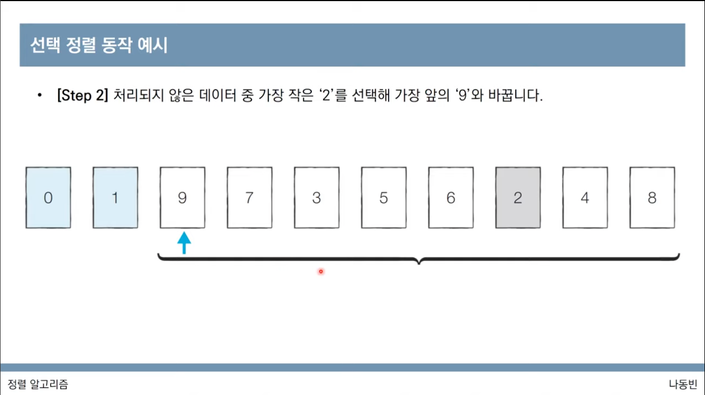
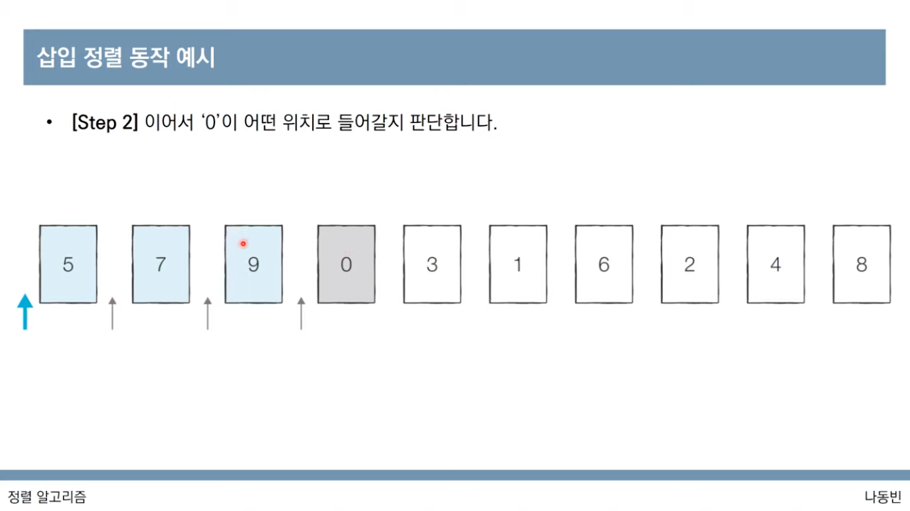
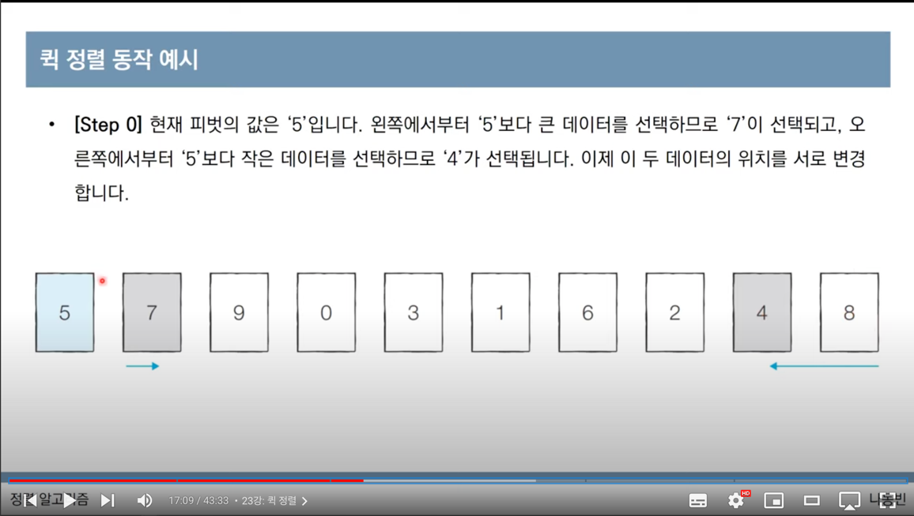
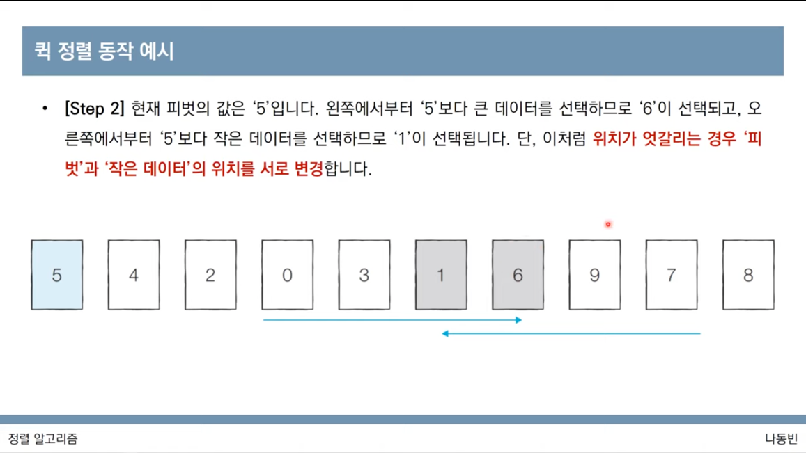
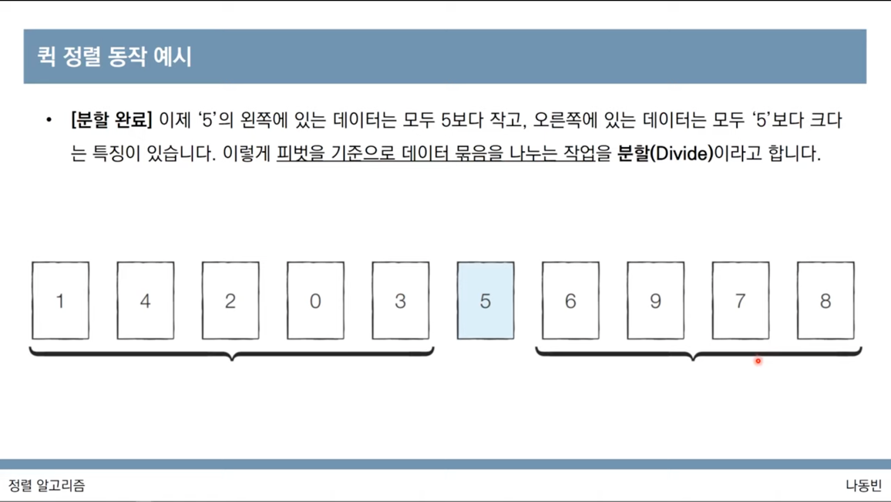
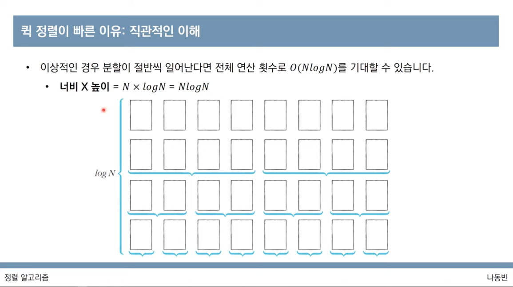
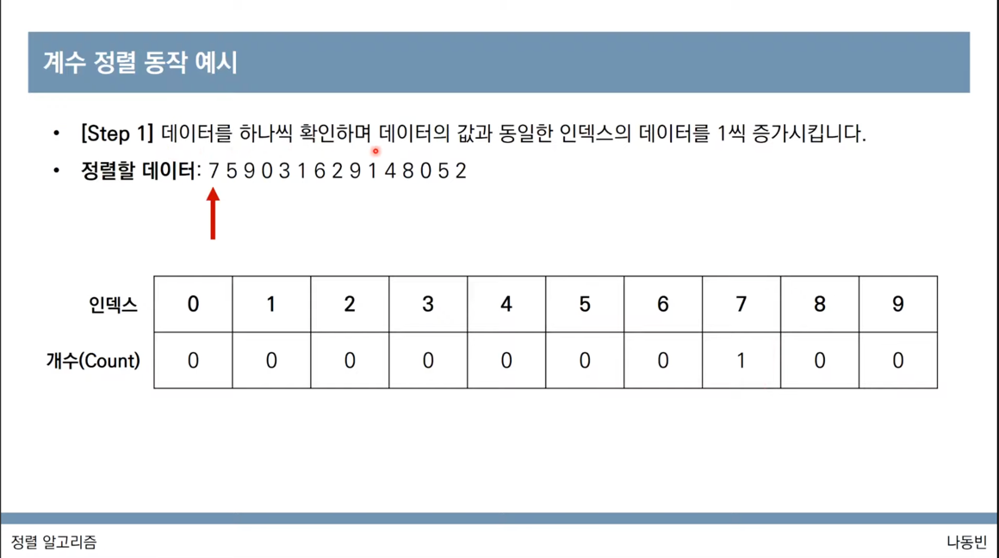
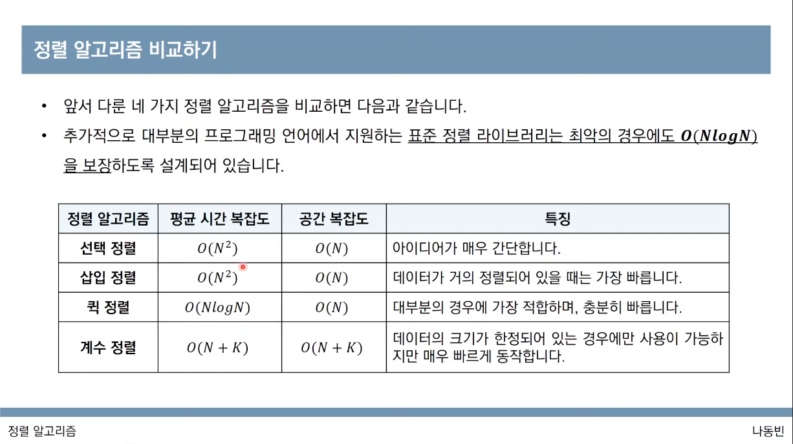

# 4. 정렬 알고리즘

> 💡 동빈나 님의 [이코테 2021 강의 몰아보기](https://www.youtube.com/watch?v=m-9pAwq1o3w\&list=PLRx0vPvlEmdAghTr5mXQxGpHjWqSz0dgC\&index=1) 를 보면서 공부한 내용을 정리하고 있습니다. 더 자세한 내용은 [**이것이 취업을 위한 코딩 테스트다 with 파이썬**](http://www.yes24.com/Product/goods/93519145) **을 참고해주세요** 😊 학습 도구로는 [리플렛](https://replit.com/) 을 사용하고 있고 원본 소스코드는 동빈님의 [Github](https://github.com/ndb796/python-for-coding-test) 에서 확인할 수 있고 스스로 공부한 소스코드는 [Github](https://github.com/Miniminis/algorithm-study-note-python) 에서 확인할 수 있습니다.

### 정렬 알고리즘

* 데이터를 특정한 기준에 따라 순서대로 나열하는 것을 말한다.
* 일반적으로 문제 상황에 다라서 적절한 정렬 알고리즘이 공식처럼 사용된다.
* 예) 무작위 카드 작은 순서대로 정렬하기

### 선택정렬 알고리즘



* 처리되지 않은 데이터 중에서 가장 작은 데이터를 선택해서 맨 앞에 있는 데이터와 바꾸는 것을 반복한다.
* 시간복잡도
  * N 번만큼 가장 작은 수를 찾아서 맨 앞으로 보내야한다.
  * 구현 방식에 따라서 사소한 오차는 있을 수 있지만 전체 연산 횟수는 다음과 같다.
    * N + (N-1) + (N-2) + ... + 2
    * \= (N^2 + N - 2) / 2
    * 빅오 표기법으로는 O(N^2) 이라고 작성한다.

```python
# 선택정렬 > 0-9까지 작은 카드를 중심으로 나열하기 

array = [7, 5, 9, 0, 3, 1, 6, 2, 4, 8]

for i in range(len(array)):
  min_idx = i
  for j in range(i+1, len(array)):
    if array[min_idx] > array[j]:
      min_idx = j
  array[min_idx], array[i] = array[i], array[min_idx]

print(array)
# [0, 1, 2, 3, 4, 5, 6, 7, 8, 9]
```

### 삽입정렬



* 처리되지 않은 데이터를 하나씩 골라서 적절한 위치에 삽입한다.
* 선택정렬에 비해서 구현 난이도가 높지만, 일반적으로 더 효율적으로 동작한다.
* 첫번째 원소가 이미 정렬되어있다고 가정하고 두번째 데이터가 어디로 들어갈 수 있을지 판단하며 정렬한다.
* 왼쪽 데이터와 비교해서 더 작으면 왼쪽에 정렬하고 그렇지 않으면 그냥 머물러있는다.
* 시간복잡도
  * O(N^2)
  * 선택정렬과 마찬가지로 반복문이 두번 중첩되어 사용됨
  * 현재 리스트의 데이터가 거의정렬되어있는 상태라면 매우 빠르게 동작한다.
  * 이미 모든 데이터가 정렬되어있다면 O(N)의 시간복잡도를 가지게 된다.
  * 이미 정렬 되었는데 다시 삽입정렬을 수행하면 어떻게 될까?
    * 선형탐색 과정이 바로 멈춰지기 때문에 매우 빨라진다.

```python
# 삽입정렬 알고리즘
# 왼쪽의 수들은 이미 정렬되어있다고 가정하고 지금의 수를 어디에 끼워넣을지 판단

array = [7, 5, 9, 0, 3, 1, 6, 2, 4, 8]

for i in range(1, len(array)):
  for j in range(i, 0, -1):
    if array[j] < array[j-1]:
      array[j-1], array[j] = array[j], array[j-1]
    else:
      break

print(array)
```

### 퀵 정렬







* `기준 데이터(pivot)`를 설정하고 그 기준보다 큰 데이터와 작은 데이터의 위치를 바꾸는 방법
* 일반적인 상황에서 가장 많이 사용되는 정렬 알고리즘 중 하나임
* 병합 정렬과 더불어 대부분 프로그래밍 언어의 정렬 라이브러리의 근간이 되는 알고리즘이다.
* 퀵 정렬은 첫번째 데이터를 기준 데이터로 설정하는 것이 보통이다.
* 예시
  1. 현재 피봇값 설정
  2. 피봇값 다음수부터 왼쪽으로 피봇보다 작은 값, 오른쪽으로 피봇보다 큰값을 찾는다.
  3. 두 수 위치를 교체한다.
  4. 2, 3을 반복하다가 위치가 서로 엇갈리는 두 수를 만나게 되면 교체 후
  5. 작은 데이터와 피봇값을 교체한다.
  6. 피봇을 기준으로 왼쪽은 이보다 작은값, 오른쪽은 이보다 큰 값이 나열된다. 이를 분할이라고 함!
  7. 피봇을 기준으로 왼쪽, 오른쪽을 각각 별도의 리스트라고 생각하고 계속 1-5의 과정을 진행한다.
  8. 이를 계속 재귀적으로 반복하면 전체적으로도 정렬이 수행된다.



* 왜 빠른걸까?
  * 이상적인 경우에는 분할이 절반씩 일어난다면 전체 연산횟수로 O(NlogN)을 기대할 수 있다.
  * 전체 데이터의 범위가 절반씩 줄어들기 때문에 logN의 값
* 시간복잡도
  * 보통은 O(NlogN)
  * 최악의 경우 O(N^2)의 시간복잡도를 가지게 됨
    * 첫번째 원소를 피봇으로 삼을 경우, 이미 정렬된 데이터에 대해서 퀵정렬을 수행할 경우
    * 0 - 9
    * 피봇은 0, 왼쪽은 1, 오른쪽은 더 작은 수가 없으므로 0을 선택하게 됨
    * 매번 오른쪽만 남게 되는데 선형탐색의 시간 N \* N개의 데이터 = N^2의 시간복잡도

```python
# 퀵정렬

array = [5, 7, 9, 0, 3, 1, 6, 2, 4, 8]
print(array)

def quick_sort(array, start, end):
  # 만약에 원소가 1개이면 return 
  if start >= end:
    return

  pivot = start
  left = start + 1
  right = end

  while left <= right:
    while left <= end and array[left] <= array[pivot]:
      left += 1
    while right > start and array[right] >= array[pivot]:
      right -= 1
    if left > right:
      array[right], array[pivot] = array[pivot], array[right]
    else:
      array[left], array[right] = array[right], array[left]
    print(array)
  
  quick_sort(array, start, right-1)
  quick_sort(array, right+1, end)

quick_sort(array, 0, len(array)-1)

print(array)


# [5, 7, 9, 0, 3, 1, 6, 2, 4, 8]
# [5, 4, 9, 0, 3, 1, 6, 2, 7, 8]
# [5, 4, 2, 0, 3, 1, 6, 9, 7, 8]
# [1, 4, 2, 0, 3, 5, 6, 9, 7, 8]
# [1, 0, 2, 4, 3, 5, 6, 9, 7, 8]
# [0, 1, 2, 4, 3, 5, 6, 9, 7, 8]
# [0, 1, 2, 4, 3, 5, 6, 9, 7, 8]
# [0, 1, 2, 3, 4, 5, 6, 9, 7, 8]
# [0, 1, 2, 3, 4, 5, 6, 9, 7, 8]
# [0, 1, 2, 3, 4, 5, 6, 8, 7, 9]
# [0, 1, 2, 3, 4, 5, 6, 7, 8, 9]
# [0, 1, 2, 3, 4, 5, 6, 7, 8, 9]
```

**파이썬의 장점을 살려서 퀵정렬하기**

```python
# 퀵정렬

array = [5, 7, 9, 0, 3, 1, 6, 2, 4, 8]
print(array)

def quick_sort(array):
  if len(array) < 1:
    return array
  
  pivot = array[0]
  tail = array[1:]

  left_side = [x for x in tail if x <= pivot]
  right_side = [x for x in tail if x > pivot]

  print("left side : ", left_side, "right side : ", right_side)

  return quick_sort(left_side) + [pivot] + quick_sort(right_side)

print(quick_sort(array))

# [5, 7, 9, 0, 3, 1, 6, 2, 4, 8]
# left side :  [0, 3, 1, 2, 4] right side :  [7, 9, 6, 8]
# left side :  [] right side :  [3, 1, 2, 4]
# left side :  [1, 2] right side :  [4]
# left side :  [] right side :  [2]
# left side :  [] right side :  []
# left side :  [] right side :  []
# left side :  [6] right side :  [9, 8]
# left side :  [] right side :  []
# left side :  [8] right side :  []
# left side :  [] right side :  []
# [0, 1, 2, 3, 4, 5, 6, 7, 8, 9]
```

### 계수정렬



* 특정한 조건이 부합할때만 사용할 수 있지만 매우 빠르게 동작하는 정렬 알고리즘
  * 계수 정렬은 데이터의 크기 범위가 제한되어 정수 형태로 표현할 수 있을 때 사용 가능하다.
* 데이터의 개수가 N, 데이터(양수) 중 최댓값이 K일 때 최악의 경우에도 수행시간 O(N+K)를 보장한다.
* 예시
  * 정렬할 데이터 : 7 5 9 0 3 1 6 2 9 1 4 8 0 5 2
* 시간복잡도, 공간복잡도 모두 O(N+K)
* 때에 따라서는 심각한 비효율성을 초래할 수 있다.
  * 데이터가 0과 999,999 로 단 2개만 존재하는 경우
  * 데이터는 두개밖에 없는데 백만개의 0 이 담긴 배열을 초기화해야한다.
* 동일한 값을 가지는 데이터가 여러개 등장할 때 효과적으로 사용할 수 있다.
  * 성적의 경우는 100점을 맞은 학생이 여러명일 수 있기 때문에 계수 정렬이 효과적!

```python
# 계수정렬
array = [7, 5, 9, 0, 3, 1, 6, 2, 9, 1, 4, 8, 0, 5, 2]

count = [0] * (max(array) + 1)

for i in range(len(array)):
  count[array[i]] += 1

for i in range(len(count)):
  for j in range(count[i]):
    print(i, end=' ')
    # 0 0 1 1 2 2 3 4 5 5 6 7 8 9 9
```

### 정렬 알고리즘 비교하기



**선택정렬 vs. 기본 정렬 라이브러리 수행시간 비교**

```python
# 선택정렬 vs. 기본 정렬 라이브러리 수행시간 비교 

from random import randint
import time

array = []
for _ in range(10000):
  array.append(randint(1, 100))

start_time = time.time()

for i in range(len(array)):
  min_index = i
  for j in range(i+1, len(array)):
    if array[min_index] > array[j]:
      min_index = j
  array[i], array[min_index] = array[min_index], array[i]

end_time = time.time()

# 수행시간
print("선택정렬 성능 측정 : ", end_time - start_time)


array = []
for _ in range(10000):
  array.append(randint(1, 100))

start_time = time.time()

array.sort()

end_time = time.time()

# 수행시간
print("기본 정렬 라이브러리 성능 측정 : ", end_time - start_time)


# 선택정렬 성능 측정 :  24.45125102996826
# 기본 정렬 라이브러리 성능 측정 :  0.002169370651245117
```

#### 두 배열의 원소 교체

문제

* 두 배열 A와 B가 있다.
* N개의 원소로 이루어져있고 원소는 모두 자연수임
* 최대 K번의 바꿔치기 연산을 수행할 수 있는데, 바꿔치기 연산이란 배열 A에 있는 원소 하나와 배열 B에 있는 원소 하나를 골라서 두 원소를 서로 바꾸는 것을 말한다.
* 최종목표는 배열 A의 원소 합이 최대가 되도록 하는 것
* N, K 그리고 배열 A, B의 정보가 주어졌을 때, 최대 K번의 바꿔치기 연산을 수행하여 만들 수 있는 배열 A의 모든 원소의 합을 최댓값을 출력하는 프로그램을 작성하세요.

풀이

* 핵심아이디어
  * 매 번 배열 A에서 가장 작은 원소를 골라서 배열 B에서 가장 큰 원소와 교체한다.
  * A는 오름차순 정렬, B는 내림차순 정렬을 한다.
  * 첫번째 인덱스부터 차례로 확인하면서 A의 원소가 B보다 작을때에만 교체를 수행한다.
  * 두 배열의 원소가 최대 100,000개 까지 입력될 수 있으므로 최악의 경우 O(NlogN)을 보장하는 정렬 알고리즘을 이용해야한다.

```python
# 두 수 바꿔치기 문제

# A에서는 작은 순서대로 정렬, B에서는 높은 수대로 정렬

n, k = map(int, input().split())

a = list(map(int, input().split()))
b = list(map(int, input().split()))


for _ in range(k):
  a.sort()
  b.sort(reverse=True)

  a[0], b[0] = b[0], a[0]

print(a, b)
print(sum(a))

# input
# 5 3 
# 1 2 3 4 5
# 5 5 6 6 5

# output
# 5 3 
# 1 2 3 4 5
# 5 5 6 6 5
# [5, 4, 5, 6, 6] [3, 5, 5, 2, 1]
# 26
```

해설

```python
# 두 수 바꿔치기 문제

# A에서는 작은 순서대로 정렬, B에서는 높은 수대로 정렬

n, k = map(int, input().split())

a = list(map(int, input().split()))
b = list(map(int, input().split()))

a.sort()
b.sort(reverse=True)


for i in range(k):
  if a[i] < b[i]:   # a가 작을 때에만 교체
    a[i], b[i] = b[i], a[i]

print(a, b)
print(sum(a))

# input
# 5 3 
# 1 2 3 4 5
# 5 5 6 6 5

# output
# 5 3 
# 1 2 3 4 5
# 5 5 6 6 5
# [5, 4, 5, 6, 6] [3, 5, 5, 2, 1]
# 26
```
