# 6. 다이나믹 프로그래밍

> 💡 동빈나 님의 [이코테 2021 강의 몰아보기](https://www.youtube.com/watch?v=m-9pAwq1o3w\&list=PLRx0vPvlEmdAghTr5mXQxGpHjWqSz0dgC\&index=1) 를 보면서 공부한 내용을 정리하고 있습니다. 더 자세한 내용은 [**이것이 취업을 위한 코딩 테스트다 with 파이썬**](http://www.yes24.com/Product/goods/93519145) **을 참고해주세요** 😊 학습 도구로는 [리플렛](https://replit.com/) 을 사용하고 있고 원본 소스코드는 동빈님의 [Github](https://github.com/ndb796/python-for-coding-test) 에서 확인할 수 있고 스스로 공부한 소스코드는 [Github](https://github.com/Miniminis/algorithm-study-note-python) 에서 확인할 수 있습니다.

### 다이나믹 프로그래밍

* 메모리를 적절히 사용하여 수행시간 효율성을 비약적으로 향상시키는 방법
* 이미 계산된 결과는 별도의 메모리영역에 저장하여 다시 계산하지 않도록 한다.
  * 한번 계산해서 해결한 문제는 다시 계산하지 않도록 한다.
* 다이나믹 프로그래밍의 구현은 일반적으로 두가지 방식으로 구성된다.
  * top-down
  * bottom-up
* 동적 계획법이라고도 부름!
  * 일반적으로 동적이라는 의미 in programming
  * 자료구조에서 동적할당은 프로그램이 실행되는 도중에 실행에 필요한 메모리를 할당하는 기법
  * 다이내믹 프로그래밍에서 다이내믹은 별다른 의미 없이 사용된 것임
* 다음의 두 경우에 쓴다.
  * 최적 부분 구조
    * optimal substructure
    * 큰 문제를 작은 문제로 나눌 수 있으며 작은 문제의 답을 모아서 큰 문제를 해결할 수 있다.
  * 중복되는 부분 문제
    * overlapping subproblem
    * 동일한 작은 문제를 반복적으로 해결해야한다.
* 예
  * 피보나치수열

### 피보나치 수열

* 1, 1, 2, 3, 5, 8, 13, 21, 34, 55, 89, ...
* 점화식
  * 인접한 항들 사이의 관계식을 의미
* 피보나치 수열을 점화식으로 표현
* 프로그램 상에서는 수열ㅇ르 배열이나 리스트를 이용해서 표현한다.

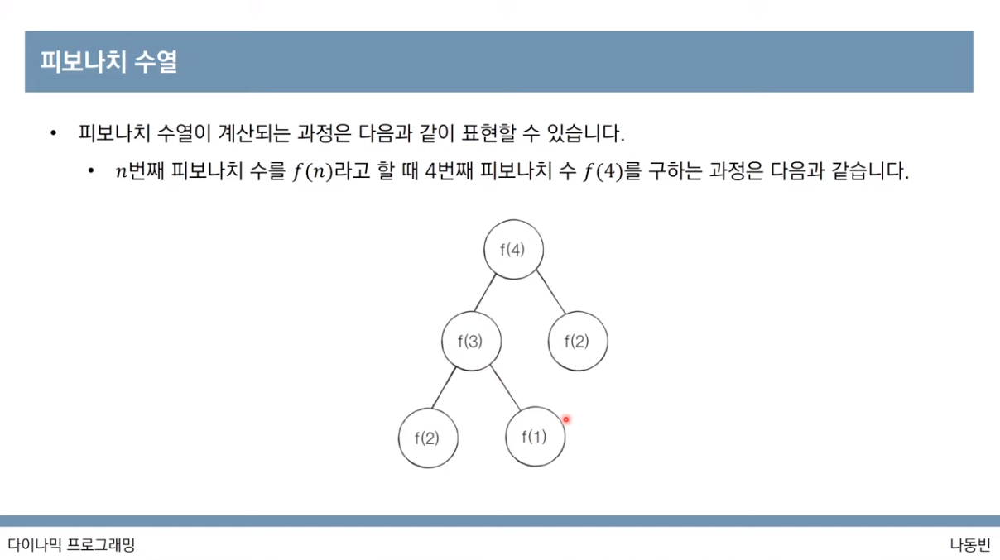

```python
# 피보나치 수열
# 4 번째 피보나치 수 구하기

def fibo(x):
  if x == 1 or x == 2:
    return 1
  
  return fibo(x-1) + fibo(x-2)

print(fibo(4));

# output : 3
```

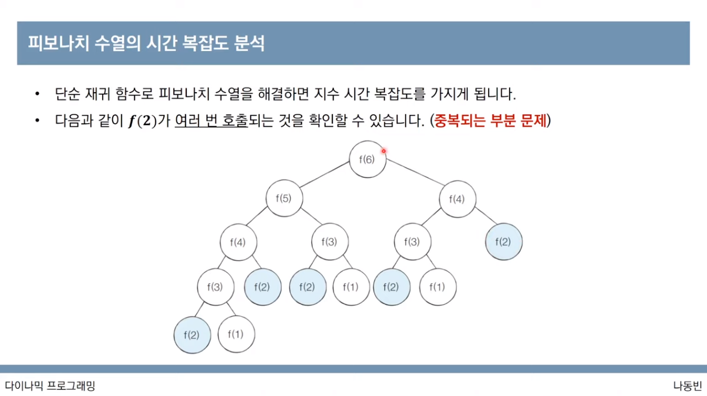

* 하지만 이렇게 단순이 재귀함수로 호출할 경우 지수 시간 복잡도를 가지게 됨
  * N의 값이 조금만 커지더라도 문제가 됨
  * 빅오표기법 : O(2^n)
* 단순히 6번째 피보나치 수만 구하더라도 중복이 5번이나 발생하게 된다.
* 한번 연산된 결과는 메모리에 보관할 수 있도록 한다.
* f(30) 을 구하기 위해서는 10억 가량의 연산을 수행해야함
* f(100) 을 구하기 위해서는? 비현실적인 수행시간이 발생하게 된다.
* 해결방법은? 다이나믹 프로그래밍!
  * 다음의 조건을 만족하나?
    * 최적 부분 구조 : 큰 문제를 작은 문제로 나눌 수 있다. -> 만족! f(4) 를 구하기 위해서 f(3), f(2) 를 구해야함
    * 중복되는 부분 문제 : 동일한 작은 문제를 반복적으로 해결한다. -> 여러번 중복 연산을 하게 됨
  * 만족한다고 판단됨!

### 메모이제이션

* 한번 계산한 결과를 메모리 공간에 메모하는 기법
  * 같은 문제를 다시 호출하면 메모했던 결과를 그대로 가져온다.
  * 값을 기록해놓는다는 점에서 캐싱이라고 한다.
  * 그래서 변수도 caching, d, dp, table 등을 사용한다.
* 메모이제이션(탑다운)은 하향식 방법
  * 보텀업 방식은 상향식! -> 반복문을 이용함
* 다이나믹 프로그래밍의 전형적인 형태는 보텀업 방식이다.
  * 결과 저장용 리스트는 dp table 이라고 부른다.
* 엄밀히 말하자면 메모이제이션은 이전에 계산된 결과를 일시적으로 기록해놓는 넓은 개념을 의미한다.
  * 다이나믹 프로그래밍에 국하된 개념은 아니다.
  * 한번 계산된 결과를 담아놓기만 하고 다이나믹 프로그래밍을 위해 활용하지 않을 수도 있다.
  * 따라서 메모이제이션 != 다이나믹 프로그래밍

#### 상향식 메모이제이션으로 피보나치 수열 해결해보기

* 별도의 리스트를 사용하여 문제를 풀면 답을 계속 기록해나간다는 점에서, 해당 문제가 이전에 해결된적 있는 문제인지 알 수 있다.

```python
# 피보나치 수열
# 99 번째 피보나치 수 구하기

d = [0] * 100

def fibo(x):
  if x == 1 or x == 2:
    return 1

  # 이미 계산된 적 있다면 해당 값을 가져다가 쓴다. 
  if d[x] != 0:
    return d[x]
  
  # 한 번 연산을 완료하면 d array 에 값을 넣는다. 
  d[x] = fibo(x-1) + fibo(x-2)
  return d[x]

print(fibo(99));

# output : 218922995834555169026
```

#### 하향식 메모이제이션으로 피보나치 수열 해결해보기

```python
# 피보나치 수열
# 99 번째 피보나치 수 구하기

d = [0] * 100

d[1] = 1
d[2] = 1

n = 99

for i in range(3, n+1):
  d[i] = d[i-1] + d[i-2]

print(d[n])

# output : 218922995834555169026
```

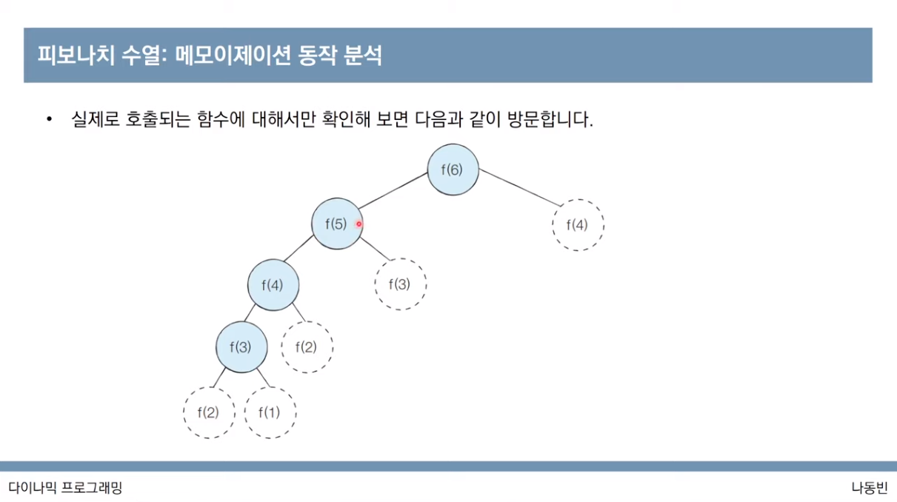

* 메모이제이션을 이용하는 경우 시간 복잡도는 O(N) 이 된다.
  * 메모리를 N만큼 가질 수 있다는 전제하에!

### 다이나믹 프로그래밍 vs 분할정복

* 공통점 : 모두 최적 부분 구조를 가질 때 사용할 수 있다.
  * 큰 문제를 작은 문제로 나누고
  * 작은 문제의 답을 모아서 큰 문제를 해결한다.
* 차이점 : 부분문제의 중복
  * 다이나믹 프로그래밍 : 각 부분 ㅁ누제들이 서로 영향을 미치고 부분 문제가 중복됨
  * 분할 정복 문제 : 동일한 부분문제가 반복적으로 계산되지 않는다.
* 다이나믹 프로그밍 접근 방법
  * 가장 먼저 그리디, 구현, 완전탐색 아이디어로 문제 해결할 수 있는지 검토
  * 다른 알고리즘으로 풀이방법이 떠오르지 않으면 다이나믹 프로그래밍을 고려한다.
  * 재귀함수로 비효율적인 완전 탐색 프로그램을 작성한 뒤 (탑다운) 작은 문제에서 구한 답이 큰 문제에서 그대로 사용될 수 있다면 코드를 개선하는 방법을 사용한다.
    * 예) 피보나치 수열
  * 일반적인 코테에서는 기본 유형의 다이내믹 프로그래밍 문제가 출제되는 경우가 많다.

### 개미전사 문제

* 개미전사는 부족한 식량을 보충하고자 메뚜기 마을의 식량창고를 공격하려고 한다.
* 메뚜기 마을의 식량창고는 일직선으로 이어져있다.
* 각 창고는 정해진 수의 식량들이 저장되어있고 개미 전사들은 선택적으로 약탈하여 식량을 최대한 많이 빼앗을 예정이다.
* 일직선상에 존재하는 식량창고 중에서 서로 인접한 식량창고가 공격받으면 바로 알아챌 수 있기에 최소 한칸이상 떨어진 식량창고를 약탈해야한다.
* 예시
  * <창고 0 : 1개> - <창고 1 : 3개> - <창고 2 : 1개> - <창고 3 : 5개>
  * 이때는 두번째와 네번째 창고를 털어야 최대 식량값인 8개를 빼앗을 수 있다.
* 식량창고 N의 정보가 주어졌을 때 얻을 수 있는 식량의 최댓값을 구하라!
* 조건
  * 식량창고 N의 개수가 3이상 100이하로 주어진다.
  * 각 창고에 저장된 식량 개수 K 가 공백 기준으로 주어진다.

해결 아이디어

* N=4 일 때, 총 8가지의 경우의 수가 있음
* 이 때 가장 많은 식량을 약탈하는 경우의 수는 3개와 8개를 약탈하는 8개의 경우이다.
* ai = i번째 식량창고까지의 최적의 해 라고 가정한다면 다이나믹 프로그래밍을 적용할 수 있다.
* DP table
  * a0 = 1
  * a1 = 3
  * a2 = 3
  * a3 = 3+5 = 8
* 왼쪽부터 식량창고를 턴다고 했을 때, 특정 i번째 식량창고에 대해서 털지 안털지 여부를 결정하면 2가지 중에서 더 많은 식량을 털 수 있는 경우를 선택하면 된다.

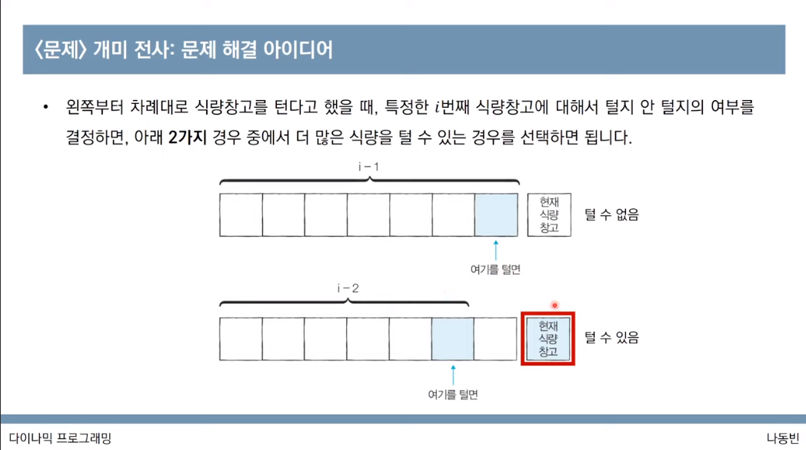

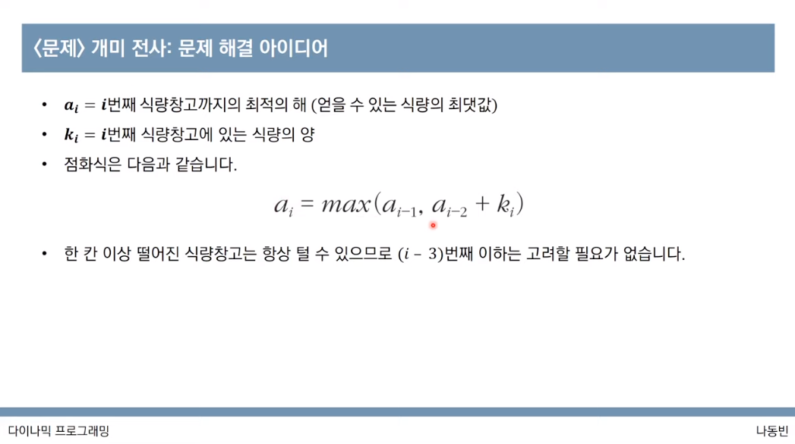

```python
# 개미전사 문제

n = int(input())
k = list(map(int, input().split()))

d = [0] * 100

d[0] = k[0]
d[1] = max(k[0], k[1])

for i in range (2, n):
  d[i] = max(d[i-1], d[i-2] + k[i])

print(d[n-1])
```

### 1로 만들기 문제

문제

* 정수 x가 주어졌을 때 정수 x에 사용할 수 있는 연산은 다음과 같이 4가지 이다.
  1. x가 5로 나누어지면 5로 나눈다.
  2. x가 3으로 나누어지면 3으로 나눈다.
  3. x가 2로 나누어지면 2로 나눈다.
  4. x -1을 한다.
* 이 때, 연산 4개를 이용해서 값을 1로 만들고자 할 때, 연산의 최소값을 구하는 문제
* 예시
  * 26 -> 25 -> 5 -> 1
* 조건
  * x는 1이상 3만 이하로 주어진다.
  * 연산하는 횟수의 최솟값을 출력해야한다.

#### 앞선 그리디 해법으로 풀 수 없는 이유

* 단순히 나누기가 가능할때 나누는 것보다 뺄샘과 나눗셈을 적절하게 사용해서 푸는 것이 훨씬 더 이득이 된다.
* 예를들면, 26의 경우,
  * 2로 나누어진다고 해서 2로 나눗셈을 하는 것보다 -> 6번
  * \-1을 먼저하고 5로 두 번 나누는 것이 연산 횟수를 더 최소화할 수 있다. -> 3번
* 오히려 이 문제는 최적 부분 구조와 중복 되는 부분 문제를 만족하므로 다이나믹 프로그래밍을 적용하는 것이 해법이 될 수 있다.

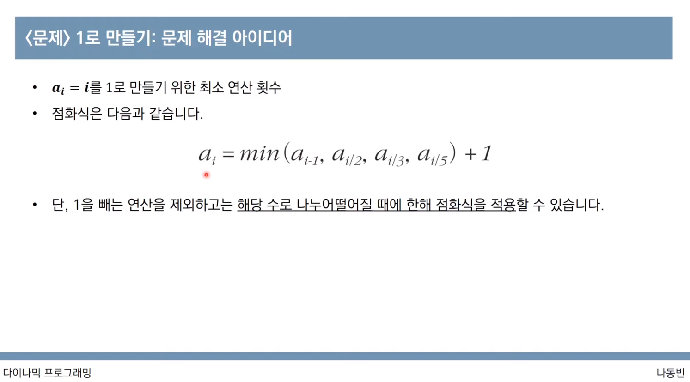

```python
# 1로 만들기 문제

# 나누기먼저 -> 뺄샘 

x = int(input())

d = [0] * 30001
# d[0] 는 안쓰는 것으로 가정
# d[1] = 0 : 본인이 가장 최소값이므로 
# 2 -> 1 : 1 
# 3 -> 1 :  1
# 4 -> 2 -> 1 : 2
# 5 -> 1 : 1
# 6 -> 5 -> 1 : 2
# 7 -> 6 -> 2 -> 1 : 3


for i in range(2, x+1):
  d[i] = d[i-1] + 1

  if i % 2 == 0:
    d[i] = min(d[i], d[i//2] + 1)
  if i % 3 == 0:
    d[i] = min(d[i], d[i//3] + 1)
  if i % 5 == 0:
    d[i] = min(d[i], d[i//5] + 1)

print(d[x])
# 26
# 3
```

### 효율적인 화폐구성 문제

#### 문제

* N가지 종류의 화폐가 있다.
* 화폐 개수를 최소한으로 해서 그 가치의 합이 M원이 되도록 하려고 한다.
* 각 종류의 화폐는 몇 개라도 사용할 수 있다.
* 예를 들어서 2원, 3원 단위의 화폐가 있을 때에는 15원을 만들기 위해서 3원 \* 5개를 사용하는 것이 가장 최소한의 화폐 개수이다.
* M원을 만들기 위한 최소한의 화폐 개수를 출력하세요
* 조건
  * N, M이 주어진다.
  * 1<= N <= 100, 1<= M <= 10,000
  * 이후의 줄에는 N개 만큼 각 화폐의 가치가 주어진다. 화폐의 가치는 10,000보다 작거나 같은 자연수임
  * 불가능 할 때에는 -1을 출력한다.
  * 예시 1)
    * 입력
      * 2 15
      * 2
      * 3
    * 출력
      * 5
  * 예시 2)
    * 입력
      * 3 4
      * 3
      * 5
      * 7
    * 출력
      * \-1

#### 해결 아이디어

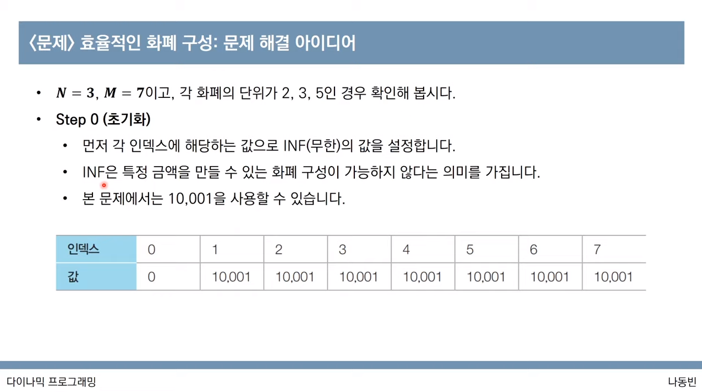

* 초기화
* 제일 처음 값인 0만 0으로 초기화해주고
* 나머지 값들은 모두 불가능하다는 의미로 현재 주어진 수 범위에서 나올 수 없는 값을 임의로 넣어준다.
* 이 문제에서는 10,001이 될 수 있음 (1<= M <= 10,000)

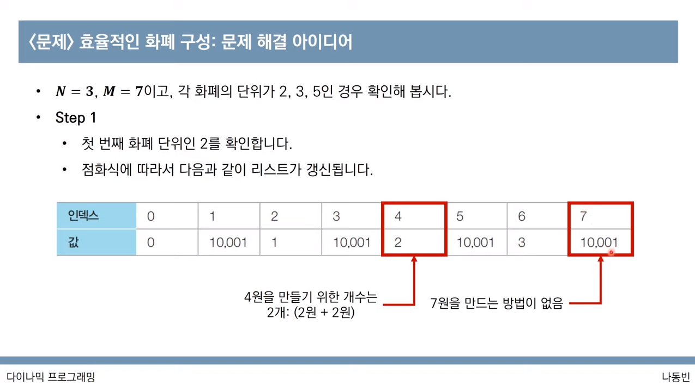

* 첫번째 화폐 단위인 2를 살펴본다.
* 각 화폐단위의 배수값은 모두 만들 수 있기 때문에 최소화폐금액 + 1 씩 하여 개수를 초기화해준다.
* 이 턴에서는 2, 4, 6, ... 등 2의 배수 금액들은 모두 개수가 업데이트 된다.

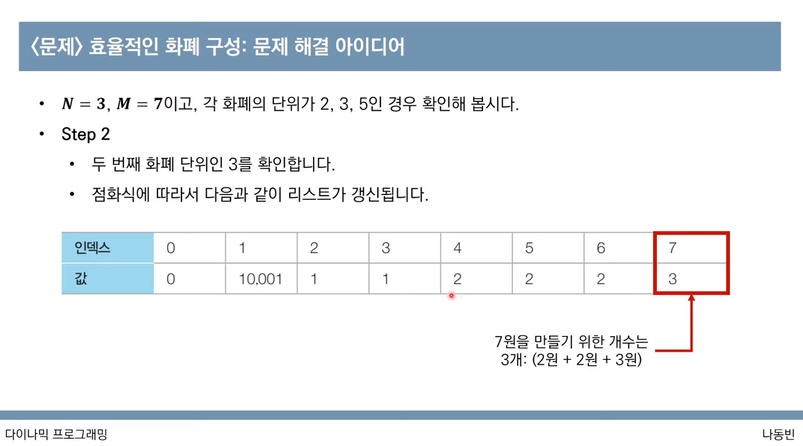

* 두번째 화폐 단위인 3을 점검한다.
* 3을 통해서 만들 수 있는 화폐 금액인 3, 6, ... 등을 업데이트 한다.
* 이 턴에서는 7도 초기화 될 수 있는데 7 의 세칸 앞인 4에서 3을 더하면 7을 만들 수 있기 때문에 3으로 업데이트 할 수 있다. (7 = 2+2+3)

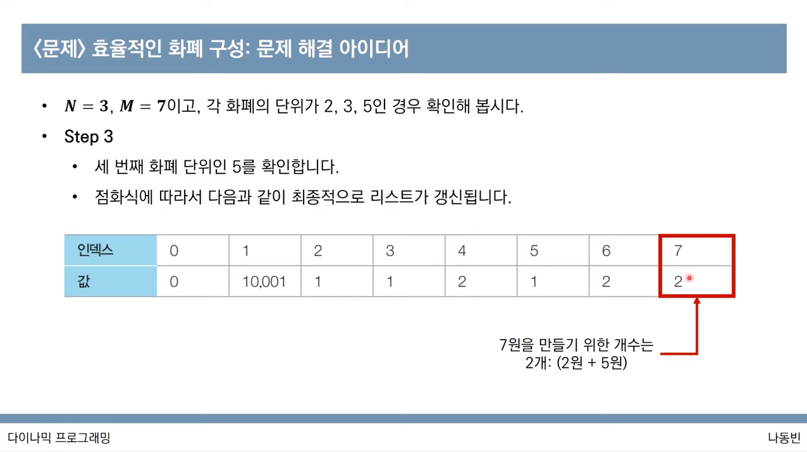

* 세번째 화폐 단위인 5를 점검한다.
* 5를 통해서 만들 수 있는 금액을 업데이트 하고
* 5를 통해서 개수를 줄일 수 있는 수들도 업데이트 한다.

> 결론적으로 7을 만들기 위한 최소한의 화폐 개수는 2개가 된다!

```python
 # 효율적인 화폐구성

# n : 화폐의 개수 
# m : 만들어야 하는 돈의 금액
# 화폐의 가치들 : values[]

n, m = map(int, input().split())

values = []
for i in range(n):
  values.append(int(input()))

d = [10001] * (m+1)
d[0] = 0

for i in values:
  for j in range(i, m+1):
    if d[j-i] != 10001:
      d[j] = min(d[j], d[j-i]+1)

if d[m] == 10001:
  print(-1)
else :
  print(d[m])


# input
# 2 15
# 2  
# 3
# output
# d = [0, 10001, 1, 1, 2, 2, 2, 3, 3, 3, 4, 4, 4, 5, 5, 5]
# 5
```

### 금광 문제

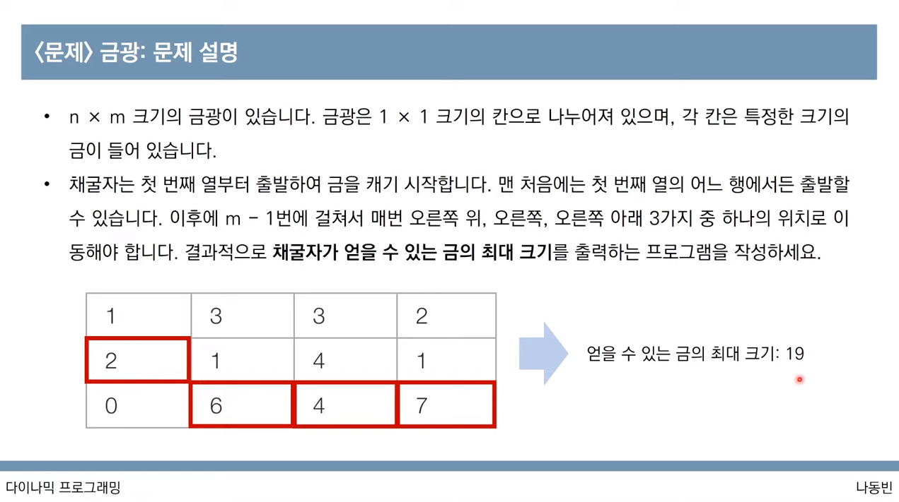

#### 조건

* 입력

```
2
3 4
1 3 3 2 2 1 4 1 0 6 4 7
4 4 
1 3 1 5 2 2 4 2 5 0 2 3 0 6 1 2
```

* 출력

```
19
16
```

#### 해결 아이디어

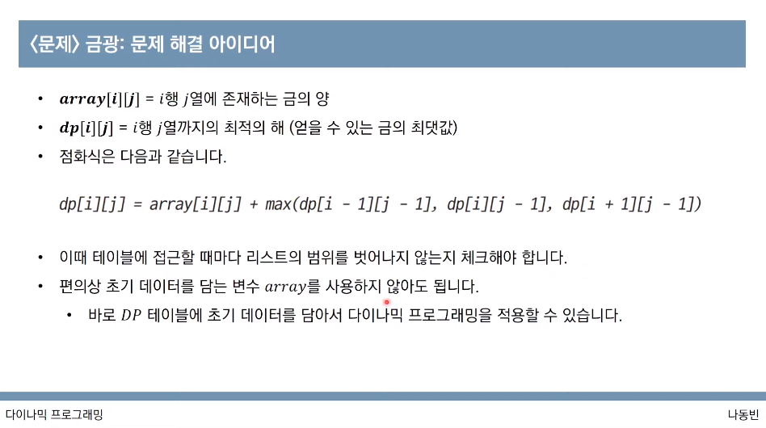 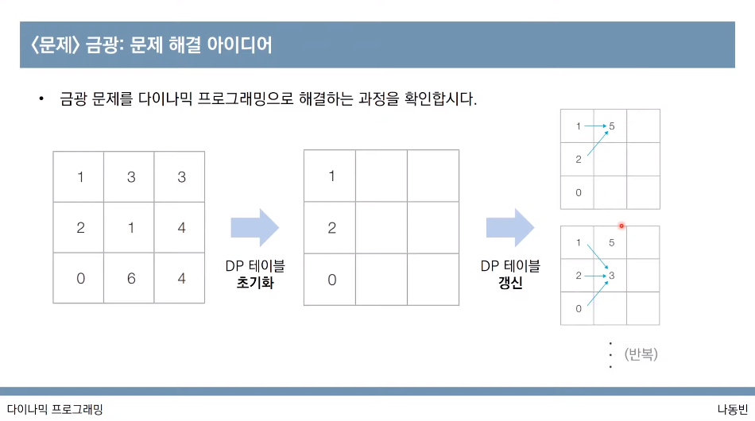

```python
# 금광문제

t = int(input())

def mining():
  goldmines = []

  n, m = map(int, input().split())
  nums = list(map(int, input().split()))
  idx = 0

  # dp table 초기화
  for i in range(n):
    goldmines.append(nums[idx:idx+m])
    idx += m

  # dynamic programming
  for j in range(1, m):
    for i in range(n):
      if i == 0: left_up = 0
      else: left_up = goldmines[i-1][j-1]

      if i == n - 1: left_down = 0
      else: left_down = goldmines[i+1][j-1]

      left =  goldmines[i][j-1]

      goldmines[i][j] = goldmines[i][j] + max(left_down, left, left_up)

  result = 0
  for i in range(n):
    result = max(result, goldmines[i][m-1])

  return result


for i in range(t):
  print(mining())


# 2
# 3 4
# 1 3 3 2 2 1 4 1 0 6 4 7
# 4 4 
# 1 3 1 5 2 2 4 2 5 0 2 3 0 6 1 2
```
