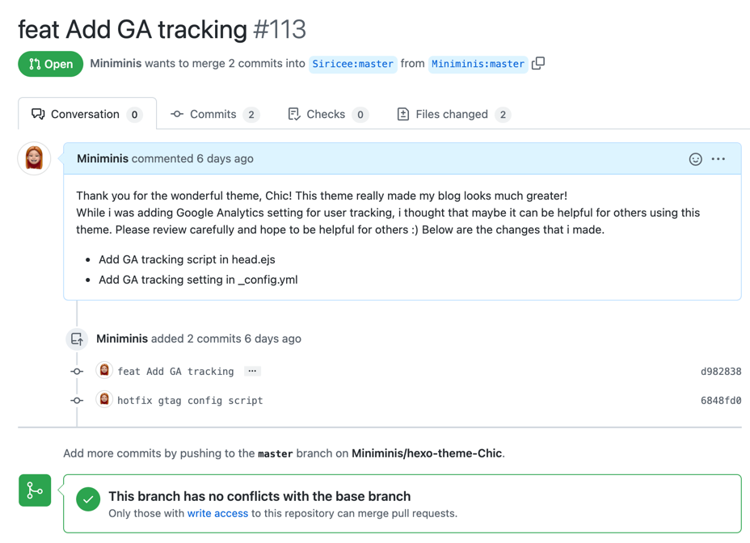

# 나의 첫 opensource contribution 경험기

개발자가 된 후, 오픈소스에 참여한다는 것은 나에겐 다소 먼 이야기처럼 느껴졌었다. 비전공자 출신인 내가 공헌할 수 있는 프로젝트는 그리 많지 않아보였고, 뭔가에 공헌하기에 나는 아직 너무도 부족해보였다. 그런데 개발을 하면 하나 둘 씩 가져다 쓰는 오픈소스 라이브러리를 커스텀해서 사용하는 일들이 생겼는데, 지금에서야 이런 부분들이 다른 개발자들에게도 유용할 수 있다고 생각되면 바로 contribution 할 수 있는 지점인 것 같다.

그러한 맥락에서 얼마 전, 처음으로 오픈소스에 PR을 날린 경험기를 공유해보고자 한다.

지금의 이 깃북 블로그를 구축하기 전, 나는 gitpage를 이용하여 블로그를 구축했었고, hexo framework 를 이용했다. hexo 내부에는 다양한 개발자 분들이 만들어 둔 각양각색의 테마들이 있는데, 당시 내가 사용했던 것은 바로 [Chic](https://github.com/Siricee/hexo-theme-Chic) 이라는 테마이다. 블로그 주인장의 개성을 잘 드러낼 수 있으면서 글의 가독성이 높되 너무 딱딱하지 않은 테마를 고르고 있었는데, 이 테마가 마침 눈에 들어왔고 얼른 적용을 해버렸다.

그런데 보통 hexo 테마들은 기본적으로 가지고 있는 Google Analytics 설정 옵션이 이 Chic 테마에는 없었다. 그야말로 빅데이터 시대인데, 내 블로그에 사람들이 어떻게 도달하고 얼마나 많은 사람들이 방문하며 어떤 글이 가장 인기있는지 궁금한 것은 너무 당연했다. 마침 GA 세팅하는 방법은 구글링 조금만 해보면 공식문서에 블로그글까지 친절하게 나오길래, 테마 내부의 소스코드를 일부 수정하여 이리저리 GA 태깅을 적용했다.

옛날 같았으면 혼자서 만-족 😊 하고 끝났을 것 같은데, 아무리 생각해봐도 이 기능은 나뿐만 아니라 이 테마를 이용하는 다른 사람들도 모두 유용하게 쓸 것 같았다. 그래서 이참에 나도 다른 개발자분들께 도움이 되는 일을 해보자고 마음먹고 오픈소스에 기여하기로 했다.

### 주니어 개발자가 오픈소스에 참여하는 5단계

> SoniaComp 님의 [주니어(초보) 개발자가 오픈소스 기여(컨트리뷰션) 하는 방법](https://soniacomp.medium.com/%EC%A3%BC%EB%8B%88%EC%96%B4-%EA%B0%9C%EB%B0%9C%EC%9E%90%EA%B0%80-%EC%98%A4%ED%94%88%EC%86%8C%EC%8A%A4-%EC%BB%A8%ED%8A%B8%EB%A6%AC%EB%B7%B0%EC%85%98-%ED%95%98%EB%8A%94-%EB%B0%A9%EB%B2%95-117e99540e2d) 글을 참고하여 아래와 같은 5단계로 진행을 할 수 있었다.

1. 오픈소스의 Github repository 를 일단 fork 한다.
2. fork 한 repository 를 로컬 환경으로 git clone 한다.
3. 프로젝트 내부에서 수정하고 싶은 코드를 수정 및 추가한 뒤, `git add` -> `git commit` -> `git push` 를 진행한다.
   1. 여기까지되면 내 계정의 repository 에 변경사항이 추가된 상태이다.
4. github 에서 방금 commit 한 repository 로 이동하여 pull request 를 생성한다.
5. pull request 작성 후, 확인을 누른다.

위의 링크를 참고하면 스크린샷과 함께 더 자세한 과정을 볼 수 있으므로 참고해주시길 바란다. 진행 완료되면 아래와 같이 내가 open 한 pull request 를 확인할 수 있다.

### 결과는?

나의 큰 실수지만, 이전의 PR 들을 확인하지 않은채 그냥 PR 을 날렸다. 자세히 살펴보니 (중국어로 적혀있어서 미쳐 헤아리지 못했지만), 이전에 이미 GA 기능을 추가했던 PR 이 존재했고, 거절당한 이력이 있었다. 파파고 번역기를 통해 돌려보건데 테마를 만든 개발자분은 통계기능이 블로그에 꼭 필수적인 기능이 아니라고 생각해서 해당 commit 을 merge 하지 않고 홀딩하고 있는 것 같았다. 이번주 초에 PR 을 날렸는데 여전히 확인되지 않은 것을 보면, 아마 거절당할 확률이 높을 것 같다 😢

### 느낀점

* 오픈 소스 참여시에는 우선 그간 history 확인부터 하기!
* 첫번째에 실패했다고 좌절하지 말고 내가 공헌할 수 있는 것 끊임없이 찾아서 꼭 오픈소스 공헌해보기
* 만나보지 않은 전세계의 개발자들과 무엇인가를 함께하고 소통한다는 건 너무나도 ... 재밌쟈나 😆
