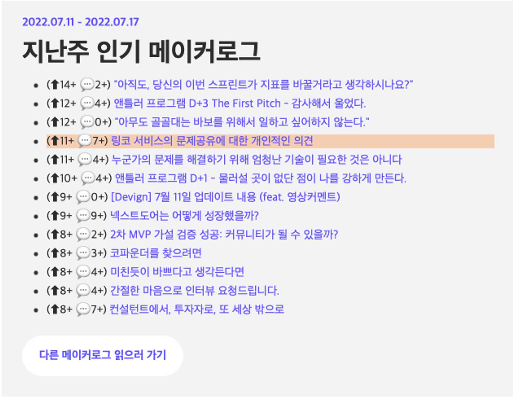
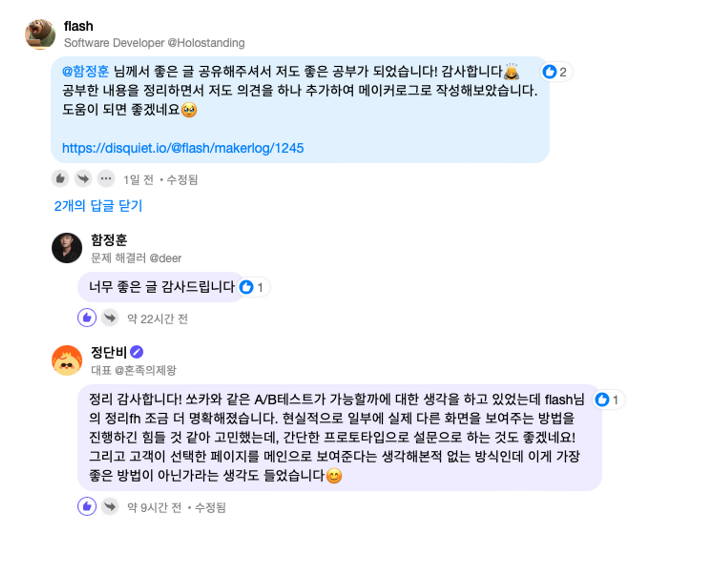

# Disquiet PM/PO 스터디, 쿨피스

<figure><figcaption></figcaption></figure>

## 기간

* 2022.07 - 2022.08

## **역할**

* ‘Building in Public’ 정신으로 36명의 사람들과 함께 초기 멤버로 참여하여 스터디 초기 단계를 구축
* `flash` 라는 닉네임으로 디스콰이엇 내 메이커들이 고민을 올리면 이에 대해 메이커 관점에서 해결책을 제시하는 활동을 진행함

## **성과**

### 1) [<링코> 서비스의 문제공유에 대한 개인적인 의견](https://disquiet.io/@flash/makerlog/1140)

* 총 168회 조회수, 11개의 upvote, 8개의 댓글을 기록
* 링코 서비스의 궁극적인 목표가 `사용자 -> 링코 -> 원본 URL 페이지` 로 이어지는 흐름에서의 중간다리 역할을 하고자 하는 것이라는 점에 착안하여 대화 없이 링크만 주고 받는 카카오 오픈 단톡방에서 링코 서비스로 요약된 컬렉션을 공유하여 사용자들을 유입시키는 방법을 제안
* **문제게시자인 링코 서비스의 대표님으로부터 문제 해결에 큰 도움이 되었다는 피드백**
* [디스콰이엇 뉴스레터](https://stibee.com/api/v1.0/emails/share/hBRs2GUbFdW7yxIHvJCGFPlVS2Vk0Mk=)에 지난주 인기 메이커로그로 소개됨

<figure><figcaption>
대화 없이 링크만 주고 받는 카카오 오픈 단톡방에서 링코 서비스로 요약된 컬렉션을 공유하여 사용자들을 유입시키는 방법을 제안
</figcaption></figure>

### 2) [<혼족의제왕> 서비스 고민에 대한 개인적인 의견](https://disquiet.io/@flash/makerlog/1245)

* 총 72회의 조회수, 7개의 upvote 를 기록
* 문제 개시자인 ‘혼족의제왕’ 대표님으로부터 문제 해결에 도움이 되었다는 피드백

## 관련링크

* [디스콰이엇, 링코 서비스의 문제공유에 대한 개인적인 의견](https://disquiet.io/@flash/makerlog/1140)
* [디스콰이엇, <혼족의제왕> 서비스 고민에 대한 개인적인 의견](https://disquiet.io/@flash/makerlog/1245)
