# AWS CodePipeline 으로 배포 자동화하기 (1)

올해 처음으로 상용 서비스를 무의 상태에서 바닥부터 구축해볼 수 있는 경험을 했다. 그 과정에서 당연히 경험과 실력이 부족하기에 여러가지 어려움도 겪었었고, 아직 눈에 밟히는 개선해야할 점도 수두룩하다. 약 6개월간 서비스를 정신없이 운영해오면서 가장 마음에 걸리고 불편하다고 생각했던 점은 바로 `배포 프로세스 자동화`이다.

## 0. 왜?

배포 자동화를 구축하기 전, 운영 서버에 개발 완료된 코드를 배포하는 나의 과정은 다음과 같았다.

1. 배포를 위해서 프로젝트를 jar file 로 빌드한다. (`clean` & `bootJar build`)
2. filezilla 를 켜서 원격으로 운영 서버에 접속한다.
3. 현재 running 중인 스프링 프로세스가 있다면 종료시킨 뒤, 해당 jar file 을 이름 변경하여 history 로 보관한다. (대략 3개정도만 보관)
4. 로컬 컴퓨터에서 빌드된 jar 파일을 원격 서버로 전송한다.
5. 새로운 버전의 jar 파일을 원격 서버 내에서 deploy script 로 실행한다.
6. 로그 모니터링 하면서 정상적으로 서버가 배포되었음을 확인한다.


위와 같은 프로세스 상에서는 아래와 같은 문제점이 있었다.

1. 일단 배포 과정이 매우 귀찮다.
   1. 사실 매우 번거로운 작업이 아닐 수 없다. 그래서 개발기간에는 작업 내역을 쌓아두고 일정 주기를 두고 하루에 한번 혹은 오전과 오후에 각각 한번씩 배포를 하곤 했었다.
   2. 배포를 하기 위해서 intelliJ, terminal, filezilla 등의 3개의 창을 띄워야 하고 여기저기 왔다갔다 개발자가 매우 분주하게 움직여야한다.
2. 개발 소스 코드 최신화 주기가 길어지게 된다.
   1. 사소한 수정사항들은 그냥 쌓아두고 더 큰 배포건에 포함시키는 등 최신화된 소스코드를 반영시키기는 주기가 길어지게 되었다.
   2. 그러다보니 이미 수정이 완료된 작업임에도 프론트 개발자 분은 최소 반나절 뒤에나 변경 내용을 확인하실 수 있게 된다.
   3. 스타트업의 특성상 개발과 업데이트가 정말 넓은 범위에서 자주 바뀌곤 하는데, 개발 과정에서 빠르고 쉽게 배포하는 것이 필요하다고 느꼈었다.
3. 실수할 수 있는 확률이 높다.
   1. 이리저리 개발자가 수동으로 해야하는 것들이 많으니 당연히 실수할 수 있는 확률이 높아지게 된다.
   2. 최대한 사람(개발자)가 직접 조작해야하는 내용들은 줄여나가는데 맞다고 생각이 들었다.
4. 배포 버전 관리가 안됨
   1. 계속해서 jar file 을 쌓아두고 있자니, 어떤 버전이 어떤 개발내용을 담고있고, 문제가 있었던 버전이 무엇이었는지 한눈에 확인하기가 어려웠다.

그래서 여러 방면으로 spring boot project 에 배포 자동화를 적용할 수 있는 방법들을 알아보는데, 대부분 외부의 유료서비스를 이용해야하거나, 아직 개발팀 규모가 작은 우리 조직에 맞지 않게 너무 초기 설계에 리소스가 많이 투여되는 방법들 뿐이었다. (사실은 최초 개발때부터 배포 자동화를 구축하고 싶었지만 못했던 이유도 여기에 있었다.)

그러던 중, 이번에도 이동욱 개발자님의 포스팅에서 해답을 찾을 수 있었다. 늘 많은 도움을 받고 있지만, 이번에도 역시! [동욱님의 AWS로 배포하기 시리즈 포스팅](https://jojoldu.tistory.com/281?category=777282)을 하나씩 따라하며 마주했던 이슈 및 해결방법들을 덧붙여서 아래에 정리를 하고자 한다.


## 1. 시작하기 전에

나는 모든 일에 있어서 전체적인 그림을 먼저 그리고 필요한 요소를 하나씩 채워넣는 방식을 좋아한다. 요소들에 먼저 집중을 하게 되면 내가 이걸 왜하고 있었는지, 이 요소가 전체 그림에서는 어떤 역할을 하는지 종종 까먹을 때가 있기 때문이다. 그래서 동욱님의 글을 읽고 내가 이해한 방식으로 글을 쓰고자 하는데, **1) 파이프라인의 전체 뼈대를 구성하면서 큰 그림을 그리고 2) 각 요소들을 채워넣는 방식**으로 진행을 하려고 한다. 이번 포스팅에서는 **1) 전체 AWS Pipeline 의 큰 프로세스를 훑어보고 2) 소스, 빌드, 배포의 파이프라인을 설정하는 부분까지 진행해보고,** 다음 포스팅을 통해서 세부 추가 설정들 및 파이프라인 테스트를 통해 제대로 동작하는지 검증을 진행해보겠다.


### 1-1. AWS IAM 먼저 이해하기

AWS 서비스를 사용하면서 IAM 에 대해서 따로 공부하지 않고 필요할때만 구글링해서 사용했었는데, 동욱님 포스팅을 보면서 IAM 설정 부분에서 이해가 안되는 부분들이 있었다. 그래서 추가적으로 IAM 에 대해서 공부하고 별도의 포스팅([AWS IAM가 뭔소린지 모르겠다면](https://blog.mhson.world/2021/12/20/aws/aws-iam/)) 에 정리를 했다. 본격적으로 파이프라인 구축을 시작하기 전에 공부해보면 좋을 것 같다.


### 1-2. 파이프라인 큰그림 이해하기

우선 우리가 하고 싶은 것은 다음과 같다.

1. 소스코드에 작업내역을 커밋 한다.
2. 작업 내역이 적용된 최신 소스코드를 원격 repository 에서 가져온다.
3. 코드빌드를 한다.
4. 원격 서버(EC2) 에 배포를 한다.

이 모든 것들이 자동화 되어야 하는데, AWS의 CodePipeline 이 이와 같은 모든 과정을 도와준다.

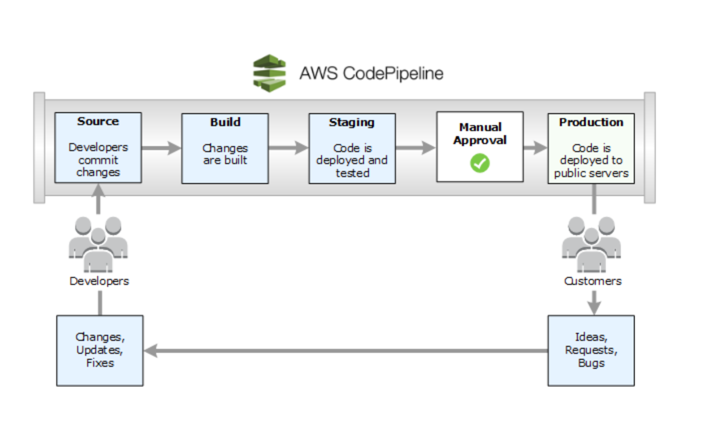

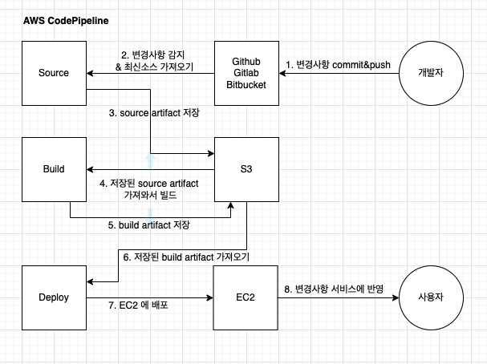

하나하나 찬찬히 보자면,

1. 우선 개발자는 소스 리포지토리에 변경사항을 커밋한다.
2. CodePipeline 은 리포지토리의 변경된 내용을 감지한다. (Source 단계)
3. 원격 레포지토리로부터 가져온 소스는 S3 버킷에 Artifact 형태로 저장된다.
4. S3 로부터 소스를 가져와 빌드를 시작한다. 그 과정에서 테스트를 구상하여 문제없이 코드가 합쳐지는지 확인한다. (Build 단계)
5. 빌드가 완료된 결과물은 다시 S3 버킷에 BuildArtifact 형태로 저장된다.
6. 저장된 빌드 결과물을 S3로부터 다시 가져와 배포 프로세스를 시작한다.
7. 배포 과정이 성공적이면, EC2 인스턴스에 정상적으로 배포가 된다. (Deploy 단계)

우리 조직은 아직 규모가 작고 관리포인트를 AWS 하나로 용이하게 하기 위하여 AWS 내부의 서비스를 이용하여 구성하였지만, source, build, staging, production 의 각 단계는 jenkins 등 외부 서비스와 연동해서도 구성할 수 있으며, 사용자가 어떻게 커스텀하느냐에 따라서 단순한 프로세스가 될수도, 복잡해질수도 있다.

그럼, 파이프라인을 생성하면서 그 과정을 이해해보도록 하자.


## 3. 파이프 라인 설정

새 파이프라인을 생성하면 다음과 같은 화면을 볼 수 있다.

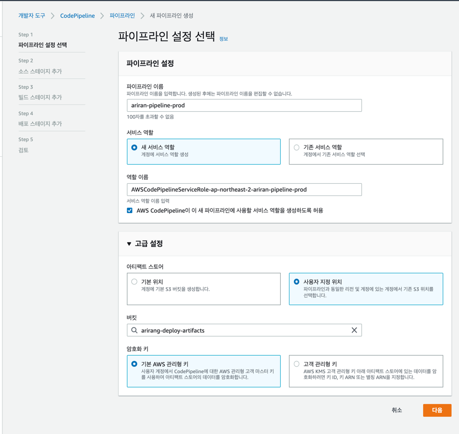

1. 파이프라인 이름은 추후에 바꿀 수 없으므로 신중하고 명확하게 이름을 입력해야한다.
2. 서비스는 새로운 역할을 생성하도록 체크한다. 서비스 역할 이름 역시 신중하게 적도록 한다.
3. 고급설정에서는 소스와 빌드된 코드가 저장되는 아티팩트 저장 위치를 고를 수 있다. 기본위치를 선택할 경우, pipeline 상에서 S3 쪽에 자동으로 버킷을 생성하게 되고, 사용자 지정위치를 선택할 경우에는 미리 본인이 생성해둔 버킷 상에 아티팩트들이 저장된다. 이 경우에는 본인이 S3 버킷을 직접 생성하고나서 연결시켜야한다.
4. 암호화 키의 경우는 기본설정 그대로 기본 AWS 관리형 키를 선택한다.

### 3-1. 소스 스테이지&#x20;

파이프라인이 설정 완료되면, 소스코드를 어디서 가져올지 설정한다. 우리 팀의 경우, Bitbucket 을 사용하고 있으므로 Bitbucket 과 연결하는 과정을 밟을 것이다.&#x20;

> 2023.04 업데이트 : Github version 추가&#x20;

#### 3-1-1. Bitbucket 이용시&#x20;

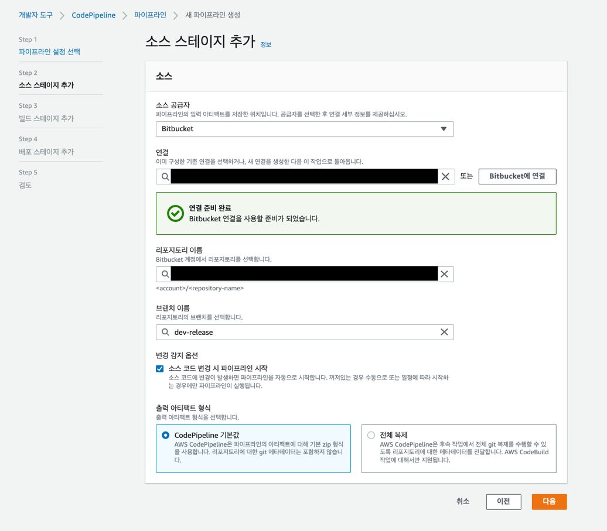

1. 소스 공급자는 Bitbucket 으로,
2. 연결 > `Bitbucket 연결`을 클릭하면
   1. 클릭하면 팝업창이 뜬다.
   2.  연결 이름을 적고 연결을 클릭한뒤 > Bitbucket 새 앱 설치를 클릭 > 권한요청팝업에서 권한을 부여한다.

       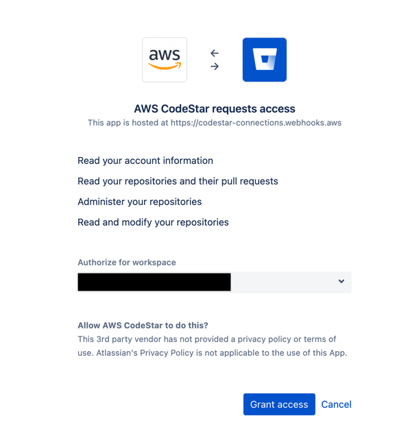
   3. 정상적으로 Bitbucket 내부의 워크스페이스와 연결되면 본래의 CodePipeline 화면으로 돌아온다.
3. 리포지토리 이름
   1. 연결하고자 하는 repository 이름을 목록에서 선택하고 (정상적으로 연결되었다면 워크스페이스 내 레파지토리 목록이 보인다.)
   2. 연결하고자 하는 브랜치 이름도 선택한다. (역시 정상적이라면 생성된 브랜치 목록도 노출된다.)
   3. 변경감지옵션 : 소스코드 변경 시, 파이프라인이 시작되도록 변경감지옵션을 체크해두고 (기본설정유지)
   4. 출력 아티팩트 형식은 CodePipeline 기본값으로 체크한다. (기본설정유지)


#### 3-1-2. Github 이용시&#x20;

> 2023년 4월 업데이트&#x20;

github 를 소스 공급자로 연결하려면 소스공급자 드롭다운에서 Github(버전2)를 선택한다.&#x20;

버전1도 있긴 한데, 선택할 경우, 버전2로 진행할 것을 권장하는 메시지를 마주하게 된다.&#x20;

<figure><figcaption></figcaption></figure>

Github(버전2)를 선택하게 되면, 아래와 같은 화면을 마주한다. "Github 연결" 버튼을 클릭하여 연결을 진행해주면 된다. &#x20;

<figure><figcaption></figcaption></figure>

작은 팝업이 뜨고, Github 연결 내용이 나온다.&#x20;

* 연결 이름에는 적당히 식별할 수 있는 이름을 적고&#x20;
* 새 앱설치를 눌러서 Github 계정과 연결해준다.&#x20;
* 기존에 연결된 Github 계정이 있다면 아마 목록상에서 뜰 것이므로 목록에서 선택하면 된다. &#x20;

<figure><figcaption></figcaption></figure>


일단 앱 연결이 완료되면 아래와 같이 레포지토리 이름, 브랜치이름을 선택해준다.&#x20;

* 우리는 소스코드가 변경되면 바로 파이프라인이 시작되도록 할 것이므로 체크박스에 체크한다.&#x20;
* 출력 아티팩트 형식은 기본값으로 그대로 둔다.&#x20;

<figure><figcaption></figcaption></figure>

#### 3-1-3. 이슈) Github Organization 계정에서 Private Repository 를 연결하고자 하는 경우&#x20;

\-


### 3-2. 빌드 스테이지

소스코드를 가져온 뒤에는 가져온 소스로 빌드를 해야한다. 빌드 공급자를 AWS CodeBuild 로 선택하고 리전은 각 상황에 맞게 선택한 뒤, 프로젝트 생성 버튼을 클릭해 빌드 프로젝트를 생성한다.

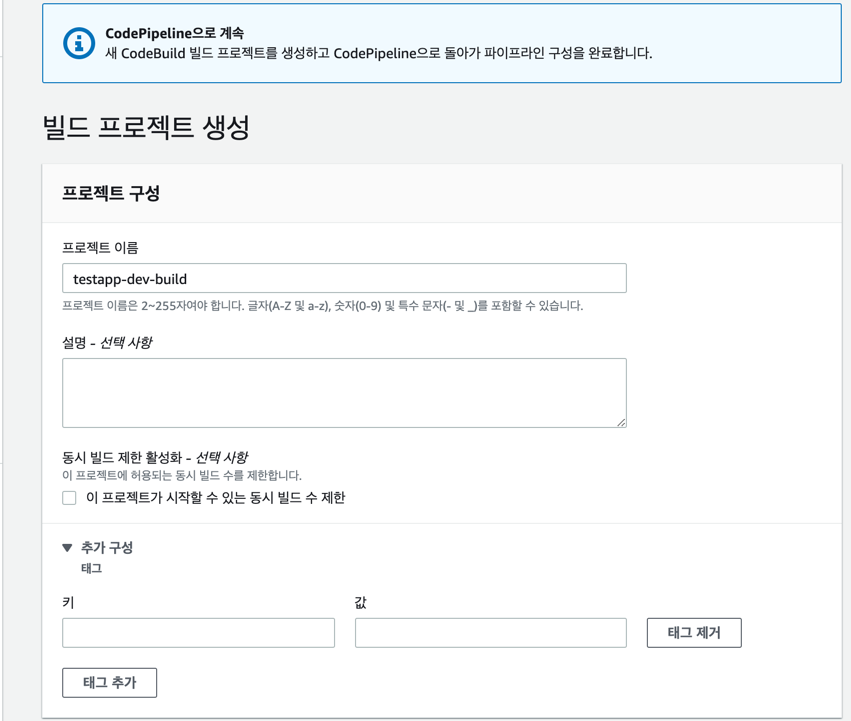

#### 3-2-1. 프로젝트 구성

* 프로젝트 이름 : 서버가 많아질수록 헷갈릴 수 있기에, 나는 AWS 내 모든 리소스에 대한 이름을 `프로젝트이름-환경-리소스이름-(리전)` 규칙으로 하고 있다. 현재 앱은 테스트용이므로, testapp, 개발환경이므로 dev, aws codebuild project 이므로 build 라고 네이밍을 했다. 본인만의 규칙이 있다면 일관되게 적용하여 관리하도록 하면, 추후에 관리할 리소스가 많아져도 헷갈리지 않을 수 있는 것 같다.
* 기타 다른 사항은 추후 필요하면 적용하도록 한다. 패쓰!


#### 3-2-2. 환경

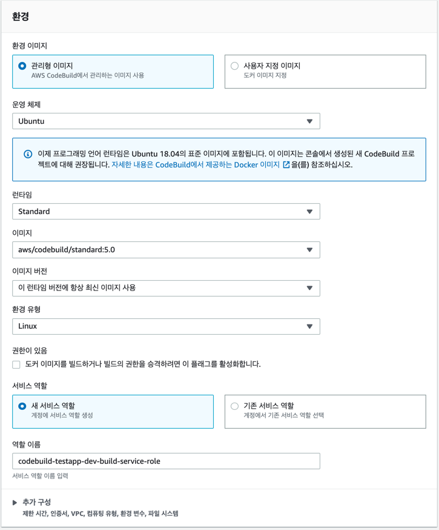

* 환경은 위와같이 설정을 한다.
* 서비스 역할 : 새로운 서비스 역할을 생성해준다.
* 기타 추가 구성은 별도로 건드리지 않는다.


#### 3-2-3. BuildSpec, 배치구성, 로그


* buildspec : 코드가 빌드될때 수행될 명령어들을 어떤 방식으로 관리할지를 결정하는 부분인데, 버전관리를 위하여 파일형식으로 관리하는 것이 좋다고 한다.
  * buildspec 파일 사용을 클릭하게 되면 파일명을 입력하도록 되어있는데, 기본적으로는 소스코드의 루트 디렉토리에서 buildspec.yml 파일을 찾으므로 파일명을 그대로 사용한다면 입력할 필요없지만, 만약 파일명을 다르게 사용한다면 파일명을 명시적으로 입력해야한다.
    * 예) 소스 레포지토리 내 루트 디렉토리에 buildspec.yml 이 없는 경우, \[rootDir]/buildspec.yml 이라고 명시해주어야 한다.
    * 만약 빌드명령삽입을 클릭한다면 편집기를 통해서 빌드명령을 삽입할 수 있도록 되어있다.
      *   구성항목들

          ```yaml
           version: 0.2

           #env:
           #variables:
                # key: "value"
                # key: "value"
           #parameter-store:
                # key: "value"
                # key: "value"
           #secrets-manager:
                # key: secret-id:json-key:version-stage:version-id
                # key: secret-id:json-key:version-stage:version-id
           #exported-variables:
                # - variable
                # - variable
           #git-credential-helper: yes
           #batch:
           #fast-fail: true
           #build-list:
           #build-matrix:
           #build-graph:
           phases:
           #install:
               #Ubuntu 표준 이미지 2.0 이상을 사용하는 경우 런타임 버전을 지정해야 합니다.
               #런타임 버전을 지정하는 경우 Ubuntu 표준 이미지 2.0 이외의 이미지를 사용하면 빌드에 실패합니다.
               #runtime-versions:
                 # name: version
                 # name: version
               #commands:
                 # - command
                 # - command
           #pre_build:
               #commands:
                 # - command
                 # - command
           build:
           commands:
           # - command
           # - command
           #post_build:
               #commands:
                 # - command
                 # - command
           #reports:
           #report-name-or-arn:
               #files:
                 # - location
                 # - location
               #base-directory: location
               #discard-paths: yes
               #file-format: JunitXml | CucumberJson
           #artifacts:
           #files:
               # - location
               # - location
           #name: $(date +%Y-%m-%d)
           #discard-paths: yes
           #base-directory: location
           #cache:
           #paths:
               # - paths
          ```
* 배치구성, 로그 등은 추후 필요할때 다시 설정하도록 하고 현재는 기본설정 그대로 둔다.

구성이 완료되면 다음과 같은 화면일 것이다.

검토 후 이상이 없다면, 다음 배포 스테이지로 넘어간다.

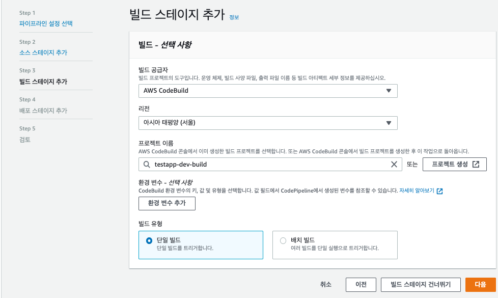

### 3-3. 배포 스테이지 건너뛰기

지금까지 파이프라인 설정을 통해서 원격 레포지토리에서 소스를 가져오고 (소스 스테이지), 가져온 소스를 빌드하는 설정까지 완료했다. (빌드 스테이지). 이제 남은 부분은 빌드된 어플리케이션을 EC2 서버로 배포하는 것이다.

배포 스테이지의 경우 파이프라인 상에서 바로 배포 어플리케이션을 생성할 수 있도록 제공해주지 않고 있다. 따라서 해당 부분은 `배포 스테이지 건너뛰기` 를 통해 우선 스킵하고 추후에 파이프라인에 다시 넣도록 하자.


**건너뛰기?**

* 파이프라인 설정을 할 때에는 총 3개의 스테이지 소스, 빌드, 배포 스테이지를 연결해 설정해주어야 하는데, 이 중 두 개의 스테이지만 설정하면 나머지 1개는 이후에 설정할 수 있도록 건너뛰기 기능을 제공해준다.
* 당장 준비가 되지 않아도 파이프라인 뼈대만 잡아두고 나중에 끼워넣어도 되는 셈!


### 3-4. 검토

마지막 검토단계를 통해서 앞서 설정한 내용이 잘 구성되었는지 확인한 뒤, 파이프라인 생성을 클릭한다.


### 3-5. 배포 스테이지 추가하기

파이프라인이 생성 완료되면 아까 스킵하고 건너뛴 배포 단계를 추가하기 위해 배포 어플리케이션 생성이 필요하다. 이를 위해서 우선 CodeDeploy 용 역할을 생성하는 것이 필요하다. 이 역할을 통해 AWS CodeDeploy 서비스는 배포역할을 가지고 EC2 에 접근하여 배포를 수행할 수 있다.


#### 3-5-1. IAM > CodeDeploy 용 역할 생성하기

IAM 으로 이동하여 역할을 생성한다.

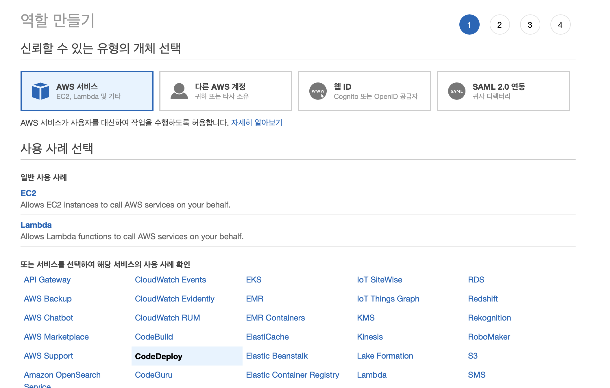

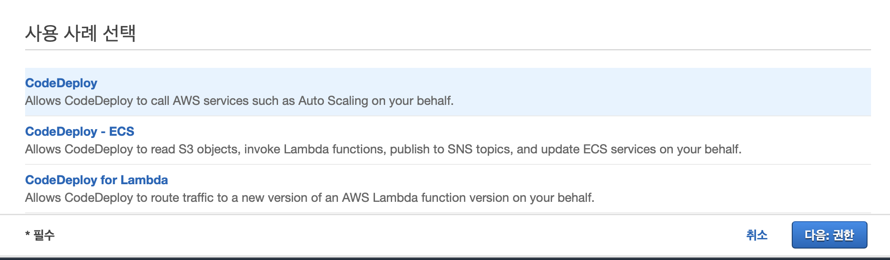

* CodeDeploy 를 선택하고 다음으로 이동한다.

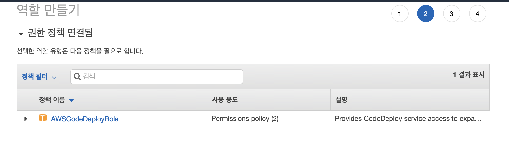

* CodeDeploy 역할이 제대로 노출되는지 확인한다.

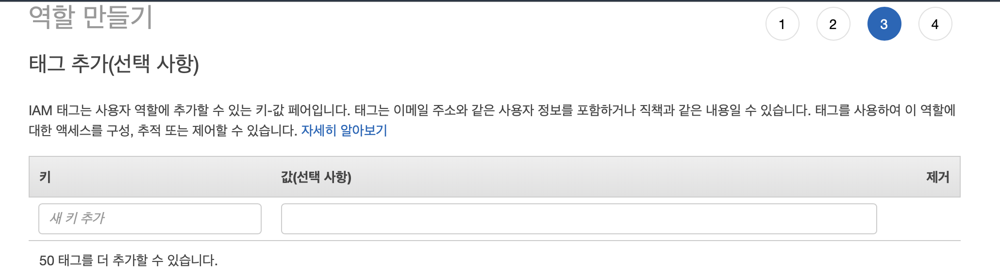

* 태그를 추가하고자 하면 추가한다.

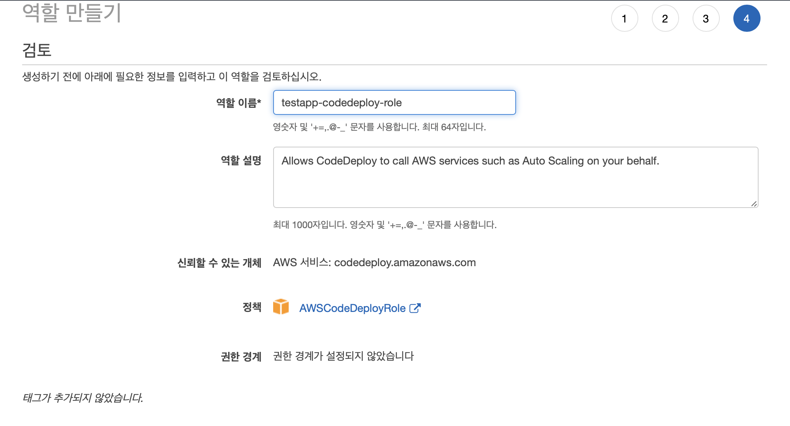

* 역할이름을 추가하고 만들기를 완료한다.


#### 3-5-2. 배포 어플리케이션 생성하기

필요한 역할도 만들었으니 이제 CodeDeploy 어플리케이션을 생성해보자. CodeDeploy > 어플리케이션 생성을 클릭하면 아래와 같이 화면이 뜬다.

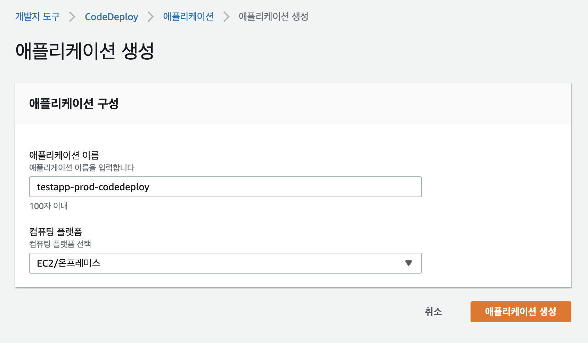

* 어플리케이션 이름과 배포할 컴퓨팅 플랫폼을 선택하고 어플리케이션을 생성한다.


#### 3-5-3. 배포 그룹 생성하기

배포 어플리케이션을 생성한 뒤에는 어디에다가 배포를 할지 타겟을 설정해주어야 하는데, 그것이 바로 배포 그룹이다. 배포 그룹을 생성해보자.

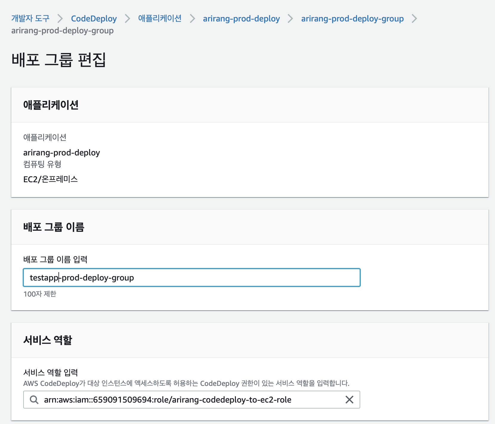

* 배포 그룹 이름을 입력하고 방금 IAM 에서 생성한 서비스 역할을 입력한다.

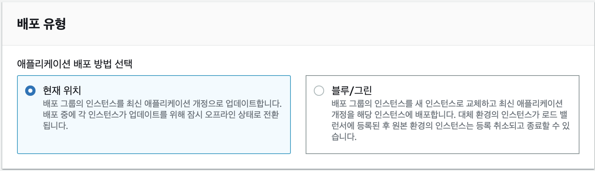

* 배포유형은 현재위치로 설정하고

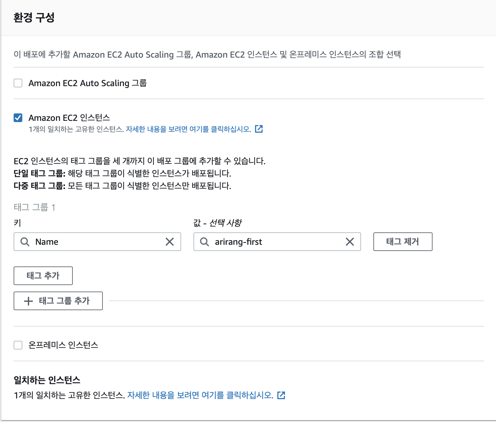

* 환경구성에서는 배포할 EC2 서버를 선택해준다.

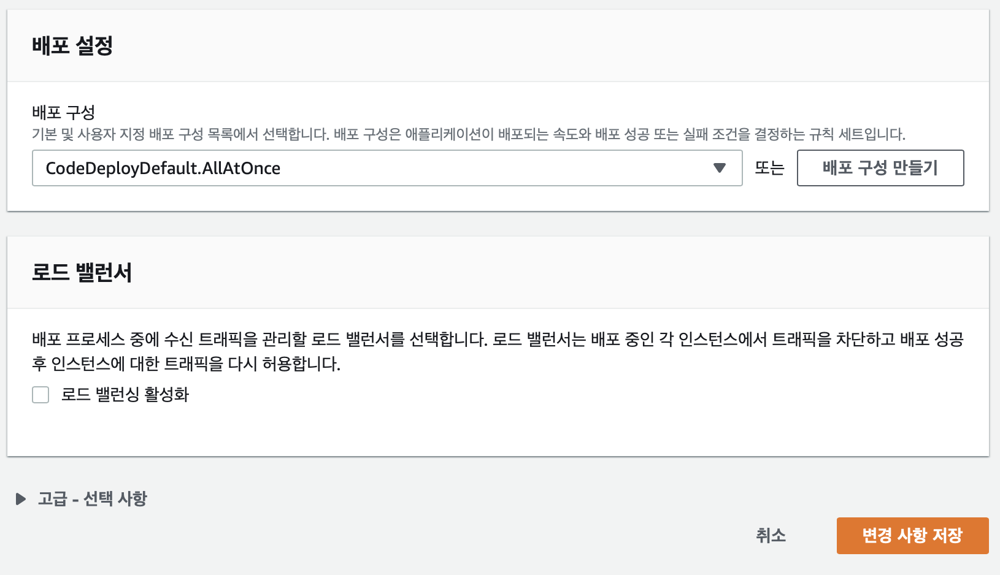

* 배포설정에는 기본설정 그대로 진행한다. 고급 선택사항 역시 기본설정 그대로 유지한다.
  * 배포구성 : AllAtOnce
  * 로드밸런서 : 비활성화
  * 트리거 : 없음
  * 경보 : 없음
  * 롤백 : 롤백 비활성화


#### 3-5-4. 파이프라인에 배포 스테이지 추가하기

배포 앱도 생성했으니, 아까 누락했던 배포 스테이지를 추가해보자.

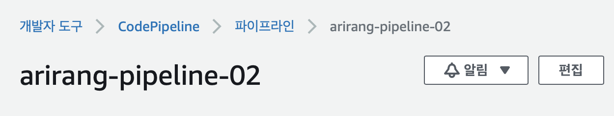

* 파이프라인 페이지에서 편집을 클릭한다.

위의 과정을 그대로 따라왔다면 현재 Source - Build 까지만 스테이지가 구성되어있을 것이다.

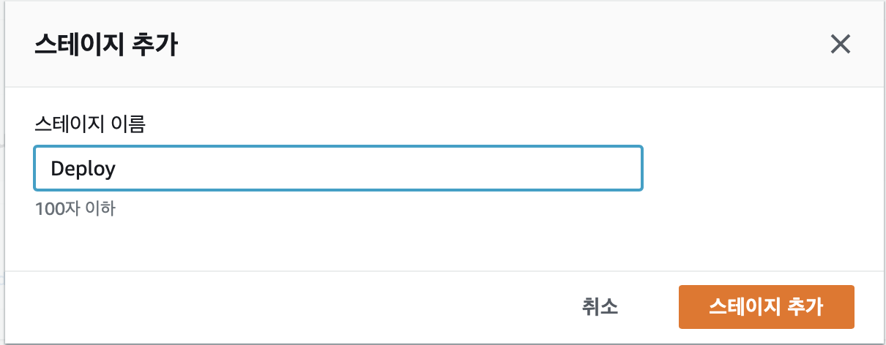

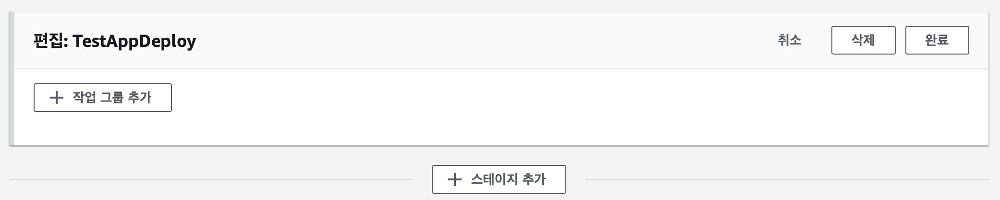

* 스테이지 추가를 클릭하여 Deploy 스테이지를 추가하고 작업 그룹 추가를 클릭한다.

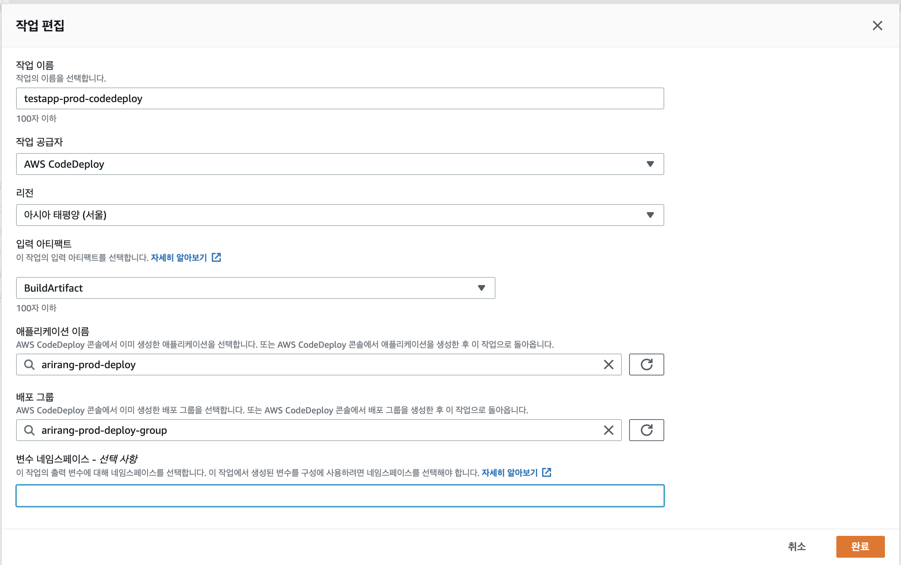

* 작업이름 등 정보를 입력한다.
* 작업 공급자는 AWS CodeDeploy로,
* 리전은 서울로 선택한다.
* 입력 아티팩트의 경우, 완료된 빌드 작업 결과물을 가지고 배포를 시작할 것이므로 BuildArtifact 를 선택해준다.
* 위에서 생성한 배포 어플리케이션, 배포그룹을 선택한 뒤, 완료를 눌러 추가를 마무리 한다.

## 4. 정리

지금까지 AWS CodePipeline 의 뼈대를 구성해보았다. 큰 그림에서 프로젝트 - 빌드 - 배포의 과정을 훑어보았고 각 단계의 구성도 마쳤다. 다음편에서는 직접 파이프라인을 실행하면서 각 단계별로 제대로 동작하는지 확인해보고 필요한 추가 세부 구성도 마무리를 하도록 하겠다.
