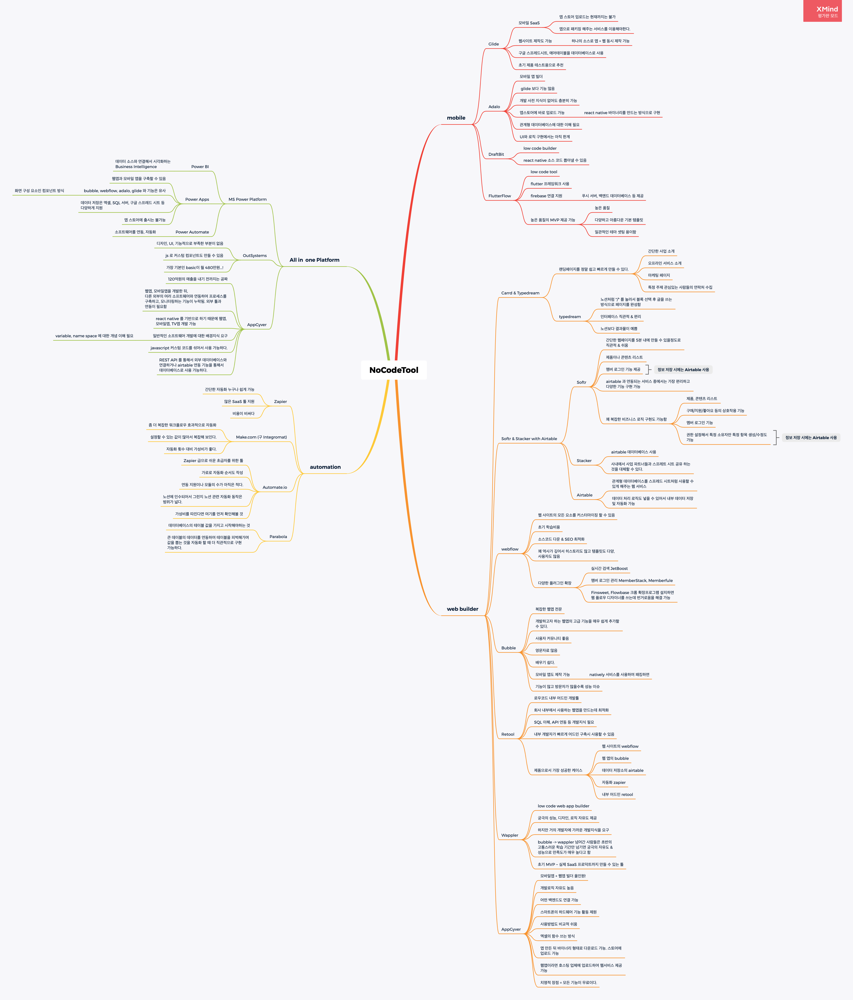

# 노코드 서비스 관련 링크 & 서비스 목록

## 참고

* [일잘러 장피엠](https://www.youtube.com/@jangpm/videos)
* [한국 노코드 커뮤니티](https://www.nocodekorea.org/)
* [https://tkim.co/](https://tkim.co/)
  * 젠텔카스텔, 노코드, 비즈니스 관련 인사이트&#x20;
  * [노코드: 개발자 없이 소프트웨어 개발을 할 수 있는 14가지 툴](https://tkim.co/2020/04/19/no-code/)
* [문과생이 추천하는 노코드(Nocode) 툴 탑 5](https://www.waveon.io/blog/no-code-tool-recommendation)
* [2023년 최고의 노코드 개발 도구](https://yozm.wishket.com/magazine/detail/1819/)&#x20;
* [노코드 에이전시](https://www.nocodeagency.kr/nocodelist)&#x20;
  * 국내 최초 노코드/로우코드 프로젝트 수행전문 노코드에이전시에서 정리한 국내 외 노코드 서비스 리스트
  * [노코드 전문가로 지원하기도 가능!](https://www.nocodeagency.kr/apply)
* [노 코드·로우 코드 개발 플랫폼 툴 총 정리 (2023년)](https://www.elancer.co.kr/blog/view?seq=78)

## 서비스 목록&#x20;

> 노코드 서비스를 하나의 맵으로 정리해보았다. 계속 업데이트 될 예정&#x20;

<figure><figcaption></figcaption></figure>

* [웨이브온](https://www.waveon.io/?utm\_campaign=owned\_media\&utm\_source=blog\&utm\_medium=owned\_traffic\&utm\_term=0313\_no-code-tool-recommendation)
  * 국내 노코드 툴&#x20;
  * 심리테스트 제작시 많이 활용&#x20;
* 익스텐션 데브&#x20;
  * 크롬 확장프로그램을 만들 수 있게 해주는 로우 코드 프로그램&#x20;
* 프리뷰드&#x20;
* NoCode API&#x20;
* 테일즈&#x20;
  * 220개 이상의 구성요소가 포함된 타일윈드 전용 페이지 빌더&#x20;
