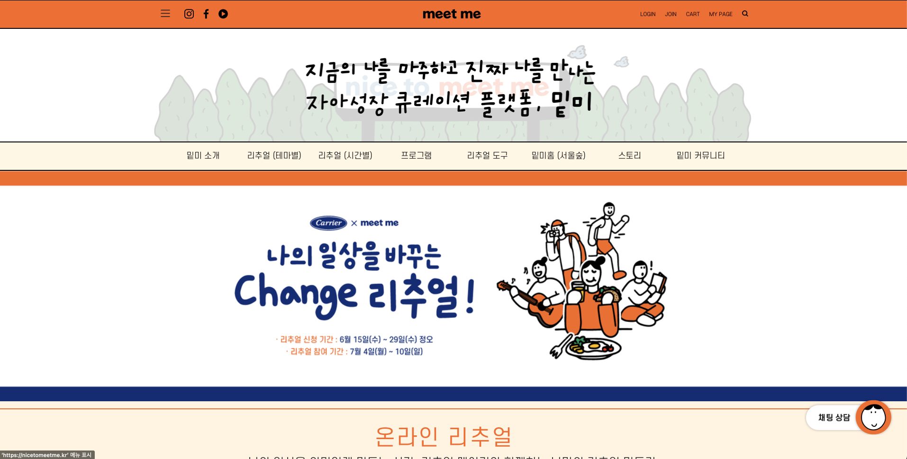
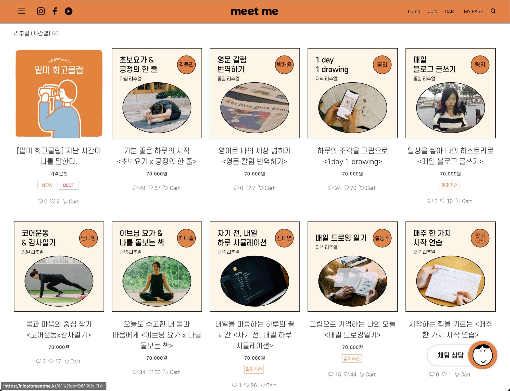
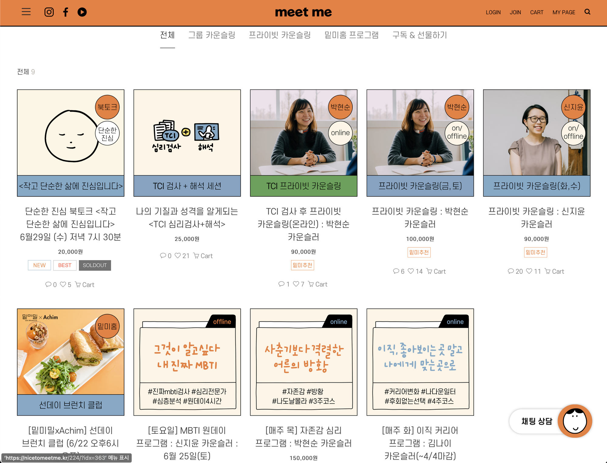
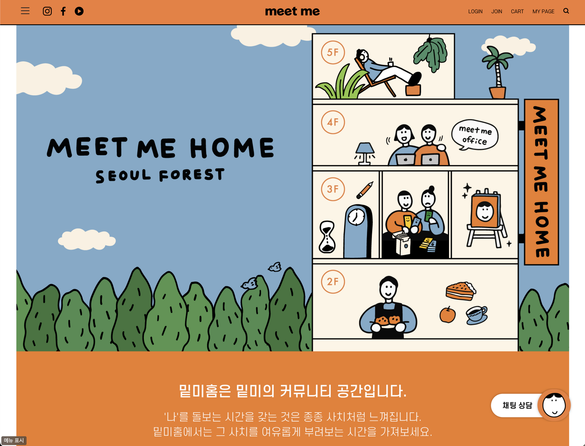

# meetme

나의 꿈은 “**모든 사람들이 주어진 조건에 의해 차별받지 않고 좋아하는 일을 하며 행복하게 사는 것**”이다. 이 꿈을 이루기 위해 나는 문장을 잘게 쪼개서 내가 할 수 있는 일을 최대한 작은 단위로 쪼개보기로 했다. 그 결과 아래와 같이 두 조각으로 나누어졌다.&#x20;

1. 모든 주어진 조건에 의해 차별받지 않고
2. 좋아하는 일을 하며 행복하게 사는 것

둘 중에서 우선 2번에 집중하여 이를 달성하는데 방해가 되는 것들을 제거하는 작업을 고민했었고, [문제맵](../../writings/philosophy/probleminlife-03.md)을 작성하면서 그 중 하나의 원인을 생각했다.

> 많은 사람들이 자기가 좋아하는 일이 무엇인지, 어떤 때 행복한지 잘 모른다. 왜냐하면 자기 자신에 대해서 잘 모르기 때문이다.

그래서 나는 이 문제를 해결하기 위한 방법의 하나로 `자아에 대한 고민을 도울 수 있는 툴이나 플랫폼`을 생각하며 [마인드 트리 사이드 프로젝트](../../sideproject/mindtree/)를 구상하고 있었다. 프로젝트를 진행하며 이런저런 다른 서비스들을 탐방하다보니, 마침내 내가 꼭 필요하다고 생각했던 서비스를 만날 수 있었다. 그것이 바로 오늘 소개할 [밑미(Meetme)](https://nicetomeetme.kr) 서비스이다.

***

## 1. 서비스 소개

처음 밑미를 알게 된 것은 사실 트위터로 팔로우하고 있었던 조은 개발자님이 이곳의 CTO로 이직하신다는 소식을 접했을 때였다. 당시에는 홈페이지를 한번 들어가서 쭉 훑어보고 그냥 나왔는데, 이후에 내가 관심가는 주제로 리서치를 하다가 다시 밑미를 만나게 되었다. 꼼꼼히 살펴보니 이 서비스, 이 세상에 없어서는 안될 걸작이었다…😲

서비스의 이름이자 회사명이기도 한 [밑미(Meetme)](https://nicetomeetme.kr)는 이름 그대로 나를 만난다는 뜻으로, 밑미 팀의 말을 빌리자면, “지금의 나를 마주하고 진짜 나를 만나는 자아성장 큐레이션 플랫폼”이라고 한다.

사실 “자아성장 큐레이션 플랫폼”이라는 단어는 기존에 많이 쓰이던 단어가 아니라서, 나에게는 단번에 이해하기는 조금 어렵고 생소한 느낌이 있었다. 그래서 서비스를 찬찬히 살펴보니, 큰 줄기에서 보면 대략 세 가지의 서비스를 제공하는 것 같았다.

1. 온라인 리추얼
2. 심리 카운슬링 프로그램
3. 오프라인 커뮤니티 공간, 밑미홈 운영

\

### 1-1. 온라인 리추얼

리추얼(ritual)은 매일의 일상에서 나를 가꾸는 하나의 의식적인 활동이다. 밑미는 온라인 리추얼 서비스를 통해서 한 명의 리추얼 메이커가 기획하고 구성한 2주 \~ 한달 단위의 온라인 프로그램을 제공하고 이 프로그램에 조인한 사람들을 중심으로 느슨한 커뮤니티를 만들어 운영하고 있다.

보통 리추얼 메이커는 밑미 팀이 직접 컨택을 하거나 홈페이지를 통해 직접 신청할수도 있다고 한다. 한달 기준으로 온라인 리추얼 프로그램의 참가비는 대략 7만원대로 형성되어있는 것 같다. 하루에 커피 한잔 값인 3,500원을 아껴서 내 마음을 돌보고 일상을 단단히 할 수 있다고 생각하면 그리 나쁘지 않은 금액인 것 같다.

\

### 1-2. 심리 카운슬링 프로그램

밑미 서비스에 대해서 이리저리 살펴보다가 대표님의 인터뷰를 통해서 알게 되었는데, 밑미 서비스는 마음이 힘든 사람들이 느끼는 전문적인 심리상담에 대한 장벽을 낮추는 역할도 한다. 사실 일반적인 사람들에게 정신과 상담이나 심리상담은 장벽이 꽤나 높게 느껴진다. 아무리 요즘 앱이나 웹 서비스가 잘 되어있다고 해도 말이다.

밑미 서비스는 아기자기한 일러스트를 통해서 우선 분위기를 둥글고 친근하게 만들며 앞서 소개한 온라인 리추얼 활동처럼 일상에서 직접 해볼 수 있는 프로그램들을 통해 심리 카운슬링에 대한 진입장벽을 낮춘다.

한 가지 내가 좀 더 흥미로웠던 포인트는 바로 B2B 프로그램인 “기업 조직 문화 프로그램”인데, 하루 절반 이상의 시간을 보내는 직장에서의 시간 역시 조직 내의 사람들이 ‘나 다운 소통’을 할 수 있도록 기업 조직 차원으로도 접근을 했다는 점이다.

\

### 1-3. 오프라인 커뮤니티 공간, 밑미홈 운영

핫하디 핫한 성수동에 위치한 밑미홈은 밑미팀의 일하는 공간이자 ‘나를 돌아보는 시간’을 갖고 싶은 모든 사람들에게 열려있다. 2층 레스토랑부터 3층에는 밑미 리추얼 프로그램을 간접 체험할 수 있는 공간, 5층에는 옥상공간까지, 참 알차게 구성되어있다.

***

## 2. 밑미가 만들어지기까지

간단하게 서비스를 호로록 훑어보았는데도 엄청나게 짜임새있고 알차다는 느낌이 들었다. 더군다나 한 번 사는 인생 “내가 이 삶에서 꼭 해결해고 싶은 문제”에 대해 스스로 글을 쓰고 고민하여 마침내 찾아낸 문제들을 이미 누군가는 해결하려는 시도를 하고 있다는 점이 너무 신기하고 두근거렸다. 이런 서비스는 도대체 누가 만든 것일까?

### 2-1. 에어비앤비 마케터 출신, 손하빈 대표

밑미에 대해서 이리저리 찾아보니, 손하빈 대표님의 인터뷰가 많이 나왔다. 그래서 거의 모든 인터뷰를 다 찾아서 읽어보았다. 아래에 대표님의 인생 스토리 중 몇 가지 흥미로운 점들을 적어보았다.

* 건축학과로 입학했지만, 여자로서 전망이 안좋다는 이야기를 듣고 산업공학과로 전과
* 산업공학과로 전과했지만, 적성에 맞지 않아서 사이드 프로젝트, 동아리 등 외부 활동으로 방황
* 친구들이 모두 의대로 진학할 때, 사람들과 소통하는 일이 즐거워 취업을 하기로 결심
* 높지 않은 영어 점수로 외국계 회사인 IBM을 당당히 합격! 자소서 소제목을 “토익점수도 낮은 사람이 외국계 지원을?” 처럼 아예 약점을 드러내는 방식으로 구성
* IBM에서 일하다가 대기업 문화가 안맞아서 퇴사. 당시 작은 기업을 찾던 중, 자유로운 근무환경을 지닌 에어비앤비로 취업을 결정
* 에어비엔비 역시 기업이 커지면서 비합리적인 문화, 관료화가 시작됨. 이에 과감히 퇴사를 결정
* 퇴사 후, 어머니의 팝업식당인 “금자씨 부엌”을 오픈부터 브랜딩까지 총괄함

손하빈 대표님은 마지막으로 했던 활동인 어머니의 팝업식당을 도와드리는 활동을 왜 그렇게 열심히 했을까, 혼자서 곰곰히 되돌아보는 시간을 가졌다고 한다. 마침내 그녀는 본인이 엄마의 자아실현을 도와 ‘진짜 엄마의 모습’을 찾아드리고 싶었다는 것을 알게 되었다. 누군가 진짜 자기 자신을 찾아가는 그 여정을 도와주는 데에서 즐거움을 느낀다는 것을 깨닫게 되었다.

이 아이디어를 전 직장 동료와 공유하고 긍정적인 피드백을 받자, 같이 해보자고 만든 것이 바로 밑미라고.

***

## 3. 내가 밑미(Meetme)를 좋아하는 이유

**내가 끌리는 서비스들을 보면, 결국에는 관통하는 두 가지의 법칙이 있다. 첫번째는 대표 혹은 서비스의 매력적인 창업스토리(혹은 인생이야기)이고, 두번째는 서비스가 가지고 있는 탄탄한 철학이다.** 밑미의 경우는 두 가지를 모두 충족한 셈이니, 내 마음에 쏙 들 수 밖에.

서비스를 찬찬히 뜯어보니, 밑미는 참으로 ‘똑똑한’ 서비스라는 생각이 든다. 많은 매력포인트 중에서 내가 좋았던 점들을 몇 가지 이야기해볼까 한다.

### 3-1. 1,000명이 넘는 회원들과 함께 시작하는 성공할 수 밖에 없는 서비스

2020년 8월에 런칭한 밑미는 본격적으로 서비스를 만들기전에 이미 1,000명이 넘는 잠재고객을 가지고 있었다고 한다. 어떻게 이것이 가능했을까?

정답은 바로 뉴스레터이다. 서비스를 만들기 전에, 뉴스레터 활동을 통해 미리 미래의 고객들과 접점을 만들어둔 것이다. 밑미가 전하고 싶은 이야기들, 밑미가 제공하고 싶은 서비스에 대한 이야기를 뉴스레터 채널을 통해 충분히 어필한 뒤, 일정 수 이상의 구독자를 모았을 때, 비로소 온라인 서비스를 런칭했다고 한다.

결과는 어땠을까. 런칭 초기부터 밑미는 광고없이 1,500명의 회원을 확보했다고 한다. 시작부터 나를 알고 응원해주는 팬들과 함께이니, 당연한 결과이다.

밑미처럼 요즘 성공하는 서비스들은 처음부터 다짜고짜 앱부터 만들지 않는다. 미리 미래의 고객들과 충분한 연대감을 형성한 뒤, 그들을 서비스의 팬으로 만들고, 내가 필요한 것이 아닌, 그들이 필요한 것을 만든다.

밑미 서비스 런칭 과정을 읽는 동안 너무 짜릿하고 재미있어서 시간가는 줄 몰랐다.

### 3-2. 탄탄한 철학

랜딩 페이지에서부터 브랜드 소개, 온라인 리추얼, 리추얼을 도와주는 일상도구, 오프라인 공간까지, 밑미는 온 힘을 다해 전하고 싶은 단 하나의 메시지를 전한다. “이곳은 진짜 나를 만나는 안전한 공간입니다”라고. 그리고 정말 재미있게도 밑미에 대한 단 하나의 서비스만 보더라도 그것이 온전히 느껴진다. 온라인 리추얼 서비스만 보더라도, 오프라인 공간인 밑미 홈만 보더라도, 29CM에서 판매중인 일상도구만 보더라도 말이다. 그 어느 것 하나 딴길로 새는 법이 없다. 무엇을 제공하는지, 무엇을 말하고 싶은지 메시지가 명확하다.

동료 마케터가 말해주길, 브랜딩은 “어떤 채널을 통해서든지 일관된 메시지를 전하는 것”이라고 한다. 적어도 내가 느낀 밑미는 브랜딩을 정말 잘 하고 있다고 생각한다.

모든 사람들은 본인만의 개똥철학이 있어야 한다고 믿는 나는, 밑미가 본인을 소개하며 내건 이 문장에 진심으로 공감한다.

> **밑미는 모든 사람들이 ‘진짜 나 (true self)’를 발견했을 때, 내가 진정으로 원하는 삶이 무엇인지 알게 되고, 삶을 내 뜻대로 살아갈 수 있다고 믿습니다. 그리고 그 믿음을 바탕으로 사람들이 다양한 심리적 문제를 극복하고, 개인 철학과 비전을 찾고, 일상 속에서 자신만의 속도를 발견할 수 있도록 돕는 다양한 서비스와 제품을 제공합니다.**

### 3-3. 극호감의 아기자기한 일러스트

확실히 감성적인 부분을 터치하는 서비스라서 그런지, 모든 곳에 둥글둥글 아기자기한 일러스트가 그득그득하다. 개인적으로 오렌지 덕후라서 그런지 컬러도 내마음에 쏙…❤️

### 3-4. 온-오프라인의 적절한 조합과 선순환

바야흐로 대 IT 서비스의 시대라고 불릴만큼 하루에도 수백개의 서비스가 새롭게 출시되는 세상이다. 그렇지만 대부분의 서비스들은 온라인이나 오프라인 한 쪽에만 치우쳐있고 양쪽의 서비스가 탄탄히 구성된 경우는 별로 보지 못했다. 메인 오프라인 서비스를 보조하기 위한 수단으로서 온라인 서비스가 존재하거나(ex. 크리에이터클럽), 아주 드물게 온라인 서비스가 성장하여 오프라인 매장을 만드는 경우 정도(ex. 와디즈).

하지만 밑미는 온라인과 오프라인 양쪽에 꽤나 탄탄한 서비스가 구축되어있다. 온라인으로 리추얼 프로그램이 활발히 운영되고 있고, 오프라인 쪽으로는 오프라인 공간인 밑미홈을 중심으로 심리 카운슬링 프로그램이나, 오프라인 리추얼 프로그램 등이 진행되고 있다.

이처럼 온-오프라인을 적절히 조합한 서비스는 어떤 점이 좋을까? 온라인이든, 오프라인이든 밑미를 만날 수 있는 접점이 훨씬 넓어진다는 것이 가장 크다. 온라인 리추얼로 밑미를 처음 만난 사람들은 오프라인 공간에도 방문하며 밑미에 참여할 수 있고 오프라인 공간으로 밑미를 처음 만난 사람들은 나중에 온라인 리추얼 고객이 될 수도 있다. 이처럼 온-오프라인의 적절한 조합이 긍정적인 선순환 고리를 만들어 낸다는 점에서 참 똑똑한 서비스라고 느껴졌다.

### 3-5. 철학에 맞는 다양한 프로그램들

“진짜 나를 만나 내면 성장을 이룬다”는 철학에 맞게 우리의 삶 곳곳에 침투할 수 있도록 교묘하게 프로그램이 설계되었다.

온라인 리추얼을 통해 마음이 너무 심하게 아프기 전, 스스로를 돌보는 습관을 갖도록 도와주고, 심리 카운슬링에 대한 장벽을 낮춰 오프라인 상담까지 연결될 수 있는 구조를 갖추었다.

또한 스스로를 돌보는데 필요한 일상도구 역시 깔끔한 디자인으로 제작되어 (관심없는 사람일지라도) 사고싶게 만드는 포인트가 있다.

오프라인 공간을 운영함으로써 밑미를 길 위의 세상에서도 볼 수 있도록 했고, 또 온라인으로 채워지지 않는 영역까지 채울 수 있도록 대안책을 마련했다.

하루 중 개인이 가장 많은 시간을 보내는 직장 내에서도 직원들 개개인이 조직 속에서 나다움을 가지고 건강하게 일할 수 있도록 프로그램을 구성하기도 했다.

***

## 4. 아쉬운 점

사실 밑미 서비스를 직접 이용해보지는 않은 내가 이렇게 아쉬운 점을 써도 되나 싶긴 하지만, 밑미 브랜드를 정말 좋아하는 사람으로서, 사용자를 처음 마주하는 공간인 웹 서비스에 대해서는 좀 개선이 필요할 것 같다는 생각이 들어 몇 자 적어보았다.

### 4-1. 사용성

너무 좋은 철학과 서비스를 제공하고 있지만, 솔직히 말하자면 사용하기 편한 웹 앱은 아니라는 생각이 든다. 그렇게 생각하는 데에는 몇 가지 이유가 있다.

첫째로, 전체 메뉴를 왼쪽 햄버거 버튼과 가운데 드롭다운 메뉴, 양쪽에서 모두 볼 수 있는데, 같은 기능을 가진 버튼이 양쪽에서 상당히 거추장스러운 느낌으로 존재한다.

* 개인적으로는 [디스콰이엇](https://disquiet.io)이나 [비사이드](https://bside.best) 처럼 메뉴가 왼쪽에 늘어져 있는 방식을 선호하는 편인데, 이는 어떤 페이지를 가더라도 메뉴바가 고정되어 내가 어디에 위치한지 알기 쉽고 다른 메뉴를 이동하기 위해서 버튼을 누르는 등의 액션을 한 번 더 취하지 않고 자유롭고 빠르게 웹사이트를 훑어볼 수 있기 때문이다.

둘째로, 페이지 이동에 따라 메뉴바가 변경되는 것을 상당히 안좋아한다. 나는 이 서비스에 대해 관심이 있고 여기저기 둘러보고 싶은데 메뉴바가 변경되어 버리면, 중간에 길을 잃고 쉽게 이탈하게 되기 때문이다.

마지막으로, 메뉴바에서 너무 많은 내용을 정신없이 소개하는 듯한 느낌이 든다. 콘텐츠가 많은 것은 알겠으나, 그걸 메뉴바에서 다 노출할 필요가 있을까? 예를 들면, 리추얼 테마별, 시간별은 사실 필터링 기능으로 따로 빠져야하는 부분이지 메뉴바에서 나뉠 부분은 아니라고 생각된다.

***

## 5. 한줄평

> 고생보다 고민을 더 많이 하는 요즘 시대에 꼭 필요한 플랫폼

근래에 동생과 이야기를 나누면서 나에게 와닿았던 말이 있다. 20년이 넘는 시간동안 아무리 공부를 많이 해왔어도 자기 자신에 대한 공부는 해본적이 없던 것 같다고. 밑미를 보면서 동생의 말이 유독 마음속에 머문 것 같다.

***

## 6. 참고

밑미에 대해 이런 저런 이야기들을 보면서 주옥같은 콘텐츠가 많다는 것을 발견했다. 밑미가 궁금하다면, 정식 웹사이트 이외에도 아래의 링크들을 참고할 수 있다.

#### 밑미 손하빈 대표 인터뷰 및 콘텐츠

* [**"성공보다 성장, 유니콘보다 커뮤니티가 먼저죠" 밑미 손하빈 대표**](https://www.mk.co.kr/news/business/view/2021/01/78092/)
* [**미라클 모닝 열풍에 입소문 타고 인기 “‘진짜 나’ 공유하는 리추얼 전도사 될 것”**](http://economychosun.com/client/news/view.php?boardName=C03\&t\_num=13610446)
* [SIDE 인터뷰, 나를 성장시키는 환경을 만들어갑니다, 밑미 대표 손하빈](https://sideproject.co.kr/sidexhabin)
* [반복하면 행복해지는 '리추얼'의 비밀 | 손하빈 밑미 대표 | 습관 행복 나다움 | 세바시 1372회](https://youtu.be/KU2tQQPcT9w)
* [PUBLY, 나를 위한 시간을 보내고 있나요? 변화를 이끌어내는 리추얼 트렌드](https://publy.co/content/6414?fr=last-chapter-recommendation)

#### 밑미에 대해 더 알고 싶다면

* [밑미(Meetme)](https://www.notion.so/Meetme-cd3cc67895ca46d098d03665fbf16d4b)
* [밑미 TV](https://www.youtube.com/channel/UCm89nRRbtDzNOGTMZhdWs2Q)
* [밑미 Instagram](https://www.instagram.com/nicetomeetme.kr/)
* [밑미 뉴스레터 다시보기](https://page.stibee.com/archives/73812)
* [밑미 일상도구 구입 in 29CM](https://shop.29cm.co.kr/brand/15613)
