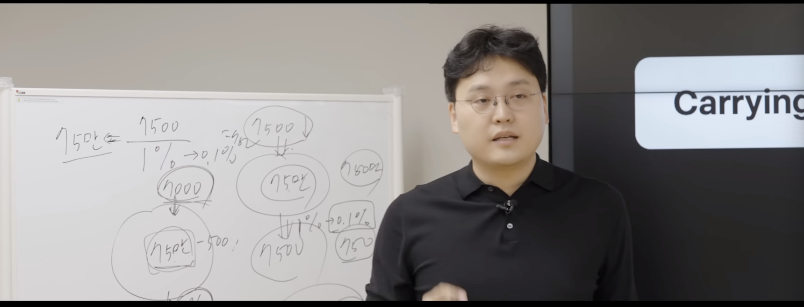
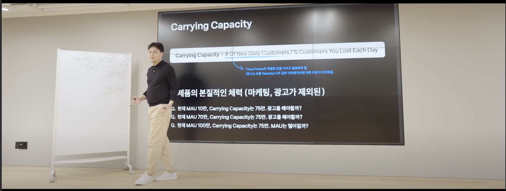
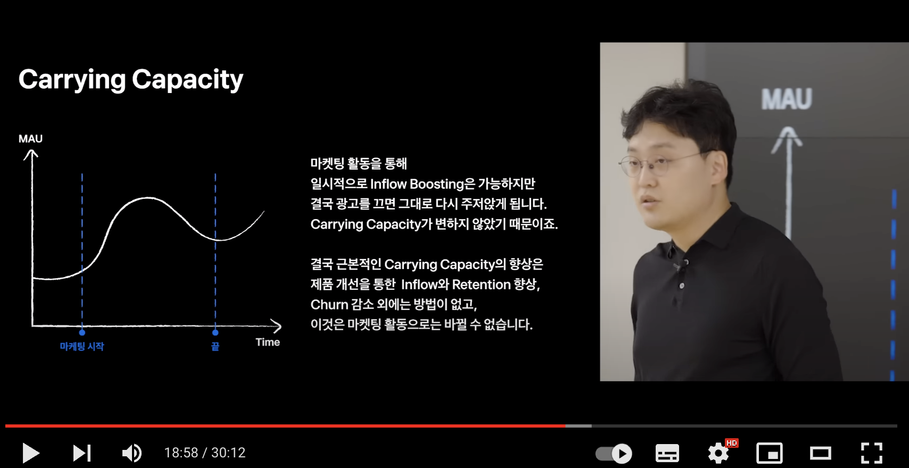
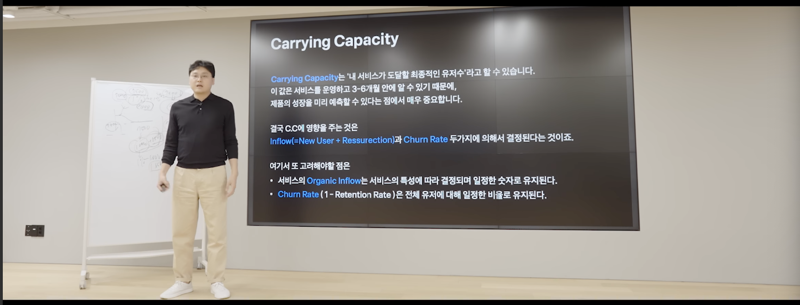

# 토스 리더가 말하는 PO가 꼭 알아야할 개념 (1)

### title: 토스 리더가 말하는 PO가 꼭 알아야할 개념 (1) date: 2022-05-08 category: - insight - productowner

\#productowner

디스콰이엇 커뮤니티를 통해서 [Toss 이승건 대표가 직접 진행했던 PO Session 의 일부 영상](https://youtu.be/0KgOCKJ1PG4)이 공유되었다. 막상 공유받은 당시에는 너무 바쁘고 정신없어서 그냥 지나쳤었는데, 이후에 영상에 대한 감상평들이 등장하는 것을 보고 다시 찾아서 보게 되었다. 어디서도 들어보지 못했던 신선한 강연이었다. 가장 좋았던 점은 검증되지 않은 이론만 무성한 이야기들이 아니라 직접 토스 제품들을 예시로 들어서 알기 쉽게 설명해주셨던 점이다. 나중에 두고두고 꺼내보려고 아래에 그 내용들을 정리해보았다.

### Carrying Capacity

아래 다섯 개의 질문에 답을 해보자.

> 진성유저들이 하는 액션의 유형을 발견했다고 가정해보자. 그 액션을 모든 사용자에게 강요하는 것이 서비스의 진성유저를 더 늘리는 방법일까, 아닐까? 효과는 긍정적일까, 부정적일까

> 만약에 서비스가 24시간동안 장애를 겪고 난 뒤, 다음날 트래픽이 많이 빠진 것을 발견했을 때, 이것은 향후 우리 서비스에 좋을까, 나쁠까?

> 우리 서비스는 하루에 10만 명이 이용하는 서비스이다. 이때, 매일 10만 명이 오는 것과 매주 70만명이 오는 것 중 어떤 것이 더 좋을까? 상관이 있을까?

> 돈을 엄청나게 투자하고 광고를 해서 유입 고객이 늘었다고 해보자. 그러면 이 방법이 최선인것일까? 계속 이렇게만 해도 괜찮나?

> 알림시스템에 (페이스북 시스템 문제 등) 문제가 생겼다. 더이상 유저들에게 새로운 활동에 대해 알릴 수가 없게 되었다. 매일 오는 유저 수가 감소한 것을 알게 되었다. 이게 걱정할 일인가?

지금까지 이 다섯가지 질문에 대해서 제대로 대답한 PO 를 한번도 본 적이 없다. 다섯 가지 질문의 핵심은 `Carring Capacity` 이다.

Carring Capacity, 한계수용능력(이하 CC) 은 호숫가의 물의 높이가 어디까지 올리올지 예측하는 데서 출발한다. 호숫가의 물의 양은 다른 모든 요인들을 걷어내고 다음의 두 가지에 의해서만 결정된다.

1. 내리는 비의 양과
2. 호숫가에서 땅으로 배출되는 물의 양

이때 이 호숫가의 물을 MAU(Monthly Active User) 라고 한다면 한계수용능력은 우리 서비스의 체력이라고 할 수 있겠다. **외부의 마케팅이나 푸시, 알림 등의 거품을 걷어내고 진정을 남은 우리 서비스의 유저, 그것이 서비스의 한계수용능력**이다.

### Data Growth Modeling

앞서 말한바와 같이, 우리 서비스의 전체 사용자 수는 신규 유입되는 유저들의 수와 이탈한 유저들의 수, 단 두 가지에 의해서만 영향을 받는다.

그렇다면 customer를 어떻게 정의할 것인가?

* `active` 에 대한 정의
  * 95% 이상의 visitor 가 꼭 하게되는 활동
  * page by page, repeatable 하고 meaningful 한 action 인가?
* `churn` 에 대한 정의
  * 어느 기간동안 안 써야 다시는 안 오는 것이라고 정의할까? 1일? 4일?
  * 상식적으로 "이 정도 안 썼으면 loss 될 것 같다"를 정한다. (그리고 이는 나중에 바꾸면 안됨)
    * 예를 들면 [Shazam](https://www.shazam.com/ko/home) 이라는 앱은 한달에 한 번 쓰는 앱이라고 한다면, 3개월 동안 다시 사용하지 않았다면 `churn` 이라고 정의한다.
    * 토스 송금은? 30%가 이전 달에 온적이 없는 유저이다.

> Carrying Capacity = # new daily customers / % new lost customer each day\
> 한계수용능력 = 신규 유입유저의 수 / 신규 이탈 유저의 비율

) 

예시를 통해서 생각해보자. 하루에 매일 7500명이 유입되고 전체 사용자의 1%가 이탈하는 서비스가 있다고 가정해보자. 이 서비스의 Carring Capacity 는 75만이 된다.

* Carring Capacity 75만 = 일별 유입 7500명 / 일별 이탈 1%

만약 해당 서비스의 일별 유입자 수가 500명씩 줄어 7000명이 되고 여전히 매일 1%씩 이탈한다면, MAU가 70 만이 될 때까지 계속 줄어들 것이다. 왜냐하면 해당 서비스의 CC(Carrying Capacity)는 70만으로 변경되었기 때문이다.

**결국 마케팅, 푸시, 광고 등의 거품을 다 걷어내고 제품의 순수한 유저를 모으는 힘의 능력, 그것이 Carrying Capacity라고 할 수 있다.**

#### 그렇다면 Carrying Capacity 는 어떻게 알 수 있는가?

* 새롭게 유입되는 유저의 수 : 서비스 런칭 이후 일주일만에 바로 알 수 있다.
* 매일 나가는 유저의 비율 : MAU 대비 얼마만에 고객을 잃는가? -> 런칭 이후 2달만에 알 수 있다.

> 결국 두 가지의 값이 바뀌지 않는다면 MAU 를 변화시킬 수 없다.

* 아무리 광고를 하고 마케팅을 하더라도 제품의 본질적인 체력선까지 MAU 는 올라가거나 내려올 것이다.

### 핵심 : 결국 신규 유저 유입수와 나가는 유저의 비율 이외에는 아무것도 MAU 에 영향을 미치지 못한다.

* 승건님의 전략
  * 현재가 10만 MAU 라면 40-50만이 될 때까지 쭉 마케팅과 광고를 통해 MAU 를 높이고
  * 70-75만이 될 때까지 두 숫자를 바꿀 수 있도록 제품을 꾸준히 개선할 것 같다.
* 광고를 두 달만 꺼도 진짜 MAU 수치를 알 수 있다.

* MAU 가 늘지 않는다면 제품의 문제점을 찾아봐야하는데 보통 스타트업들은 광고와 마케팅을 통해서 이를 해결하려고 한다.
* 대게 스타트업 C, D 단계에서 대규모 투자를 유치해서 MAU를 증가시킨다. 그리고 광고비로 몽땅 써버린다.
  * 이 경우, 마케팅과 광고를 통해서 유입이 늘어나니까 일시적으로 MAU 가 늘어날 것이다.
  * 하지만 광고비는 언젠가 소진될 것이고 광고를 끄는 순간, MAU 는 다시 기초체력수준인 CC 단계로 돌아갈 것이다.
  * 결국 핵심은 제품개선을 통해서 꾸준히 기초체력을 늘려야 한다.

* CC 는 결국 내 서비스가 도달할 최종적인 유저의 수 이다.
  * 이는 서비스를 운영하고 3개월 이내에 알 수 있다.
  * 제품의 성장을 미리 예측할 수 있다는 점에서 매우 중요하다.
  * 토스도 이를 정확히 알고 있었다. 이미 4-6개월전에 이 시점을 예측할 수 있었다.
* 다시 한 번 말하지만, CC에 영향을 주는 것은 inflow(=new users + ressurection) + churn rate, 오직 이 두가지에 의해서 결정된다.
* 여기서 중요한 점은
  * 서비스의 organic inflow 는 서비스의 특성에 따라서 결정되며 일정한 숫자로 유지된다.
  * churn rate (1 - retention rate) 은 전체 유저에 대해 일정한 비율로 유지된다.
* 4-6개월전에 미리 CC의 한계선을 알고 있었던 토스가 CC 늘리기 위해 한 것
  * 토스는 무료송금서비스를 통해서 CC를 어느정도 예측하고 있었다.
  * 기존 서비스의 한계선이 다가오자 "신용조회서비스"를 런칭하여 새로운 CC를 얹어버렸다.

### 질문에 답하기

이제 Carring Capacity 의 개념을 인지한 상태로 처음의 질문 5개에 대한 답을 찾아보자.

#### 진성유저들이 하는 액션의 유형을 발견했다고 가정해보자. 그 액션을 모든 사용자에게 강요하는 것이 서비스의 진성유저를 더 늘리는 방법일까, 아닐까? 효과는 긍정적일까, 부정적일까

* 이 질문에 대한 나의 예상 답변
  * 우선 데이터를 확인해봐야한다.
  * 그 행동을 하는 것이 진성유저가 되는 것과 관련이 있는지 먼저 확인이 필요하다.
  * 큰 효과가 없거나 오히려 부정적일 것 같다.
* 정답
  * 정답은 yes and no
  * 인과관계가 있다면 늘어날 수 있고 아니라면 줄어들 수 있다.
  * 핵심은 churn rate 을 봐야한다.

#### 만약에 서비스가 24시간동안 장애를 겪고 난 뒤, 다음날 트래픽이 많이 빠진 것을 발견했을 때, 이것은 향후 우리 서비스에 좋을까, 나쁠까?

* 이 질문에 대한 나의 예상 답변
  * 우선 데이터를 확인해봐야한다.
  * 어떻게 대응하는지에 따라서 다를 것 같다. 적절하고 올바르게 대응했다면 오히려 전화위복이 될수도 있을 것 같다.
* 정답
  * inflow와 chrun 을 봐야한다.
  * 그 값에 변동이 없다면 MAU 는 다시 회복될 것이다.
  * 하지만 대부분의 경우 downtime 이 전체 CC에 영향을 주는 경우는 거의 없다. 토스의 경우도 그러했다.

#### 우리 서비스는 하루에 10만 명이 이용하는 서비스이다. 이때, 매일 10만 명이 오는 것과 매주 70만명이 오는 것 중 어떤 것이 더 좋을까? 상관이 있을까?

* 이 질문에 대한 나의 예상 답변
  * 우선 데이터를 확인해봐야한다.
    * 매일 10만명이 오는게 더 중요할 것 같다.
* 정답
  * cc의 개념 없이 본다면, 매일의 유저 수가 더 중요해보인다.
  * 하지만 cc의 개념이 있다면 중요한 것은 하루냐 주간이냐가 아니라 inflow 와 churn 의 두 숫자가 중요하다.
  * 오직 CC를 늘리는 것만이 성장을 위한 값이다.
  * 따라서 정답은 '상관없다'이다.

#### 돈을 엄청나게 투자하고 광고를 해서 유입 고객이 늘었다고 해보자. 그러면 이 방법이 최선인것일까? 계속 이렇게만 해도 괜찮나?

* 이 질문에 대한 나의 예상 답변
  * 아니다. 이 고객이 결국 어떤 액션을 취하는지까지를 확인해야한다. 진성고객을 많이 확보해야한다.
* 정답
  * 아니다.
  * 정확히 CC에 도달할때까지만 늘어난다.

#### 알림시스템에 (페이스북 시스템 문제 등) 문제가 생겼다. 더이상 유저들에게 새로운 활동에 대해 알릴 수가 없게 되었다. 매일 오는 유저 수가 감소한 것을 알게 되었다. 이게 걱정할 일인가?

* 이 질문에 대한 나의 예상 답변
  * 모르겠다.
* 정답
  * inflow 와 chrun rate 을 확인하면 된다.
  * 그것이 그대로라면 큰 문제가 없다.
  * inflow 가 줄었다면 churn rate 도 줄었다면 그것은 CC에 영향을 미치지 못한다.
