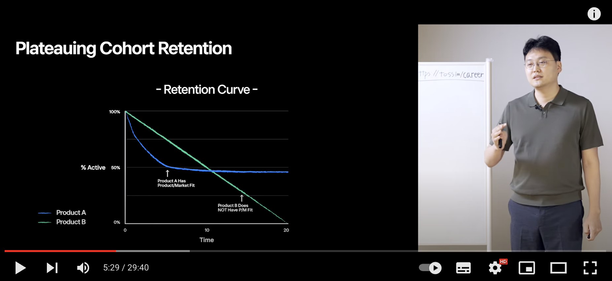

# 토스 리더가 말하는 PO가 꼭 알아야할 개념 (2)

### title: 토스 리더가 말하는 PO가 꼭 알아야할 개념 (2) date: 2022-05-18 20:53 category: - insight - productowner

\#productowner

[지난 글](https://blog.mhson.world/2022/05/08/insights/20220508-toss-po-session-01/)에 이에서 오늘도 [Toss 의 PO Session 두번째 영상](https://youtu.be/0KgOCKJ1PG4)을 보고 정리한 내용을 공유한다. 자세한 내용은 영상의 링크로 직접 이동하여 확인해보자.

### 첫번째 세션에 대한 QnA

#### 파워유저들이 하는 특정 행위를 강요했을 때, 'churn rate이 안올라간다고 해서 파워유저로 전환되고 있을 것이다' 라고 추측할 수 있는 것인가? 파워유저가 됐을수도 있고, 안됐을수도 있는데 그렇게 추측하시는 배경이 있는지? 파워유저가 하는 행위를 했음에도 churn rate 이 올라가지 않았으면 해당 유저는 파워유저를 흉내냈으니 파워유저라고 볼 수 있는 것인가요?

사실 이 부분은 첫번째 세션에서 잘못 말씀드린 부분이 있다. 말씀해주신 부분대로 churn rate 이 안올라간다면 파워유저가 되었는지 어떻게 되었는지 알지 못한다. 정확히 말하자면 파워유저들이하는 특정 행위를 유저들에게 강요했을 때, churn rate 이 내려간다면 그들이 모두 파워유저가 되었다는 의미이니 CC 가 늘어나게 된다.

#### 24시간 동안 다운타임이 있어도 트래픽이 좀 줄었다가 다시 회복된다고 말씀하셨는데 다른 대안이 많은 요즘 CC가 많이 떨어질 것으로 생각되었는데, 토스의 초기 모델은 그런 적 없을까요?

실제로 토스의 경우, 다운타임을 겪은 심각한 장애 뒤에도, CC가 거의 다 회복되었다. 다른 대안이 있음에도 아무런 문제 없이 회복이 되었다. 아마 대부분의 경우 장애가 서비스의 CC에 미치는 영향은 거의 없을 것이다.

#### outflow 는 비율 단위인데 inflow 는 정수단위이다. 일반적으로 churn rate 은 유저 수에 비례하지만 신규 유저수는 그렇지 않기 때문일까요?

질문을 주시면서 정확하게 답을 말해주고 계신다. 그러하다.

#### CC에서 시간이라는 개념을 넣으면 어떻게 변화되는가? 복리처럼 천천히 일정하게 변하는게 아니니까 속도에 가속도가 붙는 영향도 함께 봐야하지 않는가?

사실 CC개념은 간단하다. CC와 MAU 사이의 갭이 너무 크면 빨리 올라가고, 적으면 느리게 올라간다. 하지만 이 올라가거나 내려가는 속도는 크게 의미가 없다.

### Retention and Activation

#### 스타트업과 그렇지 않은 회사의 차이는 무엇일까?

차이는 **불확실성의 크기**이다. 막 창업을 시작한 스타트업이 제품, 시장, 고객의 세 가지를 확실하게 알고 파악했다면 이제 경영의 단계로 넘어갈 수 있다. (불확실성에서 확실성의 단계로 옮겨가는 것이 바로 lean startup의 방식)

따라서 PMF를 찾았다는 말은 다음의 두 가지를 의미한다.

* 우리 제품이 시장에 어떤 모습이어야 하는지를 파악했다.
* 광고 없이도 계속 우리 제품을 쓰기로 한 고객이 누군지 파악했다.

PMF를 찾은 서비스는 이제 무엇을 해야할까? 답은 Rentention과 Activation이다.

#### AARRR

보통 서비스는 고객이 서비스로 유입된 시점부터 전환에 이르기까지의 여정에 따라서 **AARRR** 분석기법에 따라 마케팅을 진행한다.

> A(Acquisition) -> A(Activation) -> R(Retention) -> R(Referral) -> R(Revenue)

많은 스타트업에서 고객 여정의 각 단계들을 앞에서부터 개선하려고 애쓴다. 광고와 마케팅을 통해서 사용자를 획득하는데 가장 먼저 & 많은 관심을 두고, 그 이후에 활성화, 유지, 추천, 수익의 단계를 차례대로 개선하려고 한다.

**하지만 AARRR은 뒤에서부터 개선해야한다.**

* Retention : 먼저 고객이 우리 서비스를 계속 쓰게 만들고
* Activation : 고객이 우리에게 오는 길을 꽃길로 만든 다음에
* Acquisition : 고객이 우리에게 오도록 해야한다.

#### Aha Moment 를 찾자

Retention 과 Activation 에 있어서 가장 중요한 것은 바로 Aha moment 를 찾는 것이다. Aha moment 는 한 마디로 고객이 우리 서비스를 계속 쓰게 만드는 제품의 핵심 가치를 발견하는 순간이다. (자세한 내용은 하단에서). 이 Aha moment를 찾기 위해서는 세 단계의 과정이 필요하다.

1. 이탈 그룹에 대한 usability test
2. 유저 그룹에 대한 data analysis
3. Aha moment 발견하기

> 떠난 유저들이 왜 떠났는지를 분석하고(usability test) 계속 쓰는 유저들은 왜 계속 쓰는지를 분석하여(data analysis) 둘 사이의 차이(aha moment)를 찾아낸다.

#### Usability Test

우리 서비스를 계속 쓰지 않고 이탈한 유저들이 왜 이탈했는지 분석하는 과정이다. 이 과정을 통해 우리가 채우지 못하는 usecase 가 무엇인지를 파악할 수 있다. 또한 장기적으로는 서비스의 Carrying Capacity 를 높이기 위해 어떤 기능과 솔루션이 도입되어야 하는지도 파악할 수 있다.

**주의할 점**

* 유저에게 물을 때 왜 우리것을 사용하지 않나요? 라고 묻지 물으면 안된다. "당신은 - 의 목적을 달성하고자 할 때 무엇을 사용하나요?"라고 물어야 목적을 달성할 수 있다.
* 대부분의 경우, 5번의 UT 만으로도 동일한 문제에 대해 상당히 일관된 답을 들을 수 있다.
  * 하지만 시장기회에 대한 직감과 패턴을 발견하기 위해서 20번 이상의 UT를 듣는 것이 좋다.
* 이 UT 는 Retention 을 개선하는데 당장 도움이 되지 않는다. 하지만 장기적인 관점에서 우리가 앞으로 커버 해야하는 Usecase 를 발견하기 위해서 진행한다.
  * 향후 또 다른 CC를 찾기 위한 밑거름이 된다.

#### Data Analysis

**Retention Rate** retention 비율에 따라 기업의 미래를 예측할 수 있다.

* 20% 이하 : 기업을 만들 수 없다.
* 20% : 괜찮다.
* 40% : 유니콘 가능
* 70% : 세상을 바꿀 수 있다. 산업을 바꿀 수 있다. 전체 인구의 대다수가 쓰는 서비스가 되기 때문이다.

페이스북의 경우, 첫 retention rate이 68% 였다고 한다. 토스의 경우도 68%였다.

**페르소나** 우리의 고객이 누군지 알기 위해 페르소나가 필요하다.

* 토스의 경우, 2-30대가 주로 사용
  * 약속에서 간편송금, 더치페이 서비스를 주로 사용한다.
* 그런데 그들 중에 왜 일부는 남고 일부는 떠나는가?
  * **남는 유저는 공통된 특징이 있다.**

#### Aha Moment

retention 을 높이려면 aha moment 운동을 늘려야한다.

* aha moment는 제품의 핵심 가치를 발견하는 순간이다.
* 서비스를 계속 쓰게 만드는 특이점, singularity
  * retained - aha - take action
  * aha moment 가 많으면 retention plateau가 올라가게 된다.

**aha moment 는**

* 정량적으로 정의되는, 유저가 서비스에 남게되는 결정적인 순간이다.
* 정성적으로도 상식적인 인과관계가 있는 순간이다.
* simplicity, not science
  * 아주 단순한 산수로, 팀원들이 무지성 추종을 하게 되는 단순한 문장이다.
  * 복잡하고 정교한 분석 결과가 아니다.
* 연역 추리와 귀납 추리의 모든 과정을 통해 찾는 것이 적절하다.
* 리텐션 개선을 위한 silver bullet 이 아니다.

**토스의 aha moment**

* 최초 4일 이내 2번이상 송금
  * 토스 1원 송금 이벤트
* 모든 구성원들이 무지성 추종을 하게 만드는 간단한 한문장이어야 한다.

**기타 다른 서비스들의 aha mement**

* facebook
  * 첫 10일동안 7명의 친구와 연결시킬것
* slack
  * 팀 내에서 2000개의 메시지가 작성될 것
* dropbox
  * 1개의 기기에 1개의 폴더가 생길 것
* twitter
  * 30명 팔로우를 달성할 것

> xx 라는 행동을 yy라는 날짜 안에 zz번 한다.

xx : 만든 서비스가 가치 있다면 PMF 을 찾은 뒤 이므로 그 서비스의 핵심 가치를 경험 yy : 서비스를 잊어버리기 전에 다시 사용해야한다.

**만약에 도저히 도달할 수 없는 aha moment 가 나온다면?**

* 예) 3일안에 40명의 친구를 연결해야한다면?
* 리텐션이 있더라도 제품을 재검토 해봐야 한다.
* 95% 가 다시 돌아오더라도 너무 이루기 어려운 미션에 좌절하게 된다.
