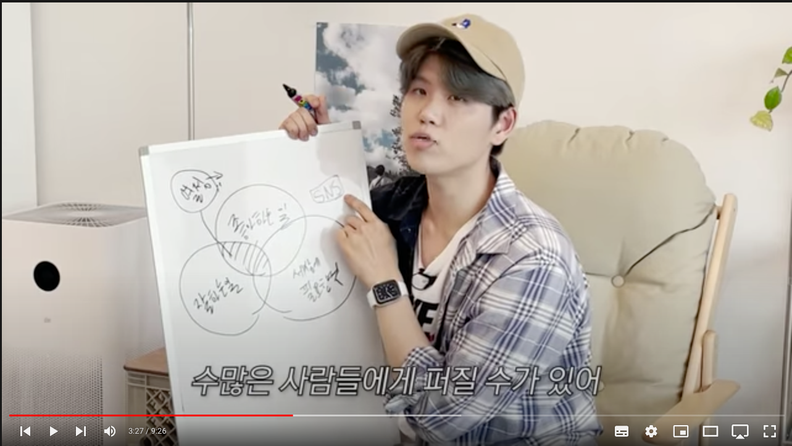
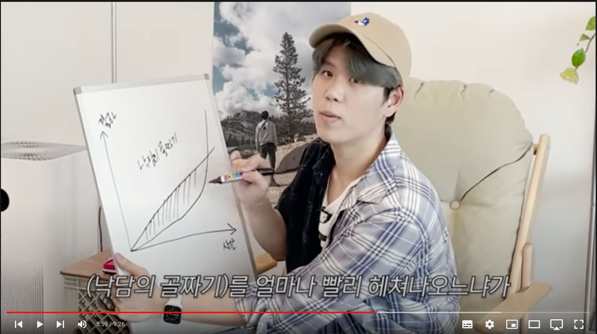

# 드로우 마이 브랜드

### 1. 순서 뒤집기

[**(퇴근 후 만든) 부캐가 본업 수익의 10배가 되며 배운 것들 (드로우 마이 브랜드 ep.01)**](https://youtu.be/dtgEhPv5Ww0)

보통 기업들은 아래와 같은 순서로 상품을 판다.

1. 상품을 기획하고
2. 그를 마케팅하여
3. 판매한다.

하지만 이렇게 할 경우, 대부분은 망한다. 상품이 고객을 만족시키지 못할 확률이 매우매우 높기 때문이다.

#### 그렇다면 망하지 않고 상품을 팔기 위해서는 어떻게 해야하는가?

1. 아무것도 없는 상태에서 브랜드 마케팅으로 팬을 모은다.
2. 팬이 어느정도 모인다면 그들이 원하는 상품을 기획한다.
   1. 포스터 만들어주세요
   2. 00 서비스 만들어주세요 등
3. 판매한다.

이렇게 할 경우, 미래의 고객으로부터 요청을 받아 상품을 만들게 되고, 이미 그 상품을 살 사람들이 많기 때문에 반드시 성공할 수 밖에 없다.

#### 브랜드 마케팅은 어떻게 하지?

1번의 브랜드 마케팅을 하는 방법이 `SNS`를 이용하는 것이다. 예를들면 인스타 팔로우 1만명을 모을 때까지 상품을 만들지 않는다거나 상품이 필요하다고 생각할 때쯤, 고객에게 직접 묻는다. (어떤 것이 필요한지, 이런 상품은 어떤지 등) 때문에 현 시대에서 콘텐츠를 만들지 못하는 기업은 망하기 쉽다. 개인도 마찬가지.

> 행복하게 일을 하기 위해 중요한 점은 1,000명을 모으더라도 내 취향을 좋아하는 사람들, 내가 말하는 것에 공감하는 사람들을 모으는 것이다.

### 2. 네 개의 원에서 교집합 찾기

[**3개월만에 또 일냈다... 내가 찾은 월 천 만원 테크트리 (드로우 마이 브랜드 ep.2)**](https://youtu.be/jmQC3J3Uhjs)

좋아하는 일로 행복하게 일을 하기 위해서는 우선 네 개의 원을 그리는 것이 중요하다.

1. 좋아하는 일
2. 잘하는 일
3. 세상에 필요한 것
4. 돈이 되는 것

1번과 2번은 사실 내가 스스로 생각하며 자아성찰을 하면서 찾아낼 수 있다. 어떻게든 혼자서 고민해야하는 영역이다. 하지만, 3번을 확인하는 것은 혼자서 생각한다고 되는 것이 아닌데, 여기서 필요한 것이 SNS이다. 3번까지 찾게 되면 4번은 저절로 따라온다.

예를들어 앤드류의 부업인 <[My Safe Space](https://www.youtube.com/channel/UCugV7nXwWVh8DPxihftSfpQ/featured)> 채널로 점검해보자.

1. 그는 인테리어에 관심이 많고
2. 집을 꾸미고 소품을 만드는 것을 잘할 자신이 있었다.
3. 1편을 만들어서 유투브에 공유했는데 고객으로부터 반응이 왔다. 세상에 필요한 것임을 알게 되었다.
4. MSS 채널을 통해서 그는 총 세 가지 유형의 수익을 얻고 있다.
   1. 조회수
   2. 쿠팡 파트너스
   3. 광고

#### 낙담의 골짜기 버티기

하지만 세상에 필요한 것을 찾는 과정은 쉽지 않다. 이런 저런 시도들을 해봐야하며 끊임없이 피보팅을 해야한다. 세상에 필요한 것을 찾는 그 순간까지 걸리는 시간은 길고 고되기에 `낙담의 골짜기`라고 한다.

낙담의 골짜기는 길고 지루하기 때문에 그 시간을 버틸 수 있는 힘이 필요하다. 그를 위해서는 다음의 두 가지가 필요하다.

1. 지치지 않는 열정과
2. 세상에 필요한 것을 반복적으로 확인하기 위한 도구인 SNS

결국에는 열정이 가장 중요하며, 그것이 낙담의 골짜기를 가장 빨리 벗어날 수 있는 방법이다.

하지만 낙담의 골짜기에 머무는 시간에도 수익화를 할 수 있는 방법이 있다. 유투브 플랫폼을 예로 들어보자.

유투브 수익화의 첫번째 허들은 다음의 두 가지 조건이다.

1. 구독자 1천명
2. 영상 4000시간

#### 쿠팡 파트너스로 처음부터 수익내기

보통 사람들은 어떻게 하면 구독자를 빨리 모으고 영상 콘텐츠를 많이 올릴 수 있을지를 고민하는데, 앤드류는 이를 처음부터 수익화할 수 있는 구조로 만들어버린다. 그는 `쿠팡 파트너스`를 이용하여 구독자가 1천명이 되지 않아도, 영상 콘텐츠의 수가 별로 없어도, 콘텐츠를 제작하는 것만으로도 수익을 냈다.

1. 쿠팡파트너스 등록
2. 물건별로 링크 생성
3. 해당 링크로 구매한 사람이 생기면 파트너스에게도 수익이 돌아간다.

### 3. 세상에 필요한 것을 찾는 방법

[**평범한 월급쟁이가 몸 값이 10배 오르며 알게된 원리 (ep.3 드로우 마이 브랜드)**](https://youtu.be/YJnGAoB4xGE)

#### SNS로 세상에 매력 어필하기

세상에 필요한 것을 알아내기 위해서는 SNS를 이용하면 된다고 했다. 그렇다면 구체적으로 어떻게 이용을 하라는 것일까?

가장 가까운 예시를 통해 이해해보자. 주변에서 나를 필요로 하는 경우는 언제인가? 제일 먼저 떠오르는 예시는 회사일 것이다.

그렇다면 회사는 어떻게 나의 가치를 발견하고 나를 필요로 하게 되었을까? 우리는 이력서를 회사에 제출해 나의 가치를 어필해왔다.

> 그렇다면, 이 이력서를 세상으로 제출한다면?

여기서 `이력서 = 콘텐츠`, `세상 = SNS` 의 등식으로 쉽게 이해할 수 있다. 기존에 회사에게 이력서로만 어필했던 나의 가치를 콘텐츠의 형식으로 SNS를 통해 세상에 어필하는 것이다. (나는 누구이고, 내가 뭘 잘하고 나의 경력은 어떤게 있는지 등)

이런 것들이 쌓이면 그때부터는 자연스럽게 나의 가치를 알아보는 사람들이 모여든다. 따라서 인스타그램, 블로그, 유투브 등 SNS에 올리는 모든 콘텐츠는 나의 이력서가 되는 것이다.

#### 수요를 늘리는 방법

세상에 나를 어필한다면, 나의 몸값은 곧 시장에서의 가격이 된다. 경제시간에 배웠듯, 가격은 수요가 많으면 높아지고, 공급이 많으면 낮아진다.

여기서 대부분의 사람들은 낮은 가격을 올릴 방법으로 더 날카롭게 능력을 갈고 닦는 것을 생각하는데, 사실은 나에대한 수요를 늘리는 것이 훨씬 더 쉽다.

디자이너의 예시를 보자. 과거에는 포토샵, 어도비 등 디자인 툴을 다루기만해도 디자이너가 될 수 있었고, 많은 수요가 있었다. 하지만 요즘은 디자인 툴에 대한 진입장벽이 낮아져서 디자인 전공자가 아니더라도 다룰 줄 아는 사람들이 많다. 여기서 디자이너로서 몸값을 더 ‘쉽게’ 올리기 위해서는 더 많은 툴을 공부하고 능력을 갈고 닦는 것이 아니라 인스타나 유튜브 등 콘텐츠를 만들면서 나를 필요로 하는 사람들을 모아야 한다.

사실 능력은 어느 정도 궤도에 오르면 다 비슷해지기 때문에 그 이후부터는 이제 콘텐츠 승부가 된다. 이 콘텐츠는 내가 누구인지, 뭘 좋아하고 잘하는지, 얼마나 잘하는지를 잘 드러낼 수 있어야 한다.

#### 프레임을 넓혀가기

극단적으로 회사를 그만두고 콘텐츠를 만들 것이 아니라, 회사를 다니면서 사이드 프로젝트로 조금씩 시작해야한다. 여기서 이 사이드 프로젝트를 재미있게 하려면 프레임을 씌워야 한다.

[MSS(MySafeSpace)](https://www.youtube.com/channel/UCugV7nXwWVh8DPxihftSfpQ)를 예로 들어보자. 앤드류는 현재 ‘드로우앤드류’ 채널을 메인으로 운영하는 유튜버이다. 그는 MSS 채널을 부업으로 키우고자 한다. 부업에 지치지 않고 재미있게 임하기 위해서 다음과 같이 프레임을 씌웠다.

1. 일주일에 하루, 금요일만 투자한다.
2. 아이폰으로만 촬영을 한다.

그가 영어를 배웠던 과정도 마찬가지이다.

1. 처음에는 카페 알바를 하면서 카페에 관련된 영어 문장만 습득한다. 이 카페라는 장소가 프레임이 되는 것이다.
2. 그 다음에는 도서관, 은행, 식당으로 프레임을 점차 넓혀간다.

이렇게 프레임을 씌우게 되면 지치지 않고 재미있게 끝까지 일할 수 있다. 그리고 점차 부업이 성장할 때, 투자하는 시간과 에너지를 조금씩 늘려나가면 된다.

### 4. 콘텐츠 수익화하기

[**집돌이가 방구석에서 스마트폰으로 시작해 경제적 자유를 얻기까지... (ep.4 드로우 마이 브랜드)**](https://youtu.be/Lits1LMpxT8)

세상에 필요한 것을 찾았다면 이제 돈은 알아서 굴러올 것이다.

다시 MSS 예시를 보자. 현재 MSS 채널의 수익구조는 다음과 같다.

1. 조회수
2. 쿠팡 파트너스
3. 브랜디드 광고

여기에 콘텐츠를 만드는데 집중하니 하나의 수익 파이프라인이 더 생기게 되었다.

유튜브 콘텐츠 댓글을 보니, 사람들의 니즈를 파악할 수 있었다.

1. 많은 사람들이 감성적인 콘텐츠를 만드는 것에 대한 기술을 궁금해했다. (영상 감성이 너무 좋다, 필터를 어떤 것을 쓰는지, 카메라는 뭘 쓰는지, 어떻게 후보정을 하는지 등)
2. 이를 보면서 브이로그를 예쁘게 찍는 방법, 편집하는 방법, 색보정 하는 법, 사진 잘 찍는 법 등 기술을 공유하면 좋을 것 같다고 생각했다.
3. Class 101 강의로 만들어 판매하기 시작햇다.

#### 장기적인 수익화 계획

그는 장기적으로 아래와 같은 것들을 하고 싶다고 한다.

1. 자신의 브랜드를 담은 온라인 쇼핑몰
2. 오프라인 공간사업 (카페 등)
3. 책 출간

그리고 그를 위해 아래와 같은 순서로 나아갈 것이다.

1. MSS 채널 및 온라인 강의에서 낸 수익으로 1번 온라인 쇼핑몰 창업을 위한 비용을 구축한다. (클래스 101의 온라인 강의는 디지털 콘텐츠이기 때문에 초기 투자비용이 없다.)
2. 온라인 쇼핑몰에서 거둔 수익으로 오프라인 공간사업을 시작한다.
3. 이 오프라인 공간사업을 통해 거둔 수익으로 책도 출판한다.

#### 온라인 클래스, 출판을 하는 이유

그가 온라인 클래스, 출판에 관심을 갖는 이유는 바로 Passive Income을 만들기 위해서이다. 향후 큰 노동없이 지속적으로 수입을 만든다면 35살에 은퇴하여 구축된 파이프라인을 통해 MySafeSpace에서 즐겁게 살아갈 수 있다.

#### 이 시점에서 다시 복습하기

좋아하는 일로 행복하게 일을 하는 방법은 아래와 같다.

1. 좋아하는 것 찾기
2. 잘하는 것 찾기
3. SNS를 통해 세상에 필요한 것 찾기
4. 돈이 되는 것 찾기

### 5. 브랜딩 시작하기

[**6개월동안 실버버튼 2개 받으며 알게된 유튜브 채널의 성장 비밀 (ep.5 드로우 마이 브랜드)**](https://youtu.be/Mxg9stVGnAA)

#### 유투브 구독자가 어떻게 그렇게 빨리 늘어요?

핵심은 브랜딩이다. 탄탄한 브랜딩을 잡고 시작했기 때문에 영상 하나만 보더라도 이 사람이 무엇을 말하고 싶은지, 어떤 것을 좋아하는지 단번에 알 수 있다. 그의 영상 댓글 중 유독 “이 영상만 보고 바로 구독!”과 같은 댓글이 유독 많은 것도 그런 맥락에서 이해할 수 있다.

#### 브랜딩을 잡고 시작하면 좋은 점

1. 구체적인 방향성을 잡고 가기 때문에 지름길로 갈 수 있다.
2. 선택의 순간에서 쉽게 올바른 결정을 할 수 있다.
3. 사람들의 기억에 남는 브랜드를 만들 수 있다.

#### 어떻게 마세슾을 브랜딩 했는가?

**첫번째, 우선 브랜딩의 시작은 사람이기에 ‘나’로부터 끄집어낼 수 있는 다양한 키워드를 구상했다.**

1. 내가 전하고 싶은 메시지
   1. 원래 나(앤드류)는 한국이라는 관계주의가 강한 환경에서 나고 자라 혼자 할 수 있는 것이 별로 없었음
   2. 갑자기 해외 취업을 하게 되어 모든 것을 혼자해야했음. 하지만 미국 사람들은 개인의 personal space 를 존중해주는 문화가 있었고 그 문화가 싫지 않았다.
   3. 비록 처음에는 혼자있는 시간을 무서워하고 두려워했지만 그 시간 덕분에 많이 성장할 수 있었다.
   4. 그래서 나(앤드류)는 모두에게 자기 혼자 있을 수 있는 안전한 공간과 시간이 필요하다고 말하고 싶다.
2. 나(앤드류)는 인테리어도 좋아하고 꾸미는 것도 좋아한다. 그리고 잘할 수 있겠다는 확신도 있었다.
3. 브랜딩은 어찌되었든 나로부터 나와야 한다. 그래야 재미있게 할 수 있다.

**두번째, 내 브랜드의 페르소나를 정한다.**

MSS 채널에서 페르소나는 ‘앤더슨’이라는 남자 아이다. 그는 MSS의 메시지를 전하는 사람이다. 여기서 페르소나 역할을 하고 있는 이 앤더슨은 사실 앤드류가 좋아하는 배우의 이름에서 가져왔다. 그 배우의 느낌을 좋아한다고 한다. 그 배우의 분위기를 전하고 싶었는데 브랜드로 하자면 Urban Outfitters + IKEA 정도. 실제로 댓글을 통해 그와 같은 피드백을 받았다고 한다.

**세번째, 브랜드 정의하기 : 지각과 경험**

브랜드를 정의할 때에는 1) 나에 대한 지각과 2) 내가 제공하고 싶은 경험, 이 두 가지를 정의하는 것이 필요하다.

지각의 경우는 1) 내가 나를 어떻게 보는지, 2) 남이 나를 어떻게 보는지, 3) 남들이 나를 어떻게 봤으면 좋겠는지 등 다양한 방면에서 바라보는 것이 필요하다.

MSS 사례를 통해서 이해해보자.

1. 지각 : 앤더슨은 남자아이인데 미적 감각이 뛰어나고 손재주가 좋은 친구이다.
2. 경험
   1. 사람들이 이 채널에 올때면 뭔가 쉬러오고 힐링하러 왔으면 좋겠다.
   2. 부정적인 생각이 없어지는 공간을 제공하고 싶다.
   3. 내 안전공간에서는 긍정적인 기운만 넘쳤으면 좋겠다.
   4. 그래서 그는 영상의 보기 싫은 댓글을 직접 삭제해버린다. 실제로 부정적인 댓글들을 삭제한 뒤, “내 안전 공간에서는 좋은 기운들만 넘치길 바라기 때문에 안좋은 댓글들은 바로 삭제할 것이다. 불만이면 너네도 너네 안전공간을 만들어라” 라고 댓글을 달아두니 좋아요가 넘쳐 흘렀다는 썰
   5. 나와 같은 생각을 가진 사람들만 내 고객이면 좋겠다는 생각

> 기억할 것 ❗️ 브랜드는 만드는 사람으로부터 출발한다. 절대로 남의 것을 가져다 쓴다고 성공할 수 없다.

### 6. 브랜드 미션 정하기

[**잘 되고 싶으면 잘 되는 이유를 만들면 돼. (ep.06 드로우 마이 브랜드)**](https://youtu.be/MZuMdOYhpUk)

브랜딩에서 필요한 세 가지는 다음과 같다.

1. 페르소나 = who i am
2. 목적 = what i do
3. 콘텐츠 = how i do

여기서 목적이 바로 브랜드의 미션이 된다. 브랜드 미션이 가져야할 세 가지는 아래와 같다.

1. 누구를 위한 것인가
2. 무엇을 하는가
3. 결과는 어떻게 나오는가

다시 MSS 의 사례를 통해서 이해해보자. MSS 채널이 전하고 싶은 메시지는 “우리 모두에게는 자기만의 안전 공간이 필요하다” 이다. 이 미션을 위해 필요한 세 가지를 알아보자.

**1. 누구를 위한 것인가**

‘우리 모두’라고는 했지만 이는 모든 사람을 의미하지 않는다. 실제로는 다음과 같은 사람들을 의미한다.

* 자신만의 시간을 소중히 하는 사람들
* 자기를 알아가고 성장하고 싶은 사람들
* 자신만의 공간을 소중히할 줄 아는 사람들
* 구체적으로는 집꾸미기에 관심이 있는 사람들
* 다양한 예술, 취미활동을 하는 사람들

**2. 무엇을 하는가?**

MSS는 라이프 스타일을 제공한다.

**3. 결과**

* 사람들이 스스로를 알아가고 치유한다.
* 측정방법 : 댓글을 보고 사람들이 힐링되었다고 말해준다면 성공!

#### 드로우앤드류와 MSS 사례로 브랜드 기획 정리하기

**MSS의 브랜드 기획**

1. 이름 : 앤더슨
2. 브랜드 정의(페르소나) :손재주, 미적감각이 뛰어나고 혼자사는 젊은 남자 앤더슨
3. 브랜드 비전(메시지) : 우리 모두에게는 자기만의 안전 공간이 필요하다.
4. 브랜드 미션(목적)
   1. 누구를 위하는가 : 자신만의 시간, 공간을 소중히 하는 사람들 / 집 꾸미기, 취미에 관심이 많은 사람들
   2. 무엇을 하는가 : 라이프 스타일 제시(인테리어 소품 만들기, 집꾸미기)
   3. 결과는 무엇인가 : 치유와 성장

**드로우앤드류 브랜드 기획**

1. 이름 : 드로우앤드류
2. 브랜드 정의(페르소나) :
   1. 반짝이는 아이디어를 이야기하는 후배
   2. 좋아하는 일로 행복하게 일하는 사람
   3. 자기 중심적. 자기에게 의미있는 일에 몰두하는 밀레니얼
3. 브랜드 비전(메시지) : 좋아하는 일로 생복하게 일하자
4. 브랜드 미션(목적)
   1. 누구를 위해 : 꿈, 의미를 소중히 하는 사람들
   2. 무엇을 제공 : SNS 마케팅, 퍼스널 마케팅, 자기계발 알려주기
   3. 결과는 무엇 : 사람들이 좋아하는 일로 행복하게 일할 수 있도록 하기

#### 유투브는 무료가 아니다.

유투브 플랫폼은 무료일지라도, 엄연히 사람들의 시간과 관심을 소비하는 것이다. 따라서 **콘텐츠는 그만큼 가치를 제공해야한다.**

**MSS는 어떤 가치를 제공하는가?**

1. 손재주 → DIY
2. 미적감각 → 인테리어
3. 힐링 → 감성 브이로그

### 7. 팔리는 콘텐츠를 만드는 방법

[**100만 조회수 영상의 비밀 (ep.07 팔리는 콘텐츠를 만든 방법)**](https://youtu.be/Uz6af\_8Z-fk)

#### 퍼널 이해하기

고객이 물건을 구매하기까지 다음과 같은 퍼널이 존재한다.

1. 인지 : 전단지 접촉
2. 관심 : 다이어트 해야하는데… 헬스나 다녀볼까?
3. 결정 : 헬스장 가서 상담받아보고 다녀보기로 결정
4. 구매 : 3개월 결제

고객에 콘텐츠를 보기까지의 퍼널도 다르지 않다.

1. 인지 : 이런 콘텐츠가 있어?
2. 관심 : 좋아하는 일로 돈을 벌 수 있다고?
3. 결정 : 나 이사람 채널 한번 들어가 볼래
4. 구매 : 너무 좋다.. 구독!

결국, 팔리는 콘텐츠는 얼마나 `좋은 가치`를 가지고 있느냐에 따라 결정된다.

#### 제품 vs. 상품 vs. 작품

* 제품 : 공장에서 찍어서 나오는 것
* `상품` : 누군가를 위해서 만들어진 것 **→ 이게 바로 콘텐츠가 될 수 있다.**
* 작품 : 내가 만들고 싶어서, 내가 좋아서 만든 것. **→ 작품이 콘텐츠가 되려면 천재의 영역. 빠르게 포기하고 넘어가자**

> 일상을 기록하면 콘텐츠, 아니면 그냥 친구와의 추억이 된다.

**Q. 좋아하는 것에 집중한다면 상품이 아닌 작품에 집중해야하는 것 아닌가?**

* 좋아하는 것은 주제일 뿐 소재는 여러개를 고려해야한다.
* 열정분야 내부에서 이런저런 시도를 해본다.
* 콘텐츠는 두 가지의 결합이다 : 내 안에서 찾는 주제 + 바깥 세계에서 찾는 소재

MSS 예시

1. [우리가 돈이없지 감성이 없냐! 쿠팡으로 집꾸미기](https://youtu.be/GwlgCUhhovY)
   1. 주제는 인테리어지만
   2. 소재는 `쿠팡` 키워드를 사용
2. [다이소 지점토로 컵받침 만들기](https://youtu.be/spYTGVVoYZ4)
   1. 주제는 DIY 이지만
   2. 소재는 당시 핫했던 `다이소 지점토`를 이용
3. [타일테이블](https://youtu.be/WLVkCFrkd8M)
   1. 주제는 DIY 이지만
   2. 소재는 당시 인기있었던 `타일테이블`을 이용

> 이제는 `무엇을` 파는지보다 `누가` 파는지가 더 중요한 시대가 되었다.

### 8. 정리

[**그동안 제 영상봐주셔서 감사합니다. (마지막 화)**](https://youtu.be/ewlbNkd2ZoE)

앞서 살펴봤던 1번부터 7번까지 브랜딩 사이클을 간단히 정리해보자.

1. 상품을 만드는 순서를 뒤집자. 내 브랜드의 팬들 만들기 전까지는 절대 상품을 만들지 않는다. 팬들이 모였을 때, 그들이 원하는 상품을 만들면 된다.
2. 네 가지 원에서 교집합을 찾자. 1) 좋아하는 일, 2) 잘하는 일, 3) 세상에 필요한 것, 4) 돈이 되는 것이 만나는 한 지점이 바로 우리가 가야할 곳이다.
3. 세상에 필요한 것은 SNS를 통해서 확인한다. 세상을 향해 나를 어필한다. 부업으로 시작할 때는 프레임을 씌워 간단하게 시작한다. 그래야 오랫동안 재미있게 할 수 있다.
4. 콘텐츠로 사업의 밑천을 마련하자. 콘텐츠 → 사업 → 다음 사업 간의 사이클을 만든다. 노동 없이 돈을 벌 수 있도록 패시브 인컴이 점차 많아져야 한다.
5. 콘텐츠를 만들기 전, 탄탄한 브랜딩이 필요하다. 그것은 향후 콘텐츠의 길잡이가 되어줄 것이다. 이때 브랜딩은 다른 사람의 이야기가 아닌, 반드시 만드는 ‘나’로부터 나와야 한다. 그래야 성공할 수 있다.
6. 누구를 위해, 무엇을, 어떻게 전달하며, 어떤 결과를 기대하는지 브랜드 미션을 탄탄히 짠다. 이 과정을 통해 가치있는 콘텐츠가 나올 수 있다.
7. 팔리는 콘텐츠는 결국 가치있는 콘텐츠이다. 제품이나 작품이 아닌 상품을 만들어야 한다. 상품은 나의주제로 바깥 세상의 소재를 이용할 때 잘 만들어진다.

> 꾸준히 하려면 결국 내가 좋아하는 일로 해야하고 내가 즐길 수 있는 시스템을 만들어야 한다.

#### 깨알 책추천

* 일을 잘한다는 것 : 중요한 것은 스펙이 아니라 감각이다.
* 타이탄의 도구들
