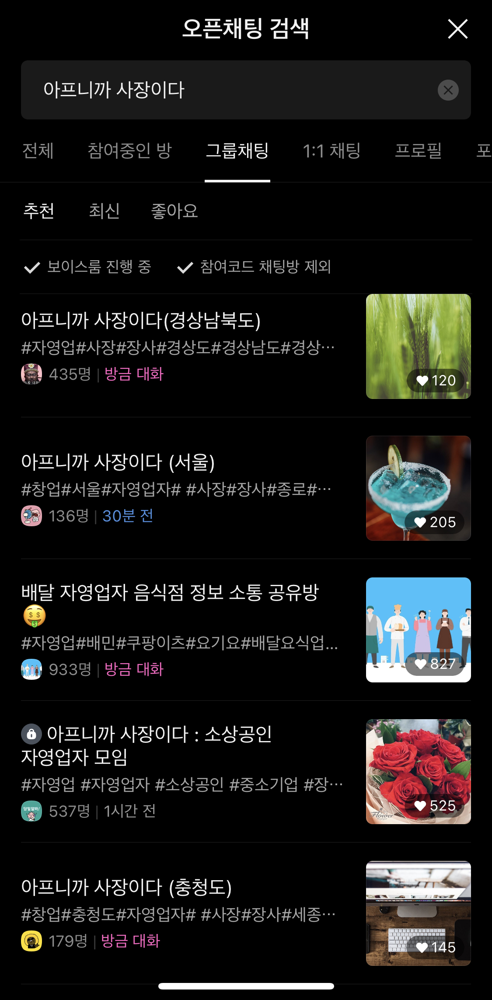

# 4. <아프니까 사장이다> 커뮤니티 데이터 분석

> 시리즈 목차&#x20;
>
> 1. [시작 - 배민 공고떴다!](1..md)
> 2. [배민상회를 만드는 사람들의 철학은 어떻게 서비스에서 묻어나는가 ](2.-and.md)
> 3. 외식업 사장님들, 그들은 누구인가&#x20;
>    1. [3-1..md](3-1..md "mention")
>    2. [3-2..md](3-2..md "mention")
> 4. [국내 대표 소상공인/외식업 사장님들 커뮤니티에서는 배민상회를 어떻게 생각할까](4.-less-than-greater-than.md)&#x20;
> 5. [문제는 드러나는게 아니라 정의하는 것 - 문제 정의 & 개선 가설 ](5.-and.md)
> 6. [결론](6..md)&#x20;

외식업 사장님 두 분과의 전화 인터뷰를 통해 외식업 세계가 어떻게 돌아가는지를 대충 큰 그림을 그릴 수 있게 되었고, 거래처를 뚫는 과정이나 식자재/물품을 구입하는데 고려하는 요소 등 혼자서 고민했다면 절대로 알 수 없었을 귀중한 인사이트를 얻게 되었다.&#x20;

그러나 두 분과의 인터뷰만으로 배민상회의 고객인 외식업 사장님들을 이해하기에는 부족한 점이 많았다. 두 분은 각각 포항과 부산 등 서울 이외의 지역에서 장사를 하고 계시기도 하고, 배민 상회나 거래처 이용에 대해서 두 분의 의견이 다소 엇갈리기도 했어서 좀 더 많은 사장님들의 생각을 듣고 싶었다.&#x20;

## 1. 대한민국 대표 외식업 사장님 커뮤니티, 아프니까 사장이다&#x20;

어떻게 하면 외식업 사장님들의 이야기를 들어볼 수 있을까 고민하다가, 네이버 카페에서 무려 130만 멤버를 가지고 있는 대표 소상공인/외식업/창업 커뮤니티인 <[아프니까 사장이다](https://cafe.naver.com/jihosoccer123)> 카페를 알게 되었다.&#x20;

찾아보니, 이곳 커뮤니티는 전국의 많은 외식업 사장님들이 가입하여 정보를 얻어가고 소통하는 공간으로, 외식업/창업 분야로는 네이버 카페 순위에서도 압도적으로 1등이었다. 매일 신규 가입자수도 많고 글도 활발하게 올라오고 있어서 이곳이라면 다양한 사장님들의 이야기를 엿볼 수 있을 것이라고 생각했다.&#x20;

### 1-1. 구글 설문지를 돌리지 않은 이유&#x20;

구글 설문지를 이용한 설문조사의 경우 고객을 이해하고 고객의 니즈를 파악하기 위해서 자주 사용되는 방법이다. 하지만 이처럼 설문조사를 이용한 사용자 리서치의 경우, 건네는 질문의 뉘앙스에 따라서 고객의 응답이 천차만별로 달라질 수 있고, **대부분의 고객들은 본인이 불편했던 경험이나 필요한 점들에 대해서 명확하게 드러내지 않기 때문에** 설문조사로 도출해낸 인사이트의 경우, 사용자의 니즈를 파악하기 위한 근거자료로는 다소 부족할 것이라는 생각이 들었다.&#x20;

## 2. "배민상회" 키워드에 대한 글을 크롤링한 뒤 분석하기&#x20;

그래서 고객에게 직접 물어보는 설문조사 대신 나는 이미 배민상회에 대해서 고객들이 말하고 있는 내용을 옆에서 지켜보는 방법을 택했다. 그 편이 고객들의 진짜 생각을 파악하는데 더 효과적일 것이라고 생각했기 때문이다.&#x20;

대한민국의 대표 외식업 사장님 커뮤니티인 이곳에서 사장님들은 배민상회에 대하서 어떤 생각을 가지고 있고, 배민상회 서비스를 왜 사용하고 있는지, 배민상회에 대해 어떤 불편을 가지고 있는지 알아보기 위해서 나는 아래와 같은 방법을 택했다.&#x20;

1. <[아프니까 사장이다](https://cafe.naver.com/jihosoccer123)> 카페 가입 및 관련 오픈 단톡방 입장&#x20;
2. 카페 내에서 "배민상회"를 키워드로 검색한 게시글 중 2022년 3월부터 현재까지의 모든 글에 대하여 크롤링. 엑셀 시트에 저장&#x20;
3. 관련 글 분석하며 외식업 사장님들의 관심 키워드, 주제, 불편 혹은 니즈 등을 파악&#x20;

### 2-1. <[아프니까 사장이다](https://cafe.naver.com/jihosoccer123)> 카페 가입 및 관련 오픈 단톡방 입장&#x20;

* 카페 정보&#x20;
  * 소상공인 자영업 창업 커뮤니티&#x20;
  * 멤버수 130만 이상&#x20;
  * 많은 사장님들이 서로 고민상담도 하고 정보도 교류하는 대표적인 외식업 사장님 커뮤니티&#x20;

 (7).png>).png>)&#x20;

<figure><figcaption></figcaption></figure>

### 2-2. "배민상회" 키워드 게시글 2022년 3월부터 현재까지 모두 크롤링&#x20;

파이썬은 제대로 배워본 적도 없고, 마지막으로 사용해본 것이 3년도 넘어서 다 까먹었었지만 ....😅 겨우겨우 구글링을 해보니 네이버 카페 크롤링 관련 글들이 많아서 생각보다는 쉽게 완료할 수 있었다. 아래처럼 엑셀시트에 모아 놓고 보니 많은 양의 글을 빠르게 탐색하며 사람들의 생각을 파악할 수 있었다.&#x20;

> 왜 2022년 3월부터의 데이터만 분석했나요?&#x20;
>
> * 배민상회는 2017년부터 시작된 서비스이지만, 그동안에는 배송도 불완전하고 서비스도 많은 변화를 거쳐왔다. 빠르게 성장하고 변화해가는 배민상회 서비스의 특성상 최근 1년 이전의 글들은 분석할 가치가 크지 않다고 판단했다.&#x20;

<figure><figcaption></figcaption></figure>

### 2-3. 분석 결과&#x20;

그렇게 약 500개의 글을 모아두고 읽어보니 작년부터 올해 상반기까지 대한민국 대표 외식업 사장님 커뮤니티에서는 배민상회에서 대해서 아래와 같은 주제로 이야기를 나누고 있었다. &#x20;

<figure><figcaption></figcaption></figure>

## 3. 외식업 커뮤니티 내 데이터 분석을 통해 얻은 인사이트&#x20;

* O2O 소상공인 플랫폼 지원사업에 대해서 배민상회 서비스 내에서 자세한 안내가 이루어지고 있지 않다. 혹은 안내된 내용이 충분하지 않다.&#x20;
* **외식업 사장님들은 특정 제품(ex. 탕용기, 냉면용기 등)에 대해 좋은 제품을 추천받고자 커뮤니티를 적극적으로 이용하며, 커뮤니티 내에서 추천받은 제품에 대해 큰 신뢰를 가진다.**&#x20;
* **배민상회의 특정 상품에 대한 후기를 물어보는 사용자들도 많았다.**&#x20;
* 어떤 제품을 사면 좋을지 고민하는 글에는 배민상회의 무료 샘플 서비스를 추천하는 사장님들이 많았다. 즉, 무료 샘플 서비스에 대해서는 긍정적인 서비스 경험을 가진 사용자들이 많았다. &#x20;
* 배민상회의 배송 서비스에 대해서 대부분의 사용자가 부정적인 경험을 했거나 부정적인 인식을 가지고 있다.&#x20;
* 온라인에서 식자재를 구입하는 사장님들은 보통 여러 곳을 비교해본 뒤 가격 대비 품질을 고려하여 구입한다.&#x20;
  * 배민상회에서 물건을 구입할 때에는 쿠폰을 적용하여 다른 곳보다 가격이 저렴해질 때이다. &#x20;
