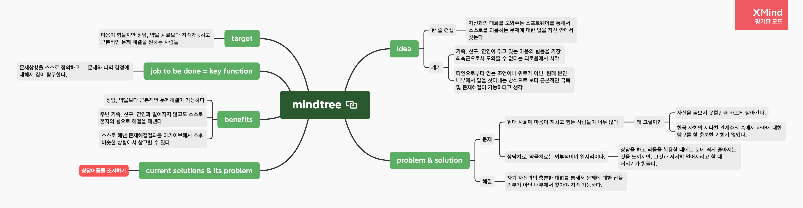

# problem map 작성하기

[삶을 살아가면서 풀고 싶은 문제들을](../../writings/philosophy/probleminlife-03.md) 글로써 정리하고나니, 이런저런 해결방법에 대해 아이디어가 막 떠오르고, 실험해보고 싶은 것들, 개선하고 싶은 것들에 대한 생각으로 머리가 꽉 차버렸다.

어차피 그 많은 것들 중, 하나도 이 생에서 다 끝내지 못하고 죽을지도 모른다. (아마 그럴 가능성이 크다 😅) 그러니 일단 지금은 당장 하고 싶은 것을 먼저 해나가면서 하나씩 채워가기로 한다.

### 문제와 문제의 만남

그러던 중 해결하고 싶은 문제와 요즘 내 삶에서 느끼는 문제들이 맞닿는 지점을 발견했다. 지난 문제탐구의 글에서도 밝힌 바와 같이, 나는 지구의 모든 사람들이 외부적 요인에 의한 제약없이 스스로 좋아하는 일을 하며 행복하게 살아가기를 바란다. 그리고 그런 세상이 될 수 없는 이유를 생각했고 두 가지의 큰 덩어리 문제를 정의했었다. **하나는 많은 사람들이 자기가 어떤 일을 좋아하는지, 어떤 때 행복한지를 잘 모른다는 것이었고,** 다른 하나는 좋아하고 행복한 일을 명확하게 알지만, 국경, 국가, 언어, 인종 등 외부적 요인들로 인해 그 일을 할 수 없다는 것이었다.

그 중 첫번째 문제 덩어리에 좀 더 집중을 해보기로 했다.

> 왜 사람들은 자신이 어떤 일을 좋아하는지, 어떤 때 행복한지 잘 알지 못할까?

이에 대해 나는 관계 중심적이고 대학입시를 중요시하는 한국 사회에서 많은 사람들이 자아에 대해 충분히 고민하고 스스로와 대화를 나눌 수 있는 기회가 많이 부족했던 것이 문제의 핵심이라는 결론에 도달했다.

이런 문제의식을 가지고 고민하던 무렵, 내 주변에는 마음이 힘든 사람들이 많았다. 가족들도 그러했고, 친구들 중에서도 알지 못했지만 상담치료를 받거나 약물을 복용하고 있는 친구들이 꽤 되었다. "타인으로부터 인정을 받고 자신의 효용성을 입증해내는 것으로부터 삶의 의미를 찾아왔는데, 이제는 그것이 너무 힘들고 괴롭다"는 친구의 말을 들었을 때, 나는 충격에 휩쌓였다. 늘 당당하고 밝고 유머러스했으며 직장 내에서 소위 말하는 일잘러에 핵인싸로 손꼽혔던 그 친구는 사실 하루하루 불안하고 지친 삶을 혼자서 이겨내 왔던 것이다.

사실 내가 절망적이었던 그 다음이다. 가족으로서, 친구로서, 연인으로서 내가 사랑하는 사람들에게 마땅히 큰 도움이 될 수 없다는 것은 너무 괴롭고 힘든 일이었다. 누구를 위로하고 공감하는 것에 나조차도 그리 익숙하지 않았기에, 그들의 이야기를 덤덤히 들어주는 것 이외에는 내가 할 수 있는 것이 없었다.

내가 할 수 있는 일이 없을까 고민하다가, 조금이라도 도움이 될까 하여 내가 고민이 있을때 주로 사용하던 문답법을 공유했다. 그 형식은 다음과 같다.

1. 자신이 지금 느끼는 부정적인 감정, 부정적인 생각, 고민을 적는다.
2. 왜 그런 감정을 느끼고 생각을 하게 되었는지, 왜 그런 고민을 하게 되었는지 이유를 생각나는 대로 적는다.
3. 다시 2번의 항목에서 '왜 그렇게 되었을까?' 를 생각하며 다시 다음 가지를 뻗어간다.
4. 문제의 핵심에 다다를때까지 1-3번을 반복한다.

여기서 중요한 것은 두 가지이다.

* 빈 종이에 글을 적든, 마인드 맵을 그리든, 그림을 그리든 간에 형식은 상관없다. 이 과정을 시각화하여 내 눈으로 확인할수만 있으면 된다.
* 다른 사람이 아닌 나의 목소리, 나의 생각에 집중해서 솔직하게 적는다.

이렇게 한 사이클을 돌리게 되면, **나를 괴롭혔던 생각들이 모두 한 장의 지면에 담기게 된다.** 그리고 **그것을 해결하며 문제의 핵심에 도달하는 과정을 내 눈으로 직접 확인할 수 있다.** 이것만으로도 나는 다음번에 비슷한 고민이나 생각, 감정을 느끼게 될 때 참고할 수 있는 지도를 손에 쥐게 된다. 한번 왔던 길을 잃는다면 다시 참고할 수 있는 지도가 있기에 자신감이 생긴다.

가장 중요한 것은 나를 괴롭히던 문제를 누구의 조언이나 도움없이 온전히 나의 힘으로 풀어낸 경험을 갖게 된다는 것이다. 이것만으로도 나는 이미 이전과는 다른 사람이 된다. **나는 나를 괴롭히는 상황 속에서 스스로 문제를 정의하고 끝까지 해결해본 사람이 된다.**

### problem map, 문제 정의하고 답을 찾는 과정

내가 공유한 문답법을 이용해서 마음의 평화를 얻었고 문제의 근본에 좀 더 다가갈 수 있게 되었다는 소식을 들었다. 누군가가 다른 사람의 조언 없이 내가 알려준 방법을 적용해서 답을 찾은 경우는 처음이었다. 순간, 어쩌면 이것이 우리 모두에게 필요한 것일지도 모른다는 생각이 강하게 들었다.

내가 가지고 있는 문제에 대한 답은 결국 자기 자신에게 있다. 그것에 대해 전문적인 상담이나 약물치료가 물론 도움이 될 수 있겠지만, 그 내면의 땅굴을 스스로 파내어 문제를 직면하지 않는 이상, 고통은 반복될 것이다.

어쩌면 우리는 너무 많은 사람들과 함께 삶을 살아왔던 게 아닐까, 하는 생각이 들었다. 충분히 스스로 자신과의 대화를 통해서 고민하고 생각하며 마음을 단단히 다질 수 있는 존재들임에도 가족, 직장동료, 학교 동기, 친구, 애인까지 너무 많은 관계들 속에서 어쩌면 스스로의 마음을 단단히 할 수 있는 기회들을 흘려보내버린 것은 아닐까.

생각이 여기까지 미치자 한 개인이 평생에 걸쳐 스스로에 대해 공부할 수 있는 서비스가 있다면 너무 좋을 것 같다는 생각이 들었다. 개인의 삶의 주기와 함께하면서 고민이 있거나 생각이 필요할 때, 답을 잘 모르겠을때, 언제든지 다시 와서 기존의 고민들과 해결과정들을 꺼내보고 참고하며 다시 새로운 문제들을 해결해나갈 수 있는 공간말이다.

떠오르는 서비스에 대해 생각나는 것들을 토대로 컨셉맵을 그려보았다. 지난번 [노코드로 PMF 찾기 웨비나](https://blog.mhson.world/2022/03/04/sideprojects/how-to-find-pmf-with-no-code/) 때, 디스콰이엇 현솔님이 공유해주신 방법을 참고했다. 아직 완벽하지는 않겠지만, 프로젝트를 진행하면서 이 맵도 서서히 보완해갈 예정이다.

이제부터는 시장의 상담어플들을 찾아보고 그것들이 채워주지 못하는 점들을 좀 더 세부적으로 조사해 맵을 구체화시켜나갈 예정이다.
