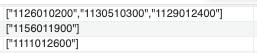
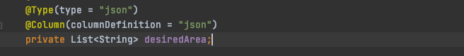

# JPA querydsl에서 json array 로 된 컬럼에 조건 적용하기

### 배경

요즘 한창 회사의 관리자 페이지 API 작업중이다. 직원분들이 이번 기획에서 가장 강력하게 요청해주신 기능 중 하나가 바로 `특정 지역구만 선택한 사용자 필터링` 이다. 이 기능이 말하는 것이 무엇인지 좀 더 설명을 덧붙여보자.

* 우리 서비스에서는 사용자가 자기가 살고 싶은 지역을 선택해 입력하는 기능이 있다.
  * 예를 들어 사용자 A 는 `관악구 전체`, `관악구 봉천동`을 입력했고,
  * 사용자 B는 `관악구 봉천동`, `강북구 번동` 을 입력했다고 가정해보자.
* 이때 사용자가 입력한 희망거주지역은 법정동코드 10자리로 서버에 전달된다.
* 관리자 페이지에서 직원분들은 관악구와 강북구를 선택한 사용자 B를 제외하고 관악구만 선택한 사용자 A를 필터링해서 보기를 원하는 것이다.

### 문제

관리자페이지인만큼 동적 쿼리로 여러가지 조건을 검색조건에 맞게 동적으로 적용하도록 쿼리를 짰는데, 지역구의 경우에는 두 가지 문제가 있었다.

#### 1. json array 형태로 저장된 컬럼에서 조건절 적용 불가

현재 데이터 베이스 상에서 사용자가 입력한 최대 5개의 희망거주지역은 json string array 형태로 데이터 베이스의 한 컬럼에 저장이 되어있었다. (아래 참고) 

이를 DB 에 저장하고 꺼내어 쓸 때에는 [이 라이브러리](https://mvnrepository.com/artifact/com.vladmihalcea/hibernate-types-52/2.4.0) 를 써서 string 리스트 형태로 바로 조회하고 저장할 수 있도록 entity 설정을 해둔 상태였다.



그래서 당연히 쿼리를 만들 때 해당 리스트의 요소에 특정 문자열이 존재하는지 검사하는 `contains()`를 써서 해결하면 될 것이라고 생각하고 아래와 같이 코드를 짰었다.

```
applyTable.expectingArea.contains(regionalCode);
```

그런데 쿼리를 막상 실행해보니, 아래와 같은 오류가 뿜어져 나왔다.

```
java.lang.NullPointerException
	at org.hibernate.hql.internal.ast.tree.MethodNode.handleElements(MethodNode.java:202)
	at org.hibernate.hql.internal.ast.tree.MethodNode.resolveCollectionProperty(MethodNode.java:146)
	...[중략]...
    at com.querydsl.jpa.impl.AbstractJPAQuery.createQuery(AbstractJPAQuery.java:101)
	at com.querydsl.jpa.impl.AbstractJPAQuery.createQuery(AbstractJPAQuery.java:94)
	at com.querydsl.jpa.impl.AbstractJPAQuery.fetch(AbstractJPAQuery.java:201)
	at space.holostanding.repositories.TourQueryRepository.findToursWithConditions(TourQueryRepository.java:90)
```

NPE 가 발생한 곳을 타고타고 넘어가보니, `collectionFromElement.getQueryableCollection();` 이곳에서 null 값으로 조회되면서 `queryableCollection.getElementPersister().getQuerySpaces()` 부분에서 NPE 가 발생되는 것을 확인할 수 있었다.

```
//MetodNode.java 파일 내부의 handleElements() 매서드

private void handleElements(FromReferenceNode collectionNode, String propertyName) {
    FromElement collectionFromElement = collectionNode.getFromElement();
    QueryableCollection queryableCollection = collectionFromElement.getQueryableCollection();       //이곳에서 null 값 조회

    String path = collectionNode.getPath() + "[]." + propertyName;
    LOG.debugf( "Creating elements for %s", path );

    fromElement = collectionFromElement;
    if ( !collectionFromElement.isCollectionOfValuesOrComponents() ) {
        getWalker().addQuerySpaces( queryableCollection.getElementPersister().getQuerySpaces() );       //이곳에서 NPE 발생!
    }

    setDataType( queryableCollection.getElementType() );
    selectColumns = collectionFromElement.toColumns( fromElement.getTableAlias(), propertyName, inSelect );
}
```

결국 json array 를 list 로 컨버팅해서 비즈니스 로직 상으로 전달받기 전까지, 해당 컬럼의 데이터들은 getQueryableCollection() 에 해당되지 않기 때문에 조회되지 않는다고 이해를 하였다. json array 타입의 컬럼 내부 데이터를 대상으로 조건을 적용할 수 있는 방법을 찾아야만 했다.

#### 2. 단순히 특정 지역구를 선택한 결과가 아닌, `특정 지역구만` 선택한 결과만 노출

게다가 생각을 해보니 위의 쿼리도 문제가 있었다. 단순히 배열이 특정 지역구를 포함하기만 하면 되는 것이 아니라, 배열 내부의 모든 요소들이 특정 지역구 코드를 포함하고 있어야 했다. 예를들어, 위 예시의 사용자 A와 B 의 경우는 아래와 같은 지역구 배열을 가지고 있을 것이다.

* 사용자 A : 관악구 전체, 관악구 봉천동 선택 -> `["1162000000", "1162010100"]`
* 사용자 B : 관악구 봉천동, 강북구 번동 -> `["1162010100", "1130510200"]`

관악구의 법정동 코드인 `1162000000` 인 경우를 생각해보면, 나는 각 배열의 요소들이 `11620` 으로 시작하는지를 검사해야했다.

### 해결

여타 다른 건의 경우는 쿼리로 해결이 어렵거나 쿼리가 너무 복잡해질 경우, 비즈니스 로직쪽으로 가져와 처리를 했겠지만, 이 건의 경우는 관리자 페이지 상 신청목록에 대한 조회였기 때문에 페이징 등 기타 이슈도 있어 이 조건만 별도로 처리하는 것이 어렵다고 판단했다. 어떻게든 이 문제를 쿼리로, 그리고 웬만하면 querydsl 로 해결하고 싶었다.

우선은 Mysql 쿼리로 해당 부분이 가능한지 검증을 해보기로 했다. 그래서 여러 방법을 검토해본 결과,

* [Mysql 8.0 documantation](https://dev.mysql.com/doc/refman/8.0/en/json.html#json-paths)
* [MySQLOraclewhere-절에서-IF문-사용하기](https://rk1993.tistory.com/entry/MySQLOraclewhere-%EC%A0%88%EC%97%90%EC%84%9C-IF%EB%AC%B8-%EC%82%AC%EC%9A%A9%ED%95%98%EA%B8%B0) 등을 참고하여 아래와 같이 쿼리를 짤 수 있었다.

```
select * from applyTable 
	where IF (JSON_EXTRACT(expecting_area, '$[0]') is not null, JSON_EXTRACT(expecting_area, '$[0]') like '"11620%', true)
    and IF (JSON_EXTRACT(expecting_area, '$[1]') is not null, JSON_EXTRACT(expecting_area, '$[1]') like '"11620%', true)
    and IF (JSON_EXTRACT(expecting_area, '$[2]') is not null, JSON_EXTRACT(expecting_area, '$[2]') like '"11620%', true)
    and IF (JSON_EXTRACT(expecting_area, '$[3]') is not null, JSON_EXTRACT(expecting_area, '$[3]') like '"11620%', true)
    and IF (JSON_EXTRACT(expecting_area, '$[4]') is not null, JSON_EXTRACT(expecting_area, '$[4]') like '"11620%', true);
```

사용자가 최대 선택할 수 있는 지역구는 5개이므로, 배열의 5개 요소마다(JSON\_EXTRACT) 특정 지역구 코드로 시작하는지를 조사했고(like '"11620%'), 만약 해당 index의 배열 요소가 없다면 pass 할 수 있도록(true) 처리하였다.

그리고 이를 querydsl 로 다음과 같이 구현하였다.

```
if (searchCondition.hasRegion()) {
    String guCode = searchCondition.searchRegionGuCode();

    StringTemplate stringTemplate0 = Expressions.stringTemplate("JSON_EXTRACT({0}, '$[0]')", recommendResult.desiredArea);
    StringTemplate stringTemplate1 = Expressions.stringTemplate("JSON_EXTRACT({0}, '$[1]')", recommendResult.desiredArea);
    StringTemplate stringTemplate2 = Expressions.stringTemplate("JSON_EXTRACT({0}, '$[2]')", recommendResult.desiredArea);
    StringTemplate stringTemplate3 = Expressions.stringTemplate("JSON_EXTRACT({0}, '$[3]')", recommendResult.desiredArea);
    StringTemplate stringTemplate4 = Expressions.stringTemplate("JSON_EXTRACT({0}, '$[4]')", recommendResult.desiredArea);

            stringTemplate0.isNotNull().and(stringTemplate0.contains(guCode)).or(stringTemplate0.isNull())
                    .and(stringTemplate1.isNotNull().and(stringTemplate1.contains(guCode)).or(stringTemplate1.isNull()))
                    .and(stringTemplate2.isNotNull().and(stringTemplate2.contains(guCode)).or(stringTemplate2.isNull()))
                    .and(stringTemplate3.isNotNull().and(stringTemplate3.contains(guCode)).or(stringTemplate3.isNull()))
                    .and(stringTemplate4.isNotNull().and(stringTemplate4.contains(guCode)).or(stringTemplate4.isNull()))
}
```

우선 기능이 정상적으로 동작하는 것을 테스트 완료했으니, 이제 반복되는 코드들을 정리하고, 리펙토링까지 하면 마무리 될 것 같다.

### 느낀점

* querydsl 을 처음 쓰기 시작할 때까지만해도 왠지 쿼리도 작성하고, 코드도 따로 작성해서 일을 두번하는 느낌이었는데, 이번에 관리자 서비스를 구축하면서 querydsl 이 아니었다면 할 수 없었을 깔끔하고 안전한 동적쿼리 작성을 경험하고 있다. 늘 선배 개발자님들께 존경과 감사를!
* 관계형 데이터베이스를 쓰는 상황에서 데이터를 저렇게 json array 형태로 보관하는 것이 좋은 방법이 아니라는 것을 알고 있다. 설계 당시에는 더 좋은 방법을 떠올리지 못해서 위와 같이 진행했지만, 결국은 그때의 부채가 지금처럼 값을 치루게 되는 것 같다. 이 부분도 하루빨리 개선되어야 할 부분으로 체크해두어야겠다.
