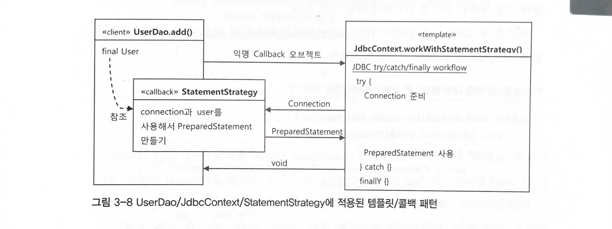

# 템플릿

## 템플릿

* 개방폐쇄원칙을 보면, 코드 내에서도 변경을 통해 기능이 다양해지려는 성질도 있고, 고정되어 변하지 않으려는 성질도 있다는 것을 알 수 있다. 변화의 특성이 서로 다른 부분들을 구분하고, 각가 다른 목적과 다른 이유에 의해 다른 시점에 독립적으로 변경될 수 있는 효율적인 구조를 만들어주는 것이 바로 개방폐쇄 원칙인 셈!&#x20;
* 템플릿의 경우, 이렇게 바뀌는 성질이 다른 코드 중에서 변경이 거의 일어나지 않으며 일정한 패턴으로 유지되는 특성을 가진 부분을 자유롭게 변경되는 성질을 가진 부분으로부터 독립시켜 효과적으로 활용할 수 있도록 하려는 방법이다.


## 예외처리 코드 추가하기

* 기존까지 진행된 리펙토링을 위해 많은 구조 개선이 있었지만, 한 가지 문제점, 예외처리가 되지 않았다는 문제점이 있었다. 특히나 DB 커넥션과 같은 제한적인 리소스를 공유해서 사용하는 서버에서 동작하는 JDBC 코드에서 예외처리는 필수적이다. 중간에 예외가 발생해서 리소스가 제대로 반환이 안될 경우, 계속 문제가 누적되어 나중에는 서버가 멈추는 현상까지 갈 수 있기 때문이다.&#x20;
* 아래와 같이 예외처리를 추가해보았다.&#x20;

```java
public class UserDao {
    private DataSource dataSource;

    public UserDao() {
    }

    public void setDataSource(DataSource dataSource) {
        this.dataSource = dataSource;
    }
    
    ...

    public void deleteAll() throws SQLException {
        Connection c = null;
        PreparedStatement ps = null;

        try {
            c = this.dataSource.getConnection();
            ps = c.prepareStatement("delete from users");
            ps.executeUpdate();
        } catch (SQLException var15) {
            throw var15;
        } finally {
            if (ps != null) {
                try {
                    ps.close();
                } catch (SQLException var14) {
                }
            }

            if (c != null) {
                try {
                    c.close();
                } catch (SQLException var13) {
                }
            }

        }
    }
    
    ...
}

```

### 문제점

* 위의 코드 상 문제점은 `c.prepareStatement("delete from users"); 사실상 이 구절만을 제외하고는 UserDao 내의 다른 매소드(add(), get(), getCount() 등) 에서 위의 구절이 반복된다는 것이다.`
* 복사 붙여넣기를 하는 것은 문제를 해결할 수 없다. 도중에 한 줄의 코드라도 실수로 잘못 붙여넣거나 빠뜨리게 되면, connection 자원은 계속 누수가 생길 것이고, 언젠가는 서버가 멈추게 된다.&#x20;
* 이 상황을 효과적으로 해결하기 위해서는 변하는 부분과 변하지 않는 부분을 명확하게 파악하고 일종의 템플릿화를 함으로써 접근할 수 있다. &#x20;


## 분리와 재사용을 위한 디자인 패턴 적용

생각해보면, 변하는 부분과 변하지 않는 부분은 명확하다.&#x20;

* 변하는 부분 : `ps = c.prepareStatement("delete from users");`
* `변하지 않는 부분 : 나머지`


### 1. 매소드 추출 방법 ❌

* 그렇다면 우선 변하는 부분을 메소드로 빼는 방법을 선택해볼 수 있다.&#x20;
* 하지만 이렇게 진행할 경우, 매소드의 내용이 다른 곳에 재사용할 수 있는 것이어야 하는데, 이 경우는 반대로 매소드 이외의 부분을 재사용하고, 매소드 부분은 DAO 로직마다 새롭게 만들어야 한다.

```java
public class UserDao {
    private DataSource dataSource;

    public UserDao() {
    }

    public void setDataSource(DataSource dataSource) {
        this.dataSource = dataSource;
    }
    
    ...

    public void deleteAll() throws SQLException {
        Connection c = null;
        PreparedStatement ps = null;

        try {
            c = this.dataSource.getConnection();
            ps = makeStatement(c);        //매소드로 추출한 부분! 
            ps.executeUpdate();
        } catch (SQLException var15) {
            throw var15;
        } finally {
            if (ps != null) {
                try {
                    ps.close();
                } catch (SQLException var14) {
                }
            }

            if (c != null) {
                try {
                    c.close();
                } catch (SQLException var13) {
                }
            }

        }
    }
    
    ...
    
    private PreparedStatement makeStatement(Connection c) throws SQLException {
        PreparedStatement = ps;
        ps = c.prepareStatement("delete from users");
        return ps;
    }
}
```


### 2. 템플릿 메소드 패턴 적용 ❌

* 템플릿 매소드 패턴은 상속을 통해 기능을 확장해서 사용하는 것
* 변하지 않는 부분은 슈퍼클래스로 두고, 변하는 부분을 추상 매소드로 정의해두어 서브클래스에서 오버라이드하여 새롭게 정의해 쓰도록 한다.&#x20;

```java
public class UserDao {
    ...
    
    abstract private PreparedStatement makeStatement(Connection c) throws SQLException;
}


public class UserDaoDeleteAll extends UserDao {
    
    protected PreparedStatement makeStatement(Connection c) throws SQLException {
        PreparedStatement ps = c.prepareStatement("delete from users");
        return ps;
    }
}
```

* 하지만 이렇게 될 경우, 새로운 DAO 로직이 늘어날 때마다 UserDao 클래스를 오버라이딩하는 새로운 클래스를 만들어야 한다는 단점이 있다.&#x20;
  * UserDao
    * UserDaoAdd
    * UserDaoDeleteAll
    * UserDaoGet
    * UserDaoGetCount
    * ...
* 또한 확장구조가 이미 클래스를 설계하는 시점에 고정되어버린다. 이렇게 되면 관계의 유연성이 떨어지게 된다.&#x20;


### 3. 전략 패턴 적용 🙆

* 개방폐쇄원칙을 잘 지키면서 템플릿 매소드 패턴보다 유연하고 확장성이 뛰어난 것이 바로 전략패턴이다.&#x20;
* 전략 패턴에서는 오브젝트를 아예 둘로 분리하고, 클래스 레벨에서는 인터페이스를 통해서만 의존하도록 만드는 방법이다.&#x20;
* 확장에 해당하는 변하는 부분을 별도의 클래스로 만들어 추상화된 인터페이스를 통해 위임하는 방식.&#x20;


#### 예) deleteAll()

예를 들어 deleteAll() 을 통해서 보자면, 이 기능은 아래와 같은 컨텍스트를 가지고 있다.&#x20;

1. DB 커넥션 가져오기&#x20;
2. PreparedStatement 를 만들어줄 외부 기능 호출하기&#x20;
3. 전달받은 PreparedStatement 실행하기
4. 예외가 발생하면 이를 다시 메소드 밖으로 던지기&#x20;
5. 모든 경우에 만들어진 PreparedStatement 와 Connection 을 적절하게 닫아주기&#x20;

여기에서 2번을 제외하고는 사실상 모든 Dao 로직에서 나머지 부분들이 반복된다. 따라서 다음과 같이 인터페이스를 이용하여 바꿔볼 수 있다.&#x20;


```java
public interface StatementStrategy {
    PreparedStatement makePreparedStatement(Connection var1) throws SQLException;
}

public class DeleteAllStatement implements StatementStrategy {
    public PreparedStatement makePreparedStatement(Connection c) throws SQLException {
        PreparedStatement ps = c.prepareStatement("delete from users");
        return ps;
    }
}

public class UserDao() {
    ...
    public void deleteAll() throws SQLException {
        try{
            c = dataSource.getConnection();
            
            StatementStrategy strategy = new DeleteAllStatement();
            ps = strategy.makePreparedStatement();
        
            ps.executeUpdate();
        } catch (SQLException e){
        ...
        }
    }
}

```

&#x20;하지만 이 경우, 또 다시 문제점이 발생한다. 컨텍스트인 deleteAll() 에서 이미 구체적인 전략인 DeleteAllStatement() 를 사용하도록 고정되어있다. 컨텍스트가 인터페이스 이외에 인터페이스의 구현체까지 알고 있는 것은 좀 이상하다.&#x20;


### 4. DI 적용을 위한 클라이언트/컨텍스트 분리 🙆

보통 전략패턴에 따르면 아래와 같은 구조가 되어야 한다.&#x20;

* 클라이언트는 전략을 선택 및 생성하고, 이러한 전략을 컨텍스트에 제공한다.&#x20;
* 클라이언트로부터 전략을 받은 컨텍스트는 전략 인터페이스 내 매소드를 호출한다.&#x20;
* 전략 인터페이스의 구현체 매소드가 실행된다.&#x20;


따라서, UserDao 는 아래와 같은 구조로 리펙토링 되어야 할 것이다.&#x20;

<figure><figcaption></figcaption></figure>

```java
public class UserDao {
    ...

    //컨텍스트
    public void jdbcContextWithStatementStrategy(StatementStrategy stmt) throws SQLException {
        Connection c = null;
        PreparedStatement ps = null;

        try {
            c = this.dataSource.getConnection();
            ps = stmt.makePreparedStatement(c);
            ps.executeUpdate();
        } catch (SQLException var15) {
            throw var15;
        } finally {
            if (ps != null) {
                try {
                    ps.close();
                } catch (SQLException var14) {
                }
            }

            if (c != null) {
                try {
                    c.close();
                } catch (SQLException var13) {
                }
            }

        }

    }
    
    ...

    //클라이언트
    public void deleteAll() throws SQLException {
        Statement st = new DeleteAllStatement();
        jdbcContextWithStatementStrategy(st);
    }

    ...
}
```


## JDBC 전략 패턴의 최적화&#x20;

* 위까지 리펙토링을 했지만, 그럼에도 불구하고 2가지의 아쉬움이 있다.&#x20;
  * DAO 로직이 새로 생겨날 때마다, StatementStrategy 구현 클래스를 만들어야 한다. 이렇게 계속 새로 생성되는 것은 로직마다 상속하는 템플릿 메소드 패턴과 다를 것이 없다.&#x20;
  * 또 다른 점은 add() 와 같은 매소드의 경우는 User 와 같은 부가정보를 넘겨받아 statement 를 실행하기 때문에, 부가적인 생성자를 만들어주어야 한다.&#x20;


이 문제를 해결하는 방법은 두 가지 방법이 있을 것 같다. 1. 로직클래스와 2. 익명클래스 이다.&#x20;


### 로컬 클래스

로컬 클래스는 매소드 내부에 정의된 클래스를 말한다. DeleteAllStatement 나 AddStatement 는 어차피 한번씩 UserDao 에서만 사용된다. 그렇다면 굳이 외부 클래스로 두지 말고 매소드 내부에 클래스 정의를 하자는 입장이다.

로컬 클래스로 바꿨을 경우, 장점은 다음과 같다.&#x20;

* 매소드 내부에서 정의되기 때문에 자신이 선언된 곳의 내부 정보에 접근이 가능하다.&#x20;
  * add() 매소드의 파라미터로 넘어온 user 를 바로 가져다가 쓸 수 있기 때문에 클래스 내부에서 별도의 생성자로 받아 인스턴스 변수로 저장하고 있지 않아도 된다.&#x20;
  * 다만, 이렇게 로컬 클래스에서 바로 접근하려면 매개변수로 전달된 User 에 final 이 붙어야 한다.&#x20;
* 클래스 파일 1개를 줄였고, add() 매소드 내에서 PreparedStatement 생성로직을 함께 볼 수 있다.&#x20;

```java
public class UserDao {
    ...
    public void add(final User user) throws SQLException {
        
        //add() method 내부에 정의된 AddStatement() 구현체 
        class AddStatement implements StatementStrategy {
        
        public PreparedStatement makePreparedStatement(Connection c) throws SQLException {
            PreparedStatement ps = c.prepareStatement("insert into users(id, name, password) values(?,?,?)");
            ps.setString(1, user.getId());
            ps.setString(2, user.getName());
            ps.setString(3, user.getPassword());
            return ps;
        }
    }
}

```

#### 참고) 중첩클래스의 종류

1. static class : 독립적으로 오브젝트로 만들어질 수 있음
2. &#x20;inner class, 내부클래스 : 자신이 정의된 클래스의 오브젝트 안에서만 만들어질 수 있음
   1. 멤버 내부 클래스 : 멤버 필드처럼 오브젝트 레벨에 정의됨&#x20;
   2. 로컬 클래스 : 매소드 레벨에 정의됨&#x20;
   3. 익명 내부 클래스 : 이름을 갖지 않는 익명 내부 클래스. 범위는 선언된 위치에 따라서 다름
      1. 이름이 없기 때문에 클래스 자신의 타입을 가질 수 없다.&#x20;
      2. 구현한 인터페이스 타입의 변수에만 저장할 수 있다.  &#x20;


### 익명 내부 클래스

* 아예 add() 매소드 내부에서만 사용되는 것이라면 이름이 필요 없을수도 있다. 익명클래스로 만들어볼수도 있다.&#x20;

```java
public class UserDao {
    ...
    public void add(final User user) throws SQLException {
        this.jdbcContextWithStatementStrategy(new StatementStrategy() {
            public PreparedStatement makePreparedStatement(Connection c) throws SQLException {
                PreparedStatement ps = c.prepareStatement("insert into users(id, name, password) values(?,?,?)");
                ps.setString(1, user.getId());
                ps.setString(2, user.getName());
                ps.setString(3, user.getPassword());
                return ps;
            }
        });
    }

    public void deleteAll() throws SQLException {
        this.jdbcContextWithStatementStrategy(new StatementStrategy() {
            public PreparedStatement makePreparedStatement(Connection c) throws SQLException {
                return c.prepareStatement("delete from users");
            }
        });
    }
    
    ...
}
```


## 컨텍스트와 DI&#x20;

* 지금까지의 흐름을 정리해보자면 아래와 같다.&#x20;
  * 클라이언트 UserDao&#x20;
  * 컨텍스트 : jdbcContextWithStatementStrategy()&#x20;
  * 개별 전략 : 익명 내부 클래스로 만들어진 두 개의 strategy&#x20;


### 클래스 분리

* JDBC 는 일반적으로 UserDAO 뿐만 아니라 다른 DAO에서도 사용이 가능하다. 따라서 별도의 클래스로 분리하여 사용하는 것이 더 나을 것 같다.&#x20;

```java
public class JdbcContext {
    DataSource dataSource;

    public JdbcContext() {
    }

    public void setDataSource(DataSource dataSource) {
        this.dataSource = dataSource;
    }

    public void workWithStatementStrategy(StatementStrategy stmt) throws SQLException {
        Connection c = null;
        PreparedStatement ps = null;

        try {
            c = this.dataSource.getConnection();
            ps = stmt.makePreparedStatement(c);
            ps.executeUpdate();
        } catch (SQLException var15) {
            throw var15;
        } finally {
            if (ps != null) {
                try {
                    ps.close();
                } catch (SQLException var14) {
                }
            }

            if (c != null) {
                try {
                    c.close();
                } catch (SQLException var13) {
                }
            }

        }

    }
}


public class UserDao {
    private JdbcContext jdbcContext;

    public UserDao() {
    }

    public void setDataSource(JdbcContext jdbcContext) {    //JdbcContext 를 DI 받는다. 
        this.jdbcContext = jdbcContext;
    }

    public void add(final User user) throws SQLException {
        this.jdbcContext.workWithStatementStrategy(new StatementStrategy() { ... }
        });
    }
    
    public void deleteAll() throws SQLException {
        this.jdbcContext.workWithStatementStrategy(new StatementStrategy() { ... }
        });
    }
}
```


### 빈 의존관계 변경&#x20;

* 위와 같이 JdbcContext 를 별도로 분리하게 되면, 의존관계가 다음과 같이 변경된다.&#x20;
  * UserDao -> JdbcContext(구체) -> DataSource (인터페이스) <- SimpleDriverDS (구현체)&#x20;
* 일반적인 DI의 경우, 두 오브젝트가 인터페이스를 사이에 두고 서로 느슨하게 연결되어있는 것이 기본인데, UserDao 와 JdbcContext 의 경우는 좀 특별하다. JdbcContext 는 JdbcContext 를 제공해주는 서비스 오브젝트로서의 의미만 있고, 그 내부의 구현방법이 변경될 가능성이 없다. 따라서 변동성을 염두해두어 인터페이스를 두고 느슨하게 연결할 필요 없이, 그냥 JdbcContext class 구체를 직접 연결해준다.&#x20;
* 위의 의존관계 변경에 맞춰, XML 파일 내부의 정보도 변경해준다.&#x20;
  * 아직까지 UserDao 내에서 JdbcContext 로 변경하지 않은 부분들이 있으니 우선 dataSource 를 주입받고 있도록 설정을 지우지 않았다.&#x20;

```xml
<?xml version="1.0" encoding="UTF-8"?>
<beans xmlns="http://www.springframework.org/schema/beans"
   xmlns:xsi="http://www.w3.org/2001/XMLSchema-instance"
   xsi:schemaLocation="http://www.springframework.org/schema/beans 
                  http://www.springframework.org/schema/beans/spring-beans-3.0.xsd">

   <bean id="dataSource" class="org.springframework.jdbc.datasource.SimpleDriverDataSource">
      ...
   </bean>
   
   <bean id="userDao" class="springbook.user.dao.UserDao">
      <!-- 추후 jdbcContext 로 완전히 전환되면 삭제 예정 -->
      <property name="dataSource" ref="dataSource" />
      <property name="jdbcContext" ref="jdbcContext" />
   </bean>
   
   <!-- 추가된 jdbcContext 타입의 빈 -->
   <bean id="jdbcContext" class="springbook.user.dao.jdbcContext">
      <property name="dataSource" ref="dataSource" />
   </bean>
   
</beans>
```


### JdbcContext 의 특별한 DI

* JdbcContext 에 DI 할 수 있는 두 가지 방법이 있다.&#x20;
  * 스프링 빈을 통한 DI&#x20;
  * 코드를 이용하는 수동 DI&#x20;

&#x20;

#### 스프링 빈을 통한 DI&#x20;


UserDao -> JdbcContext 간의 관계가 인터페이스를 이용한 연결이 아니라 구체로 고정되어있다. 이 경우에도 여전히 DI 라고 할 수 있을까?


* 여전히, jdbcContext 는 DI 라고 말할 수 있는데, DI 개념 자체가 객체의 생성과 관계설정에 대한 제어 권한을 오브젝트에서 제거하고 외부로 위임했다는 IoC 개념을 포괄하기 때문이다. 현재 JdbcContext 는 스프링을 이용하여 UserDao 객체에서 사용하게 주입되고 있기 때문에 DI 의 기본을 따르고 있다고 할 수 있다.&#x20;
* 그렇다면 JdbcContext 는 왜 굳이 DI 를 따라야 할까? 두 가지 이유가 있다.&#x20;
  * 하나는 스프링 컨테이너 내에서 싱글톤 레지스트리에서 관리되는 싱글톤 빈이 될 수 있기 때문이다.
    * JbdcContext 의 경우, 그 자체로 변경되는 상태정보가 없고, dataSource 라는 인스턴스 변수가 있지만, 조회용이므로 큰 상관이 없다.&#x20;
    * 게다가 JbdcContext 는 JDBC 컨텍스트 메소드를 제공해주는 일종의 서비스 오브젝트로서의 의미가 있기 때문에 싱글톤으로 등록 되어서 여러 오브젝트에서 공유해 사용되는 것이 좋다. &#x20;
  * 또 다른 하나는 JdbcContext 가 DI 를 통해 다른 빈에 의존하고 있기 때문이다. &#x20;
    * 스프링 DI 를 위해서는 대상이 되는 오브젝트들이 모두 스프링 컨테이너에 의해 관리를 받는 IoC 대상이어야 한다. 따라서 dataSource 빈을 주입받기 위해서라도 JdbcContext 는 스프링 빈으로 관리가 되어야 한다.&#x20;

#### 왜 인터페이스를 사용하지 않는가?&#x20;

* JdbcContext 의 경우는 UserDao 와 매우 긴밀한 관계를 가지고 있다. UserDao 는 반드시 JdbcContext 와 같이 사용되기 때문이다.&#x20;
* JdbcContext 의 경우, Jpa나 하이버네이트와 같은 ORM 을 사용해야한다면 아예 통째로 바뀌어야 한다.&#x20;
* dataSource 와 달리, 테스트에서도 다른 구현으로 대체해서 사용할 이유가 없다.&#x20;

따라서 위와 같은 경우, 별도로 인터페이스를 두지 않고 강력한 결합을 인정하며 스프링 빈으로 등록하여 DI 되도록 만드는 것이 좋다. 싱글톤으로 만들수도 있고 JdbcContext 내부에 사용되는 DI 를 위해서라도 말이다.&#x20;

다만, 이런 코드 구성은 최후의 고민수단이다. DI 는 일단 인터페이스를 사용하여 관계를 맺는 것을 기본으로 하기 떄문에 이 경우는 매우매우매우 특수한 경우이므로, 주의해서 사용하자. 인터페이스 만들기 귀찮다고 이렇게 쓰는 것은 절대로 아니다...!&#x20;


#### 코드를 이용하는 수동 DI&#x20;

* 스프링 빈으로 등록해서 DI 하지 않는다면, UserDao 내부에서 직접 DI 를 적용하는 방법도 있다.&#x20;

```java
public class UserDao {
    private DataSource dataSource;
    private JdbcContext jdbcContext;

    public UserDao() {
    }

    public void setDataSource(DataSource dataSource) {    
        //수정자 매소드이지만, JdbcContext 에 대한 DI 작업도 동시에 이루어지고 있다. 
        this.jdbcContext = new JdbcContext();
        this.jdbcContext.setDataSource(dataSource);
        this.dataSource = dataSource;        // 아직 jdbcContext 를 이용하고 있지 않은 매소드를 위해 남겨두는 코드 
    }
}
```

```xml
<?xml version="1.0" encoding="UTF-8"?>
<beans xmlns="http://www.springframework.org/schema/beans"
   xmlns:xsi="http://www.w3.org/2001/XMLSchema-instance"
   xsi:schemaLocation="http://www.springframework.org/schema/beans 
                  http://www.springframework.org/schema/beans/spring-beans-3.0.xsd">
                  
   <bean id="dataSource" class="org.springframework.jdbc.datasource.SimpleDriverDataSource">
      ...
   </bean>
   
   <bean id="userDao" class="springbook.user.dao.UserDao">
      <property name="dataSource" ref="dataSource" />
   </bean> 
</beans>
```


#### 비교하기 : 스프링 빈을 이용한 DI vs. 코드를 이용한 수동 DI&#x20;

* 스프링 빈을 이용한 DI&#x20;
  * 장점 : 오브젝트 간 의존관계가 설정파일에서 명확하게 드러난다.&#x20;
  * 단점 : DI 근본 원칙에 부합하지 않는 구체적인 클래스와의 관계가 설정에 직접 노출된다.&#x20;
* 코드를 이용한 수동 DI&#x20;
  * 장점 : UserDao - JdbcContext 간의 관계가 외부에 직접적으로 노출되지 않는다.&#x20;
  * 단점
    * JdbcContext 를 여러 오브젝트가 사용하더라도 싱글톤으로 만들 수 없다.&#x20;
    * DI 작업을 위해서 별도로 코드 작업이 필요하다.&#x20;


장단점은 각자가 알아서 비교해보며 사용하면 된다. 어느 것이 더 낫다고 말할 수 없다. 특정 것을 사용하는데 분명한 이유가 있는 것이 훨씬 중요하다.&#x20;



## 템플릿과 콜백

* 템플릿/콜백 패턴 : 복잡하지만 바뀌지 않는 일정한 패턴을 갖는 작업 흐름이 존재하고, 그 중 일부만 교체하여 사용해야하는 경우, 전략 패턴 기본 구조 + 익명 내부 클래스를 활용하는데, 이러한 방식을 스프링에서는 템플릿/콜백 패턴이라고 부른다.&#x20;
  * 전략패턴의 컨텍스트를 템플릿, 익명 내부 클래스로 만들어지는 오브젝트를 콜백이라고 부른다.&#x20;
* 템플릿
  * 어떤 목적을 위해 미리 만들어둔 모양이 있는 틀
  * 참고) 템플릿 메소드 패턴 : 고정된 틀의 로직을 가진 템플릿 메소드를 슈퍼클래스에 두고, 바뀌는 부분을 서브 클래스의 메소드에 두는 구조&#x20;
* 콜백
  * 실행되는 것을 목적으로 다른 오브젝트의 매소드에 전달되는 오브젝트를 말한다.&#x20;
  * 자바에서는 매소드를 파라미터로 전달할 수 없기 때문에, 메소드가 담인 오브젝트를 전달해야한다.&#x20;

### 템플릿/콜백의 특징

* 단일 메소드 인터페이스를 사용한다. 특정 기능을 사용하기 위해 한번만 호출되는 경우가 일반적이기 떄문이다.&#x20;
  * 보통 전략 패턴의 경우는 여러 개의 메소드를 가진 인터페이스를 사용할 수 있도록 한다.&#x20;
* 콜백은 일반적으로 하나의 매소드를 가진 인터페이스를 구현한 익명 내부 클래스로 만들어진다.&#x20;
* 콜백 인터페이스 메소드에는 보통 파라미터가 존재하며 이는 템플릿의 작업 흐름 중에 만들어지는 컨텍스트 정보를 전달받기 위함이다.&#x20;

<figure><figcaption><p>출처) 토비의 스프링</p></figcaption></figure>

<figure><figcaption><p>출처) 토비의 스프링</p></figcaption></figure>

* DI 방식의 전략 패턴 구조라고 이해하면 좋다.&#x20;
* 클라이언트 UserDao 가 템플릿 매소드 workWithStatementStrategy() 를 호출하면서 콜백 오브젝트 StatementStragety 구현체를 전달하는 것은 메소드 레벨에서 일어나는 DI 이다. 오브젝트를 생성함과 동시에 주입하고 있는 셈이다.&#x20;
* 템플릿/콜백 패턴에서는 매번 메소드 단위로 사용할 오브젝트를 새롭게 전달받는다.&#x20;
  * 일반적인 DI 라면 템플릿에 인스턴스 변수를 만들어두고 사용할 의존 오브젝트를 수정자 메소드로 받아서 사용한다
* 콜백 오브젝트가 내부 클래스로서 자신을 생성한 클라이언트 매소드 내의 정보를 직접 참조한다는 것도 특이하다. (final User 등)&#x20;


### 콜백의 분리와 재활용

* 장점
  * 클라이언트인 DAO 메소드가 간결해진다. 최소한의 데이터 엑세스 로직만 가지고 있게 된다.&#x20;
* 단점
  * 내부 클래스로 코드가 되어있어 가독성이 좀 떨어진다.

```java
public class UserDao {
    ...
    
    public void deleteAll() throws SQLException {
        executeSql("delete from users");
    }
    
    private void executeSql(final String query) throws SQLException{
        this.jdbcContext.workWithStatementStrategy(
            new StatementStrategy() {
                public PreparedStatement makePreparedStatement(Connection c) 
                        throws SQLException{
                    
                    return c.prepareStatement(query);
                }
            }
        );
    }
}
```

* 위와 같이 공통된 부분을 추출하여 다른 DAO 메소드에서도 활용할 수 있도록 하였다. 이제 deleteAll() 에서는 실행할 쿼리문만 전달하면 된다.&#x20;


### 콜백과 템플릿의 결합

* 한단계 더 나아가, UserDao 내부에서만 executeSql() 을 사용할 것이 아니라 외부까지 그 범위를 확장해보는 것은 어떨까. 다른 DAO 클래스들이 공통으로 사용하고 있는 JdbcContext 클래스 내부로 옮겨주자.&#x20;

```java
public class JdbcContext {
    ...
    private void executeSql(final String query) throws SQLException{
        workWithStatementStrategy(
            new StatementStrategy() {
                public PreparedStatement makePreparedStatement(Connection c) 
                        throws SQLException{
                    
                    return c.prepareStatement(query);
                }
            }
        );
    }
}


public class UserDao {
    ...
    
    public void deleteAll() throws SQLException {
        this.jdbcContext.executeSql("delete from users");
    }
}
```

* 이렇게 구조를 바꾸니, 클라이언트인 UserDao 에서는 쿼리문만 전달해주고, 나머지 쿼리 실행을 위한 목적을 공유하는 코드들은 JdbcContext 클래스 내부로 모이게 되었다.&#x20;
  * 코드의 성격이 다른 것들은 분리하는 것이 보통이지만, 이 경우는 같은 목적을 위해 긴밀하게 움직이고 있으므로 한군데 모여있는 것이 유리하다.&#x20;
* 구체적인 구현, 내부 전략패턴, 코드에 의한 DI, 익명 내부 클래스 등 기술은 최대한 감춰졌고, 외부에는 꼭 필요한 기능만 오픈할 수 있게 되었다.&#x20;


### 템플릿/콜백의 응용 - Calculator&#x20;

#### 1. test 만들기

* 덧셈기능을 가진 계산기를 만들어보자
* 아래와 같이 한줄에 하나씩 숫자가 존재하고, 각 라인의 숫자를 더해 그 합을 반환해주는 기능을 가진 계산기를 만든다. &#x20;

```
//numbers.txt
1
2
3
4
```

```java
public class CalcSumTest {

    @Test
    public void sumOfNumbers() throws IOException {
        Calculator calculator = new Calculator(); 
        int sum = calculator.calcSum(getClass().getResource("numbers.txt").getPath());
        assertThat(sum, is(10));
    }
}
```

```java
public class Calculator {
    public Calculator() {
    }

    public Integer calcSum(String filepath) throws IOException {
        BufferedReader br = new BufferedReader(new FileReader(filePath));
        Integer sum = 0;
        String line = null;
        while ((line = br.readLine()) != null) {
            sum += Integer.valueOf(line);
        }
        
        br.close();
        return sum;
    }
}
```


#### 2. try, catch, finally 로 예외처리하기

```java
public class Calculator { 
    public Calculator() { }
    
    public Integer calcSum(String filepath) throws IOException {
        BufferedReader br = null;
        try {
            br = new BufferedReader(new FileReader(filePath));
            Integer sum = 0;
            String line = null;
            while ((line = br.readLine()) != null) {
                sum += Integer.valueOf(line);
            }
            return sum;
        
        } catch(IOException e) {
        
        } finally {
            if (br != null) {
                try { br.close(); }
                catch (IOException e) { System.out.println(e.getMessage()); }
            }
        }
    }
}
```


#### 3. 중복제거 및 템플릿/콜백 설계하기

* 곱셈기능 및 다른 기능이 추가된다면...? 위처럼 길다란 try \~ catch 문을 무지성으로 반복할수는 없다. 일정한 패턴이 보이므로 패턴을 따보자.

```java
//BufferedReaderCallback.java
public interface BufferedReaderCallback {
    Integer doSomethingWithReader(BufferedReader br) throw IOException;
}

//Calculator.java
public Integer fileReadTemplate(String filePath, BuffredReaderCallback callback) 
        throws IOException {
        
    BufferedReader br = null;
        try {
            br = new BufferedReader(new FileReader(filePath));
            int result = callback.doSomethingWithReader(br);
            return result;
        } catch(IOException e) {
        
        } finally {
            if (br != null) {
                try { br.close(); }
                catch (IOException e) { System.out.println(e.getMessage()); }
            }
        }
    
}

//Calculator.java
public class Calculator { 
    ...
    
    public Integer calcSum(String filepath) throws IOException {
        BufferedReaderCallBack callback = new BufferedReaderCallback() {
            public Integer doSomethingWithReader(BufferedReader br) 
                    throw IOException {
                    
                Integer sum = 0;
                String line = null;
                
                while ((line = br.readLine()) != null) {
                    sum += Integer.valueOf(line);
                }
        
                return sum;
            }
        };
        
        return fileReadTemplate(filePath, callback);
    }
    
    public Integer calcMultiply(String filepath) throws IOException {
        BufferedReaderCallBack callback = new BufferedReaderCallback() {
            public Integer doSomethingWithReader(BufferedReader br) 
                    throw IOException {
                    
                Integer sum = 0;
                String line = null;
                
                while ((line = br.readLine()) != null) {
                    sum *= Integer.valueOf(line);
                }
        
                return sum;
            }
        };
        
        return fileReadTemplate(filePath, callback);
    }
}


//CalcSumTest.java
public class CalcSumTest {
    Calculator calculator;
    String numFilepath;

    public CalcSumTest() {
    }

    @Before
    public void setUp() {
        this.calculator = new Calculator();
        this.numFilepath = this.getClass().getResource("numbers.txt").getPath();
    }

    @Test
    public void sumOfNumbers() throws IOException {
        Assert.assertThat(this.calculator.calcSum(this.numFilepath), CoreMatchers.is(10));
    }

    @Test
    public void multiplyOfNumbers() throws IOException {
        Assert.assertThat(this.calculator.calcMultiply(this.numFilepath), CoreMatchers.is(24));
    }
}

```


#### 4. 템플릿/콜백 재설계&#x20;

* 그럼에도 불구하고 반복되는 구조 발견! ->read lines
* 이 부분도 개선해보자.&#x20;

```java
//LineCallback.java
public interface LineCallback {
    Integer doSomethinkWithLine(String line, Integer value);
}


//Calculator.java
public class Calculator { 
    ...
    
    public Integer calcSum(String filepath) throws IOException {
        LineCallback callback = new LineCallback() {
            public Integer doSomethinkWithLine(String line, Integer value) 
                    throw IOException {
                return value += Integer.valueOf(line);
            }
        };
        
        return lineReadTemplate(filePath, callback);
    }
    
    public Integer calcMultiply(String filepath) throws IOException {
        LineCallback callback = new LineCallback() {
            public Integer doSomethinkWithLine(String line, Integer value) 
                    throw IOException {
                return value *= Integer.valueOf(line);
            }
        };
        
        return lineReadTemplate(filePath, callback);
    }
    
    
    public Integer lineReadTemplate(String filePath, LineCallback callback, int resultValue) {
        BufferedReader br = null;
        try {
            br = new BufferedReader(new FileReader(filePath));

            Integer result = resultValue;            
            String line = null;
            while ((line = br.readLine()) != null) {
                result = callback.doSomethinkWithLine(line, result);
            }
            return result;
        
        } catch(IOException e) {
        
        } finally {
            if (br != null) {
                try { br.close(); }
                catch (IOException e) { System.out.println(e.getMessage()); }
            }
        }
    }
}
```


### 제네릭스를 이용한 콜백 인터페이스

* 반환 결과를 Integer 타입이 아닌 String 타입으로 하고 싶다면 어떻게 해야할까?&#x20;
  * 자바 5부터 추가된 제네릭을 이용하면 된다.&#x20;

```java
public interface LineCallback<T> {
    T doSomethingWithLine(String line, T value);
}

public <T> T lineReadTemplate(String filePath, LineCallback<T> callback, T initVal) 
        throws Exception {
        
    BufferedReader br = null;
    try {
        br = new BufferedReader(new FileReader(filePath));
        T result = initVal;
        String line = null;
        while ((line = br.readLine()) != null) {
            result = callback.doSomethinkWithLine(line, result);
        }
        
        return result;
    } catch(IOException e) {
        ...
    } finally { ... } 
}
```

```java
public class CalcSumTest {
    ...
    
    @Test
    public void concatenateStrings() throws IOException {
        Assert.assertThat(this.calculator.concatenate(this.numFilepath), CoreMatchers.is("1234"));
    }
}

public class Calculator {
    ...
    public String concatenate(String filepath) throws IOException {
        LineCallback<String> concatenateCallback = new LineCallback<String>() {
            public String doSomethingWithLine(String line, String value) {
                return value + line;
            }
        };
        return (String)this.lineReadTemplate(filepath, concatenateCallback, "");
    }

    public <T> T lineReadTemplate(String filepath, LineCallback<T> callback, T initVal) throws IOException {
        BufferedReader br = null;

        try {
            br = new BufferedReader(new FileReader(filepath));
            T res = initVal;

            for(String line = null; (line = br.readLine()) != null; res = callback.doSomethingWithLine(line, res)) {
            }

            Object var8 = res;
            return var8;
        } catch (IOException var15) {
            System.out.println(var15.getMessage());
            throw var15;
        } finally {
            if (br != null) {
                try {
                    br.close();
                } catch (IOException var14) {
                    System.out.println(var14.getMessage());
                }
            }

        }
    }
}
```


## 스프링의 JdbcTemplate


