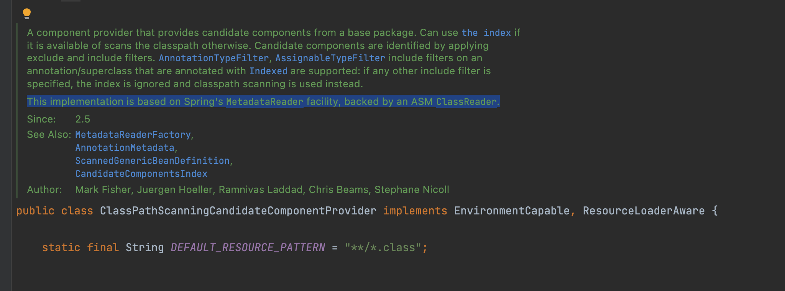

# 왜 목록은 항상 최신순이어야 할까?

## 1. 배경&#x20;

P2P 플랫폼 <청년 5.5>의 안드로이드 앱은 신용정보가 부족한 사회초년생 청년들이 빌리고자 하는 돈의 사용처와 사연을 작성하면, 투자자들이 해당 청년들에게 원하는 금액을 투자하고 5.5% 이자로 금액을 돌려받을 수 있는 투자 플랫폼이다.&#x20;

<청년 5.5>의 메인 화면은 청년들의 펀딩 신청 목록이 노출된다. 각 펀딩 신청은 0%부터 100%까지 펀딩률이 보여지고, 투자자들은 자기가 원하는 펀딩 상품에 원하는 만큼 투자를 할 수 있다.&#x20;

펀딩률이 100%가 되어야 신청자에게 대출이 가능해진다. 그 전까지 신청자들은 대출을 받을 수 없는 대출 대기 상태가 된다. &#x20;

그런데 어느 날 운영팀에서 기능 추가 개발 요청이 들어왔다. 메인 페이지에 노출되고 있는 펀딩 목록들을 필터링하고 정렬해서 볼 수 있는 기능을 추가해달라는 것이었는데, 소통을 하다 보니, 한 가지 의문점이 들었다.&#x20;

## 2. 문제정의&#x20;

개발 요청 건을 받아보고 제일 먼저 "이번 개발 건의 궁극적인 목표가 무엇일까"를 생각해보았다. 운영팀은 매 달 가장 최전선에서 실적과 싸우는 팀이었다. 매월 펀딩률이 얼마인지, 실제 대출 실행률이 얼마나 되는지, 연체율은 어느정도가 낮아졌는지 체크하고 그 숫자들을 높이거나 낮추기 위해 밤낮으로 고생을 하는 팀이다.&#x20;

그렇다면, 이번 개발 건의 궁극적인 목표는 투자활성화일 것이다. **펀딩률 100%를 채워 실제 대출을 실행하는 건을 늘리는 것**이 운영팀 입장에서 가장 중요한 수치일 것이다.&#x20;

**하지만, 필터링 기능이 그 목표를 달성하는데 가장 좋은 방법일 것인가? 그것에 대해서는 조금 생각해볼 필요가 있었다.**&#x20;

운영팀이 생각하기에는 펀딩 신청 목록이 많지만, 투자자들이 원하는 상품을 자세하게 필터링해서 볼 수 있는 기능이 없기 때문에 투자율이 떨어진다고 생각했다. 하지만 CTO님과 내가 데이터를 통해 보았을 때에는 조금 의견이 달랐다. 현재 우리 서비스의 메인 펀딩 신청 목록을 보면, 펀딩률이 50% 정도에 그치는 건들이 대부분이었다. 이러한 경향을 보이는 원인은 아주 쉽게 유추가 가능했다. 보통 펀딩목록에서는 아래와 같은 사이클이 발생하기 때문이다.&#x20;

1. 최신순으로 펀딩 목록이 노출됨. 신규 신청시, 가장 최상단에 노출됨&#x20;
2. 최상단에 노출될수록 노출률이 높으니, 펀딩을 많이 받는다.&#x20;
3. 하지만 펀딩률이 100%가 되기 전에, 다른 신청 건들이 추가되고, 50% 정도 펀딩이 완료된 상품은 하단으로 밀리게 된다.&#x20;
4. 하단으로 밀릴수록 노출률은 줄어들고, 펀딩이 완료될 확률이 줄어든다.&#x20;
5. 계속 100%를 달성하지 못하고 장기 체류하게 된다.&#x20;

## 3. 해결방법

결국, 나를 포함한 개발팀은 필터링 기능을 새롭게 추가하는 것보다 먼저 펀딩 임박률 순으로 펀딩 목록을 노출하는 것이 우리 서비스의 궁극적인 KPI인 실제 대출 실행률을 높이는 데 도움이 될것이라고 보았다. 그래서 운영팀의 개발 요청 건에 대하여 필터링 기능에 앞서 펀딩 임박률 순으로 메인 페이지 노출 기준을 변경하는 건을 먼저 진행하는 것이 어떤지 제안을 드렸다.&#x20;

## 4. 나의 역할

* 개발 요청 건에 대하여 무지성으로 개발하는 것이 아니라, 개발을 통해 이루고자하는 궁극적인 목표를 먼저 확인하였다.&#x20;
* 목표를 달성하기 위해 더 좋은 기획과 더 좋은 방향이 있다고 생각되어, 개발 팀원들과 함께 논의하였고, 논의 결과를 운영팀에게 제안하였다.&#x20;

## 5. 성과

결론적으로 말하자면, 제안된 내용은 운영팀으로부터 받아들여지지 않았다. 하지만, 아래와 같은 변화가 있었다.&#x20;

* 개발팀의 내부 논의 결과를 존중하며, 합리적이라고 생각하여 운영팀 내부에서 다시 한번 논의하는 회의가 있었다.&#x20;
* 제일 처음 요청된 개발 건에 대해서 좀 더 생각해보고 발전시켜 요청을 주시겠다고 하여, 일단은 개발 진행 건이 홀딩되었다.&#x20;

## 6. 느낀점 / 배운점

* 개발자로서의 첫 발을 뗀 이곳에서 CTO님으로부터 좋은 가르침을 많이 받았다. 어느정도 팀에 익숙해지고 개발 루틴이 정해지고 있을 때즈음, 요청된 기획 건에 대해 바로 개발을 진행하려고 했던 나에게 CTO님은 개발자일수록 요청된 기획에 대해서 100% 이해를 하고 납득을 한 뒤에 개발을 진행해야한다고 가르쳐주셨다.&#x20;
* 개발팀이기 때문에, 개발자이기 때문에 요청된 것을 요청된 대로 개발만 한다면, 좋은 개발자가 될 수 없다. 기획된 내용, 개발 요청 건들에 대해서 궁극적인 목표와 본질을 생각하고, 이해하려고 노력하며, 이해가 되지 않는다면, 이해가 될 때까지 촘촘한 질문과 적극적인 소통을 해야한다. 납득되지 않은채로 시키는대로만 개발하는 것은 개발자로서의 책임을 다하지 못하는 것이다.&#x20;
