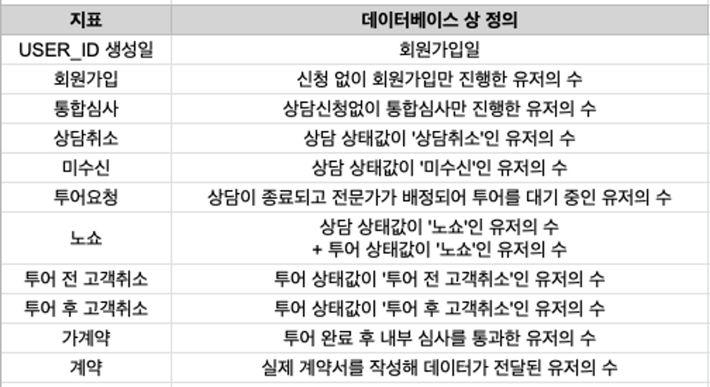
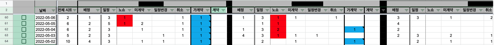
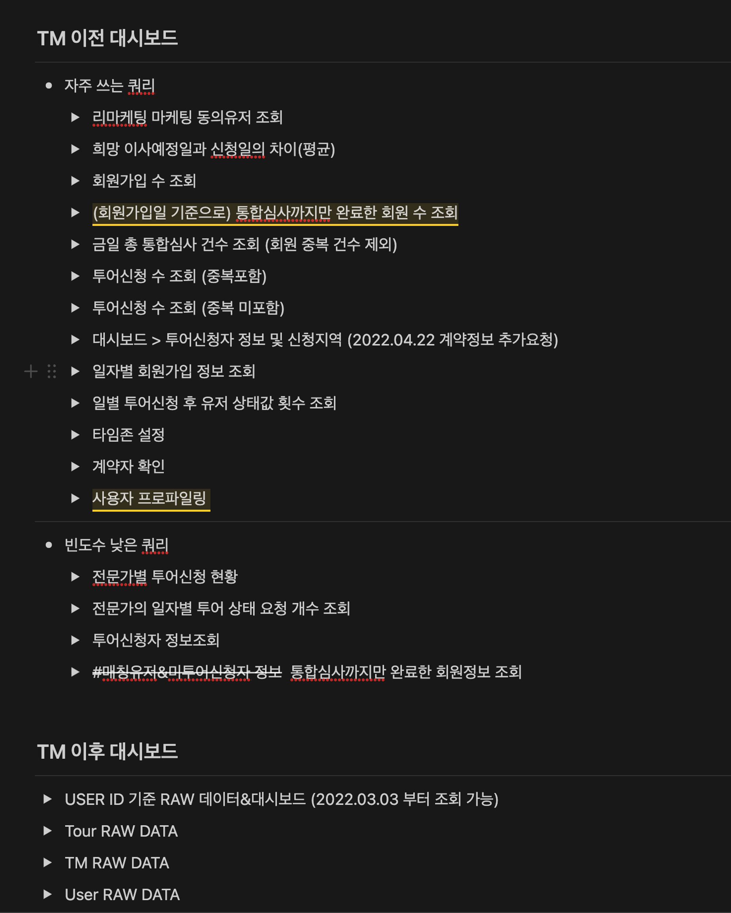

# On/Offline 통합 Data Dashboard 구축

## ​​​​1. 배경

홀로스탠딩은 보증금 0원 방을 보고 싶은 신청자가 신청을 하면 중개사를 매칭해주는 서비스이다. 현재 홀로스탠딩 서비스는 크게 사용자가 상담신청을 하는 \*\*`온라인`\*\*파트와 중개사를 만나 방투어를 하는 **`오프라인`** 파트로 나뉘어져 있다.

## 2. 문제정의

* 온라인 파트는 GA, 데이터베이스 등으로 데이터 관리가 용이하지만, 오프라인 파트는 현장에서 데이터를 수집하기가 어려워 데이터를 기반으로 의사결정을 하는데 어려움을 느낀다.
* 구체적인 데이터를 가지고 이야기를 하지 않다보니, 현장 인력의 개인적인 의견에 의해 프로덕트에 대한 의사결정이 되는 경우가 많았다.
* 오프라인의 상담가 및 중개사에게 데이터 수집에 관한 협조 요청을 하지만, 현장 상황에 의해 데이터가 누락되거나 업데이트가 안되는 경우가 많았다.
* 또한 현장인력의 경우, 데이터를 통해 파트별, 개인별 KPI 가 관리되지 않는다는 문제점도 드러났다.

## 3. 해결방법

* 온오프라인 데이터를 한 곳에서 볼 수 있도록 대시보드를 구축하여 구체적인 데이터를 기반으로 의사결정을 할 수 있도록 한다.
* 온라인쪽 데이터는 데이터베이스 및 GA 데이터를 연동하여 자동 업데이트 되도록 한다.
* 오프라인쪽 데이터는 지표를 정의 후, 데이터베이스 내 데이터와 조건들을 조합하여 산출한다.

### 3-1. 오프라인 데이터 지표 정의


상담 → 중개사 배정 → 중개사와 신청인 만나서 방 투어 → 투어 완료 후 내부 심사 → 가계약 → 계약


위와 같이 진행되는 오프라인 프로세스 중, 상담가나 중개사가 데이터 수집을 위해 별도의 액션을 취할 필요 없이 자동으로 데이터가 수집될 수 있도록 서버 데이터 기준으로 지표를 재정의했다.

기존에는 오프라인 데이터 수집을 위해 일일히 현장 전문가들에게 전화를 걸어 데이터를 수집해야했지만, 위의 지표 정의 이후에는 서버 및 데이터베이스 상에서 수집된 데이터를 통해 대시보드를 구축함으로서 데이터 수집과정을 일정 부분 자동화 시킬 수 있었다.

### 3-2. 각 담당자별 / 지역별 KPI 측정을 위한 개별 대시보드 구축 

기존에는 각 파트별, 실무자별 개인 업무결과가 수치로 관리되지 않거나 관리되더라도 모두 수동으로 데이터 수집이 이루어져 정확성이 많이 낮았다.

위처럼 각 파트별, 개인 실무자별 대시보드를 구축하여 데이터베이스 상 데이터를 기준으로 수치를 채워넣으니, 각 개인별 업무 수행도와 KPI 달성 여부를 한눈에 확인할 수 있었다.

### 3-3. 상담 이전과 이후 대시보드 상에서 쓰이는 쿼리문 통일 

기존에는 데이터가 필요한 사람이 각각 쿼리문을 작성하다보니, 같은 데이터임에도 불구하고 데이터가 맞지 않거나 동시에 업데이트가 되지 않는 등 문제가 있었다.

하나의 노션 페이지 내에서 각 단계별로 쓰이는 쿼리문들을 관리할 수 있도록 하여, 데이터를 조회하는 개인이 모두 같은 쿼리문을 기반으로 데이터에 접근할 수 있도록 체계화했다. 또한 프로덕트 변경사항에 대해 업데이트 되는 쿼리문도 한 곳에서 관리되기 때문에 이력관리도 용이하게 할 수 있도록 했다.

## 4. 나의 역할 

* 대시보드의 지표 설정 및 데이터베이스로부터의 산출 규칙 등을 주도적으로 정의하였다.&#x20;
* 대시보드 상에서 쓰이는 쿼리 및 데이터분석용 쿼리문을 투명하게 관리하여 정확한 데이터분석이 이루어질 수 있도록 하였다.&#x20;
* 서버 및 데이터베이스에서 필요한 데이터를 자동 산출할 수 있도록 시스템을 구축하여 현장 인력의 업무 로드를 줄일 수 있었다.&#x20;

## 5. 성과 

* 온오프라인 데이터를 하나의 대시보드 상에서 확인함으로써 수치에 대한 확인이 보다 수월해졌다.
* 현장 인력이 직접 입력하는 데이터를 최소화하고 데이터베이스 상 데이터로 수치를 표시함으로써 데이터 수집 및 업데이트에 대한 부분이 자동화되면서 현장 인력의 업무부담은 줄어들고 데이터의 정확성은 높아졌다.
* 현장 인력의 개인적인 의견과 더불어 대시보드 상 데이터를 조합하여 의사결정을 할 수 있게 되었다.

## 6. 느낀점 / 배운점

* 현장 인력의 경우, 업무로드가 크기 때문에 데이터 수집 등 부가적인 업무를 수행하는데 어려움이 있을 수 있다. 이 경우, 오프라인 쪽의 데이터도 최대한 자동으로 수집할 수 있도록 시스템적으로 보완할 부분이 많은 것 같다.
* 진정한 데이터 기반 의사결정을 하기 위해서는 데이터의 수집부터 업데이트 및 분석까지 일련의 과정이 모두 프로덕트 개선만큼이나 중요하다는 것에 대해 팀원들 모두의 공감과 이해가 필요하다.
