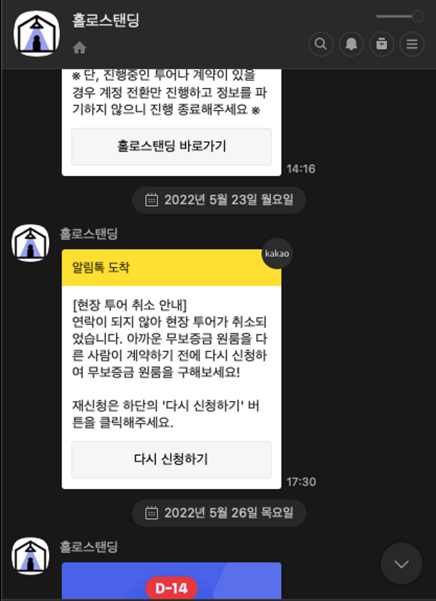
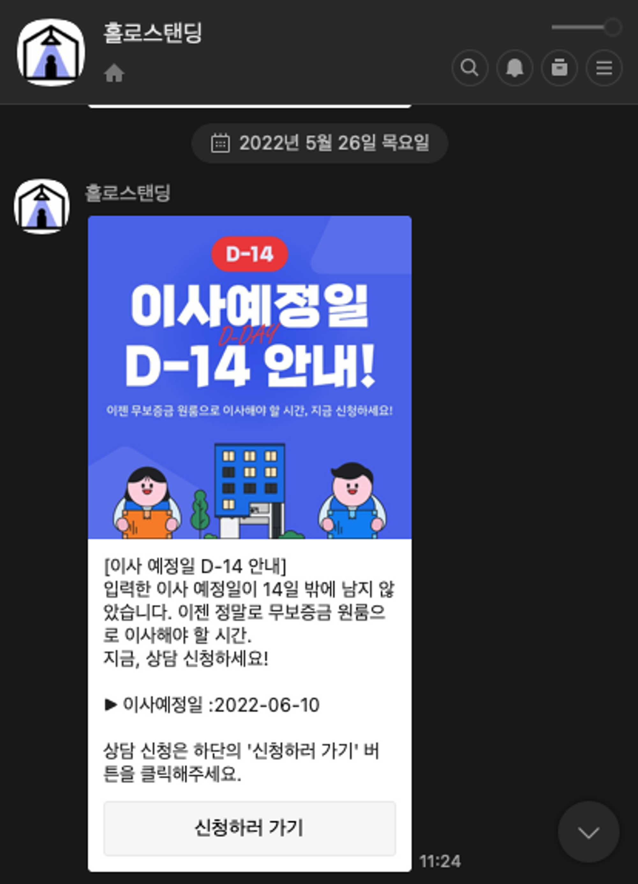

# CRM 프로세스 자동화를 통한 상담 신청률 개선

## 배경

홀로스탠딩에서는 크게 아래와 같은 단계로 퍼널이 존재한다.


회원가입/로그인 → 무보증금 조건 확인 → 상담 신청 → 전문가 투어 → 가계약 → 계약


* 우리 조직의 최대 목표는 계약수를 늘리는 것이었고 그를 위해서는 `전문가 투어가` 많이 활성화되어야 했다. 하지만 각 퍼널별로 다음 단계로 넘어가지 않고 머물러 있는 사용자들이 상당했고 이들을 움직일 방법이 필요했다.

## 문제 정의

* 기존에는 마케터 분이 정기적으로 특정 조건에 맞는 사용자 목록을 뽑아 수동으로 대량 알림톡을 전송했는데, 이는 시간이 오래 소요될 뿐만 아니라 각 사용자별로 개인화된 문구를 전달할 수 없다는 아쉬움이 있었다.

## 액션

* 각 퍼널별로 머물러있는 유저들을 대상으로 상황에 맞는 문구를 커스텀하여 전송하는 자동 배치 프로세스를 구축하기로 했다.
* 배치 프로세스는 매일 새벽 1시부터 6시까지 자동으로 돌며, 각 조건에 맞는 사용자들의 정보와 휴대폰 번호를 조회하여 카카오 알림톡 전송 대기열에 넣어둔다.
* 하루 중 정해진 전송 시각이 되면 유형별 알림톡이 사용자들에게 전송된다. 알림톡 메시지 내부의 버튼에는 유형별 UTM 코드가 심어져있어서 어떤 알림톡 유형을 통해 유입이 되었는지 확인할 수 있도록 했다.

<figure><figcaption>
사용자 상태별 알림톡 조건 정의
</figcaption></figure>

 

## 나의 역할

* 기존에 수동으로 전달되던 알림톡들 중 서버를 통해 자동화할 수 있는 유형들을 모두 추출하여 메시지가 자동으로 생성 및 전송되도록 전체 시스템을 구축했다.
* 마케터 및 기획자와의 회의를 통해 알림톡을 전송할 대상에 대한 조건을 구체화할 수 있도록 도왔다.
  * 예) 투어신청의 경우 사용자 당 중복신청이 가능하기 때문에 한번도 신청하지 않은 사람을 대상으로 할 것인지, 중복신청 여부와 상관없이 현재 신청이 안된 사람들만 대상으로 할 것인지 등

## 성과

* 일 평균 약 3,000 건의 메시지를 각 사용자의 조건 및 정보에 맞게 커스텀하여 알림톡으로 자동 전송할 수 있게 되었다.
* 주 평균 52건의 투어신청 수 중 약 38건이 서버를 통해 자동 전송된 알림톡을 통해 신청된 건으로 약 73% 정도가 알림톡을 통해 투어신청을 한 것으로 확인되었다.

## 느낀점 / 배운점

* 서비스의 초기 단계에는 확실히 운영 인력이 가지게 되는 업무 로드가 상당하다는 것을 느꼈다. 초기부터 완벽한 서비스를 내놓을 수 없기에 서비스를 성장시키면서 하나씩 자동화할 수 있는 부분들을 찾아서 자동화하고 비효율을 줄여나가는 작업이 필요하다.
* 안타까운 점은 초기 스타트업에서 운영의 업무로드는 서비스의 기능개선보다 우선순위가 밀리는 경우가 많기에 운영인력이 상당기간 고통을 감내해야한다는 점이다. 운영 상의 비효율도 틈틈히 줄여나가면서 서비스를 개선시킬 수 있는 방법이 필요할 것 같다.
