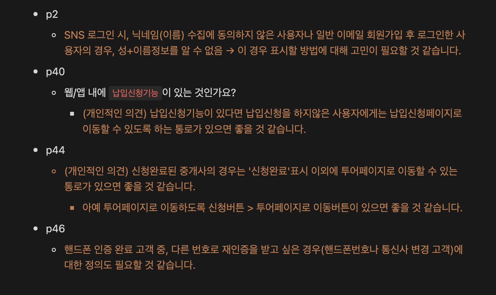
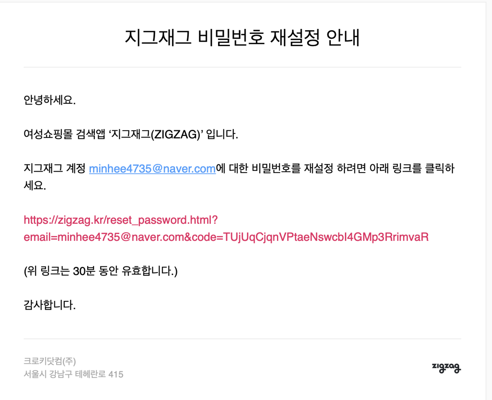

# Holostanding 웹 서비스 신규 개발기

## 1. 팀 합류

2021년 2월. 홀로스탠딩 팀에 합류하게 되었다. 대표님은 [불편함](https://icbox.io)이라는 서비스를 만들어 운영하다가 성공적으로 회사를 매각했고, 새롭게 서비스를 만들 팀을 구하고 있었다. 나는 대표님과 같은 공유오피스를 쓰던 다른 회사 사람이었고 공교롭게도 내가 퇴사하는 시기에 맞게 대표님께서 팀 합류 제안을 주셨다.

개발을 처음 배울 때부터 줄곧 백엔드 개발을 하고 싶었고, 초기 스타트업에서 팀원들과 밤새 일하고 토론하며 열정적으로 서비스를 만드는 경험을 하고 싶었다. 기존 회사에서는 아쉽게도 그러한 경험을 할 수 없었는데, 대표님과 함께라면 재미있게 서비스를 처음부터 하나씩 만들어 볼 수 있을 것 같았다. (무엇보다 팀원들과 이미 일면식이 있는 사이이기도 해서 걱정이 조금 덜했다.)

그렇게 나는 초기 스타트업 홀로스탠딩에 유일한 서버 개발자로 합류하게 되었다.

## 2. 개발자로서 기획 함께하기

우리 팀은 평균연령 20대 후반으로 이루어진 젊은 팀이었다. 팀원들은 각자 개성이 정말 뚜렷했고, 각자 분야나 서비스에 대한 열정도 가득했다. 매일 16시, 우리는 스몰토크를 위한 간식시간을 갖곤 했는데, 원래는 일과 상관없이 자유롭게 하고 싶은 이야기들을 나누거나 간식을 먹거나, 자거나(?), 산책을 가는 등 하고 싶은 것들을 하는 시간임에도, 꽤나 자주 우리는 서비스에 대해 고민하다가 보드마카를 꺼내들고 서로 격렬한 토론을 펼치는가 하면, 결국 오후 회의로 이어져 야근을 하게 되는 경우가 많았다.

세상에 존재하지 않는 서비스를 0부터 1까지 만드는 과정이라, 마케터, 개발자, 디자이너 등 직군에 상관없이 우리는 서비스에 대해 함께 이해하고 고민하고 기획에 적극적으로 참여했다. 매번 기획서가 업데이트 될때마다 함께 리뷰하며 우리는 궁금증이 들거나 헷갈리는 부분들, 확인이 필요한 부분들에 대해 이야기를 나눴고, (당시에는 외부에서 일하던) 기획자 분 역시 우리와 적극적으로 소통해주셨다.

<figure><figcaption>
매번 기획서가 업데이트 될때마다 사용자의 입장에서, 개발자의 입장에서 필요한 부분들을 이야기하며 기획에 적극적으로 참여했다.
</figcaption></figure>

지금 생각해보면, 열정적이었던 우리를 잘 정리해주신 기획자분이 얼마나 대단했는지, 세삼 감사함을 느낀다. 덕분에 기획은 성공적으로 잘 마무리될 수 있었다.

## 3. 어디까지 만들까

### 3-1. 우리가 만들고자 하는 서비스

우리가 만들고자 했던 것은 "보증금 0원인 매물을 가진 중개전문가"와 "보증금이 없는 예비 임차인"들을 서로 연결시켜주는 서비스였다. 애초에 "보증금"이라는 것은 집에 거주할 임차인을 신뢰하기 위한 일종의 담보의 개념이었으므로, 우리 회사가 "예비임차인이 보증금 1,000만원은 없을지라도 충분히 매달 50만원 이상의 월세는 지불할 수 있다"는 것을 보증해준다면, 집주인 역시 보증금을 0원으로 만들어줄 수 있을 것이라고 생각했다. 즉, 우리 회사 자체가 보증금의 역할을 하는 것이다.

### 3-2. 최소한의 최소기능으로

서비스를 만들다보면 필요한 기능은 한도끝도 없다. 100명의 사람이 있다면, 아마 100개의 필수기능이 각각 꼽힐수도 있지 않을까. 우리 팀은 이제 막 걸음마를 뗀 아기 스타트업이었으므로, 우리는 아주아주 작게 시작하기로 했다. 그렇다고는 해도 서로 다른 두 사용자 간의 중개 플랫폼이기 때문에 결국 임차인을 위한 앱과 중개 보조인을 위한 앱, 두 가지 종류의 프로덕트를 만들어야 했다. 그래서 정말 최소한의 기능만을 가지고 버전 1을 런칭하기로 했다. 처음 구상했던 월세 납입 기능이나 자취 꿀팁을 공유하는 꿀팁 게시판, 중개사와 임차인이 방 투어를 함께하기 위해 필요한 채팅 기능 등 필수적인 기능이 아닌 것들은 모두 제외 되었다. 그렇게 우리는 단 두 가지에만 집중하기로 했다. 하나는 임차인이 충분히 월세를 낼 수 있을지 검증하는 것, 또 다른 하나는 검증된 임차인이 최종적으로 투어를 신청할 수 있도록 하는 것이다.

> 지금 생각해보면 아쉬운 점
>
> * 목적성을 제대로 드러내지 못했던 기능
>   * 1년 8개월이 지나서 되돌아볼 때, 당시 유행하던 MBTI 테스트 형식으로 구축되었던 월세 검증 심사 단계에는 두 가지의 목적이 혼재되어있었던 것 같다. 월세 지불 능력을 검증하기 위한 질문지와 마케팅 및 바이럴을 위한 가벼운 무드의 MBTI 테스트.
>   * 결국 사용자들이 월세 검증 심사 단계를 "검증"으로 인식하지 못하고 단순 재미를 위한 MBTI 테스트 정도로 인식하게 되면서, 우리는 추후에 이 설문단계를 좀 더 엄중한 느낌으로 가져가게 된다.
>   * 결국은 바이럴도 잘 되지 않았고, 원래 목적이었던 검증의 역할도 제대로 하지 못했다고 생각한다. 차라리 MBTI 테스트를 별도의 토이 프로젝트처럼 런칭하여 마케팅을 진행했다면 더 나았을 것 같다.
> * 너무 많은 허들
>   * 우리 서비스에는 퍼널이 굉장이 많았다.
>     * 방문 - 회원가입/로그인 - 월세 지불능력 검사 - (휴대폰인증) - 투어 신청 - 중개사와 투어 - 가계약 - 계약
>   * 초기에 사용자를 검증하려고 하기 전에, 얼마나 많은 사람들이 중개 투어를 신청하는지 먼저 검증을 해봤으면 좋았겠다는 생각이 들었다. 애초에 니즈를 충분히 파악하기도 전에 최종 목표인 계약 단계까지 너무 많은 허들을 두었다는 생각이 들었다. 이후에 꽤 오랜 기간동은 우리 팀은 이때 세웠던 허들을 걷어내는 작업에 몰두하게 된다.

## 4. 어떤 기술을 사용할까

다시 한 번 말하지만 우리는 초기 스타트업이었다. 우리에게 가장 중요한 것은 최소한의 기능을 가진 프로덕트를 빠르게 런칭해내는 것이었다. 따라서 원래 계획했던 모바일 앱 개발은 이번 단계에서 진행하지 않기로 했다. 아직 프로덕트의 성공 여부가 검증되지도 않았고, 사용자들과 핏을 맞추지도 못했는데, 네이티브 앱을 런칭할 경우, 빠른 변경으로 인한 테스트가 다소 어렵기 때문이다. 물론 안드로이드와 IOS, WEB 까지 많은 클라이언트 환경을 감당할만큼 개발자가 없었던 것도 그 이유이다. 그렇게 Web 서비스에 집중하기로 하면서 우리는 어떤 기술들을 쓸지 대략적으로 정할 수 있게 되었다.

* Web - JavaScript, ReactJS
* Server - Java, SpringBoot, Mysql
* Infra - AWS

클라이언트 단에서는 추후에 리엑트 네이티브 등으로 앱 서비스도 함께 하기 위해서 자바스크립트 + 리엑트 조합을 사용하기로 했다. 물론 국내에서 가장 큰 사용자 층을 가지고 있기에 참고할 레퍼런스가 많다는 점도 한몫을 했다.

서버 단에서는 Java + Spring 조합을 이용하기로 했다. 이유는 두 명의 개발자가 모두 java, spring 에 대한 경험이 있었고, 참고할만한 레퍼런스도 가장 많았기 때문이다. 무엇보다 추후에 개발 팀원을 충원하기에 가장 유리하다는 점도 결정에 한몫을 했다. (그래도 요즘은 js+node 백엔드 개발자분들이 많아진 것 같다.)

인프라는 가장 익숙하고 흔히 쓰이는 AWS 서비스를 사용하기로 했다. 역시 두 개발자가 가장 익숙하게 다룰 수 있는 플랫폼이기 때문이었다. 그만큼 속도 면에서 유리할 것이라고 생각했다.

## 5. 사용자 0명, 초기 스타트업을 위한 인프라 구축하기

홀로스탠딩에 합류하기 직전, 전 회사에서 마지막으로 진행했던 프로젝트가 바로 P2P 온투법에 대응하여 서버 인프라를 [AWS 환경에서 Koscom Cloud 환경으로 이전하는 작업](../../crepass/aws-koscom-cloud.md)이었다. 덕분에 인프라와 네트워크에 대한 지식이 어느정도 있었던 상황이라, 초기 인프라는 내가 구축하기로 했다.

아래와 같은 단계를 거쳐 인프라를 나름 성공적으로 구축했다.

1. 인프라 구조도 작성
2. 네트워크 설정 (망분리) : VPC, Subnet, IGW, NGW, Route Table, Security Group 생성 및 구조도에 맞게 설정
3. 서버 설정 : EC2 서버 생성 및 내부 설정 (Nginx 설치, java 설치 등)
4. 데이터베이스 설정 : RDS 생성 및 설정
5. 통신 확인하기 : 직접 jar 파일 배포하여 web - application - database 까지 연결되는 것을 확인한다.
6. 배포 자동화 구축하기 : Github Action 혹은 AWS Pipeline 등으로 배포 자동화 시스템 구축하기

> 지금 생각해보면 아쉬운 점
>
> * 과한 설계
>   * 초기에 인프라를 구축할 때, 내가 익숙했던 구조 그대로 3티어 구조로 구축을 했었다. 그런데 인프라 구조도를 처음 보고 동료 개발자분이 우리 서비스에 비해서 너무 인프라가 큰 것 같다고 피드백을 주셨다. 사실 생각해보면 서버 1개에 데이터베이스 1개인데, 너무 과하게 구축을 했었다. (기존 회사는 P2P 금융 서비스였기 때문에 신한은행, KCB 신용평가, 내부 신용평가 분석모델 등 연결된 외부 서비스도, 서버도 많고 복잡했었다.)
>   * 우리 서비스에 맞는, 우리 단계에 맞는 인프라를 설계했다면, 초기에 리소스를 낭비하지 않았을 것이다. 피드백을 받은 뒤, 우리에게 적합하게 소규모 형태로 다시 구조도를 수정하는 작업을 진행해야했다.

## 6. 데이터베이스 모델링하기

서버 개발자로서 내가 가장 좋아하는 작업이다. 기획서를 보면서 어떤 데이터들이 어떻게 관리되어야할지 고민하고 생각하며 동료 개발자들과 이야기를 나누는 과정을 참 좋아한다. 당시에는 백엔드 개발자로서 상용 서비스의 개발을 처음 해보는 것이었기에 아마 부족한 점이 많았을 것이다. 함께 작업했던 10+년차 동료 덕분에 무사히 모델링을 마칠 수 있었다. (다시 한 번 감사해요 🧡)

## 7. API 개발하기

본격적으로 API 개발을 진행하기 시작했다. 개발자가 둘 뿐이고 서버 개발은 또 나 혼자라서 제한된 리소스로 최대한 빠르게 작업할 수 있도록 고민을 많이 해야했다.

### 7-1. 기본 매너 지키기

보통 기획서를 기다리면서 백엔드는 프로젝트 초기 구축 작업을 진행할 수 있다. 제일 먼저 모든 서비스의 기본이 되는 아래와 같은 작업들을 진행했다.

* 프로젝트 구조 설계
* 로깅
* 트랜잭션
* 환경별 설정파일 구성
* 테스트/로컬 환경구축 (h2)

### 7-2. 변경 가능성 예측하여 설계하기

회원가입 이후 사용자들이 첫번째로 마주하게 되는 월세 지불 능력 심사. 해당 단계는 아무래도 운영팀이 모니터링하면서 수시로 질문체계나 질문별 점수 및 가중도가 달라질 것으로 예상이 되었다. 그래서 개발팀에서는 해당 질문 - 답변지를 모두 데이터베이스에서 동적으로 로딩하는 방식으로 설계했다.

결론적으로 1년 8개월이 지나고 난 뒤, 돌이켜보면 그때의 선택은 정말 옳았다는 생각이 든다. 우리의 예상대로 매주 그로스 해킹때마다 실제 심사 결과값 수치를 확인하며 질문지를 수시로 바꾸거나, 점수 배점 및 가중치를 다르게 하였다. 동적으로 설정한 덕분에 매번 클라이언트나 서버나 다시 배포하지 않아도 데이터베이스 상에서 손쉽게 바꿀 수 있었다. 좋은 설계의 유용함을 충분히 느끼게 된 계기였다.

### 7-3. SMS 는 누가 보내고 Email 은 누가 보내지?

> 적절한 외부 서비스로 부족한 개발 리소스 대신하기

개발자가 2명인 우리팀. 클라이언트와 서버를 각각 맡아서 개발하다보니, 당연하게도 시간도, 리소스도 너무 부족했다. 그래서 우리는 우리의 니즈를 충족할 수 있는 외부 서비스가 있다면 적극적으로 이용하기로 했다. 핵심 기능을 구현하기에도 바쁜데, 부가적인 개발까지 신경쓰고 싶지 않았기 때문이다.

찾아보니 우리가 필요로 하는 기능만을 제공하는 수많은 국내외 서비스들이 존재했다. 투어신청 전 휴대폰 번호 인증이 필요했던 우리는 인증번호 전송을 위한 SMS 발송과 사용자 리텐션을 위한 카카오 알림톡 전송을 알리고 API 서비스를 이용하여 구축하기로 했다. 개발 문서도 잘 되어있어서 구현하기가 편리했고, 웹 상에서 비개발자도 직접 보낼 수 있었기 때문에 좋았다.

Email 전송의 경우는 AWS SES 서비스를 이용하기로 했다. 하루에 2만 5천건 이하라면 무료로 이용할 수 있었기 때문에 아직 사용자가 많지 않은 우리에게 적절해보였다. 게다가 AWS 서비스이기 때문에 문서화나 레퍼런스도 많았다.

운영 서비스는 채널톡을 이용하기로 했다. 10인 이하의 팀으로 별도로 CS 담당자가 없었던 우리 팀은 적극적으로 유선 상담을 할 수 없는 상황이었다. 한명이 여러 명의 고객에 응대할 수 있도록 채널톡 서비스를 이용했다. 추후에는 채널톡 측에서 제공해주는 마케팅 서비스도 효과적으로 이용할 수 있어서 일석이조였다.

### 7-4. 우리 팀은 Git 을 이렇게 사용하기로 해요

팀 내 개발자는 두 명이었지만, 외부에 프론트 개발자분이 있었기도 하고, 서비스 런칭 이후, 개발팀원들을 추가로 채용할 계획이었기 때문에 Git 전략을 초반에 잘 정해두면 좋을 것 같았다.

찾아보니 GitFlow, GithubFlow, GitlabFlow 등 다양한 브랜치 전략이 있었다. 주로 다른 회사들은 어떤 방식을 사용하고 있나 검색해봤고, 아래의 두 글이 가장 유용했다.

* [우린 Git-flow를 사용하고 있어요 by 우아한형제들 기술블로그](https://techblog.woowahan.com/2553/)
* [deploy 브랜치 전략 활용 방법 by 당근마켓 팀블로그](https://medium.com/daangn/deploy-%EB%B8%8C%EB%9E%9C%EC%B9%98-%EC%A0%84%EB%9E%B5-%ED%99%9C%EC%9A%A9-%EB%B0%A9%EB%B2%95-545f278ca878)

위의 두 글을 포함하여 많은 레퍼런스를 참고했고, 우리 팀은 아래와 같은 방식으로 진행하는 것이 적절할 것 같았다.

* master : 현재 운영버전. 운영서버에 바로 배포 가능
* develop : 기능 구현이 완료된 상태. 개발서버에 배포 가능
* feature : 현재 작업중인 브랜치
* release : develop 기준으로 생성하며 배포+모니터링 끝난 뒤에 develop과 master 브랜치로 merge 한다.
* hotfix : master 브랜치에 release 브랜치가 합쳐진 후 발생한 버그를 빠르게 수정하고 배포함 → 마무리되면 develop, master 브랜치로 merge 함

### 7-5. 비밀번호 찾기는 어떻게 구현하지?

로그인이나 회원가입, 게시판 CRUD 등은 사실 온라인 강의를 듣거나 토이 프로젝트를 하면서 아주 쉽게 접할 수 있다. 하지만 비밀번호 찾기 같은 경우는 이번 프로젝트를 진행하면서 처음 구현해보는 기능이었다. 그래서 다른 서비스들은 어떻게 이것을 구현했나하고 구경하고 공부하는 과정이 좀 필요했다. (결과적으로는 너무 재미있었다!)

사실 비밀번호 찾기 기능을 제공하지 않거나 아예 재설정하는 페이지로 넘어가는 경우도 종종 있어서 서비스마다 우리가 구현하고자 하는 기능을 가지고 있는지 확인을 좀 해야했었다. 내가 참고했던 서비스는 쿠팡, 지그재그, 렌딧 등 이었고 주로 아래와 같은 과정을 거친다는 것을 알게 되었다.

* 비밀번호 찾기 클릭
* 받을 이메일 주소 입력
* 회원용 인증 코드가 담긴 이메일 전송
* 메일 내 비밀번호 재설정 버튼 클릭하면 비밀번호를 재설정할 수 있는 페이지 로드
  * 이 페이지의 URL 에는 해당 사용자 임을 확인할 수 있는 인증 코드가 있다.
* 올바른 사용자임이 입증된다면 비밀번호 재설정한 뒤, 재로그인하도록 유도

<figure><figcaption>
지그재그 서비스의 비밀번호 재설정
</figcaption></figure>

* 쿠팡 : [https://login.coupang.com/login/resetPasswordByEmail.pang?authToken=h5LfGsHJV%2Bwn4goA7vO2s7GBDiMK5YkQAM0pfBhcp6w%3D\&SERVICE\_NAME=MEMBER\_WEB\&src=800\&spec=208](https://login.coupang.com/login/resetPasswordByEmail.pang?authToken=h5LfGsHJV%2Bwn4goA7vO2s7GBDiMK5YkQAM0pfBhcp6w%3D\&SERVICE\_NAME=MEMBER\_WEB\&src=800\&spec=208)

구현할 때에는 아래와 같은 블로그 글들을 참고했다.

* [https://velog.io/@yhe228/nodemailer-이메일-인증을-통한-비밀번호-초기화-기능-구현](https://velog.io/@yhe228/nodemailer-%EC%9D%B4%EB%A9%94%EC%9D%BC-%EC%9D%B8%EC%A6%9D%EC%9D%84-%ED%86%B5%ED%95%9C-%EB%B9%84%EB%B0%80%EB%B2%88%ED%98%B8-%EC%B4%88%EA%B8%B0%ED%99%94-%EA%B8%B0%EB%8A%A5-%EA%B5%AC%ED%98%84)
* [https://programmer93.tistory.com/69](https://programmer93.tistory.com/69)
* [https://moonong.tistory.com/45](https://moonong.tistory.com/45)

덕분에 새로운 기능을 구현하면서 재미있었다. 상용 서비스들이 어떻게 구현하고 있는지 구경하는 재미도 꽤나 쏠쏠했다.

### 7-6. 다른 서버와 통신하기

홀로스탠딩에서 예비 임차인 사용자가 방 투어 신청을 하게 되면, 중개 전문가와 함께 투어 날짜를 정해서 직접 방문 투어를 하게 된다. 이때, 보통의 경우 방이 마음에 든다면, 당일에 가계약금을 걸고 가계약을 하게 되는데, 바로 이 시점에 중개 전문가는 우리 파트너스 서비스를 통해 해당 임차인을 다시 한번 심사하는 과정이 필요했다.

초기 심사 과정이 개인정보는 담지 않는 가벼운 수준이라면, 이때 진행하는 심사는 직장정보나 월급 정보등 개인적인 정보가 담겨있어서 심사가 한 단계 더 심화된다.

이때 심사하는 모델과 로직이 다른 회사의 서버에 있었기 때문에 나는 아래와 같은 로직을 구현했어야 했다.

* 파트너스 사이트에서 심사 요청
* 서버 간 통신으로 다른 서버에 심사 요청
* 다른 서버로부터 심사 결과 받아 우리 데이터베이스에 업데이트
* 파트너스 사이트에 심사 결과 노출

다른 팀의 서버 개발자와 함께 협업해보는 것도 처음이었고, 서버 간 로직도 구현하는 것도 처음이었다. 그래서 공부를 꽤 많이 했던 것 같다. 이번에도 다른 사람들은 보통 어떻게 구현하는지, 그것에 따른 장단점이 무엇인지 조사를 했고, 우리팀에 적절한 방법으로, 그리고 내가 잘 이해하고 구현하기 쉬운 방법으로 진행했다. 처음 해보는 것이어서 오히려 더 재미있었다.

### 7-7. 통계 사이트 querydsl 100%로 사용하기

중개 전문가 분들을 위한 홀로스탠딩 파트너스 페이지에는 투어 후 사용자들이 남긴 후기와 별점, 오늘 들어온 투어 신청 건이나 월별 투어 횟수 등 전체적인 통계 정보들을 한눈에 볼 수 있는 대시보드 페이지가 있다. 처음 쓰는 JPA에 이제 어느정도 익숙해졌는데, 결국 복잡한 통계성 쿼리를 해야할 순간이 온 것이다. 단순히 집계를 하는 것들은 그래도 쉽게 수행할 수 있었는데 조금 복잡해서 서브쿼리를 써야하거나 조인문이 너무 복잡해졌던 2개의 API는 결국 `@Native` 태그를 이용하여 SQL 네이티브 쿼리를 쓸 수 밖에 없었다.

> 돌이켜보며
>
> * 비록 당시에는 오픈 일정에 쫓겨 고민할 시간이 많지 않았지만, 후에 2개의 쿼리 덕분에 장애를 맞이하는 상황이 오게 되었다. 전체적으로 테이블 명을 변경해야하는 건이었는데, 네이티브 쿼리는 문자열 내에 있어서 탐색범위에서 제외되었던 것이 원인이었다. 다행히도 그 이후로 해당 쿼리를 모두 querydsl 로 바꾸어 우리 서비스는 네이티브 쿼리 없이 100% querydsl 문으로 데이터를 조회할 수 있게 되었다.

## 8. 위기의 순간들

3월부터 7월까지. 4개월이라는 그 짧은 기간 동안에도 프로덕트를 만드는 우리에게는 크고 작은 위기가 있었다.

### 8-1. 개발 중간 단계에 서비스 핵심 로직이 바뀐다?

원래 홀로스탠딩은 보증금이 부족한 청년들과 보증금 0원의 매물을 매칭해주는, 말하자면 직방 혹은 다방과 같은 매물 매칭 플랫폼이었다. 서비스를 구상하고 개발을 진행하던 중에도 우리 모두는 한치의 의심도 없이 사용자들이 보증금 0원인 매물을 보고 골라 투어를 진행하는 그런 그림을 그리고 있었다. **왜냐하면 그것이 일반적인 프롭테크 서비스의 모습이었기 때문이다.**

그런데 한창 개발을 진행하던 어느날, 여느 때와 다름없이 월요일 그로스 해킹을 진행하고 있는데, 갑자기 대표님이 서비스의 방향에 대해 고민이 필요할 것 같다는 이야기를 꺼냈다. 이유는 다음과 같았다.

* 우리에게는 매물 데이터베이스가 충분하게 많지 않다.
* 오늘 보증금 0원인 방은 내일 집주인이 마음을 바꾼다면 언제라도 0원이 아닐 수 있게 된다. 즉, 매물 DB 를 확보해도 소용없다.
* 우리가 매칭해주어야 할 대상은 임차인 - 매물이 아니라, 오히려 임차인 - (보증금 0원 방을 찾아줄) 중개전문가 라는 생각이 들었다.
* 따라서 현재 버전인 매물 매칭 로직을 중개사 매칭 로직으로 변경하는 것을 제안한다.

이미 데이터베이스 모델링을 다 끝내고 한창 개발을 진행하던 중에 갑자기 들어온 굵직한 변경 건이라 꽤나 당황스러웠던 것은 맞다. 하지만 곰곰히 생각해보니, 그의 말은 충분히 설득력이 있었다. 그래서 우리는 기획부터 디자인, 개발 단까지 전체적인 수정 작업에 돌입하게 되었다.

> 지금와서 생각해보면 이때의 결정이 옳았다는 생각이 든다. 서비스의 후반부로 갈수록 부동산 시장이 정체되고 금리가 올라서 매물이 잘 나오지 않게 되면서 우리는 서비스 운영상 아주 힘든 시간들을 겪었다. 만약 매물 매칭 서비스였다면, 사용자들은 어떠한 매물도 매칭되지 못한채 빈 화면을 보게 되지 않았을까.

### 8-2. 외부 인력과 협업하기

우리 팀은 2021년 3월부터 본격적으로 서비스 개발 작업을 시작하게 되었는데, 당시만해도 서비스의 전체적인 모습을 그리고 있던 기획자 분과 메인 프론트 개발자 분이 외부에서 겸엄을 하고 계셨던 상황이었다. 다니고 있던 회사와의 사정으로 인해 바로 팀에 합류할 수 없는 상태여서 시간을 두고 4-5개월 뒤에 합류하기로 되어있었는데, 가장 핵심적인 두 포지션이 외부에 있다보니, 아무래도 소통하는데 어려움이 정말 많았다.

사실 원격 그 자체가 힘들었다기보다는 두 분 다 본업이 있는 분들이셔서 실시간 커뮤니케이션이 어렵거나 업무하는 시간이 달라서 생기는 어려움이었다. 또 당시에는 우리 모두 원격 근무에 그리 익숙하지 않은 상태여서 현명하게 원격근무를 하는 방법을 몰랐던 것 같기도 하다.

> 다시 돌아간다면
>
> 사실 당시의 나는 팀에 가장 마지막으로 합류했던 터라 나름대로 적응하느라 바쁜 상태였는데, 전체적인 업무상 커뮤니케이션에서 여러가지 문제점을 느끼고 있었었다. 지금와서 생각해보면 이때 내가 개발자라는 포지션에 갇히지 않고 좀 더 커뮤니케이션을 주도했다면 어땠을까, 하는 아쉬움이 든다. 당시에는 오히려 내가 끼어들면 사공이 많아질 것 같아서 한 발자국 떨어져서 간접적인 방향으로 피드백을 주고 받았었는데, 팀내 개발자와 원격으로 일하고 있는 기획자사이에서 괴로워했던 마케터 분이나 대표님을 떠올려보면 내가 좀 더 적극적으로 했다면 도움이 되지 않았을까 싶다.

## 9. QA

이런저런 위기의 순간들을 거쳐 마침내 우리에게도 QA 시즌이 다가왔다. 생각했던 것보다 사고도 많고 예상하지 못한 버그들도 많았지만, 이 시즌에는 매일같이 밤늦게 퇴근하며 프로덕트를 완성해나갔던 것으로 기억한다.

## 10. 마침내 릴리즈 🎉 와 함께하는 회고

그렇게 7월. 4개월 간의 대장정을 마무리했고 마침내 우리 서비스도 런칭이 되었다. 물론 런칭하자마자 이런저런 보완할 점들이 가득했지만, 그래도 일단 한 사이클을 넘겼다는 안도감이 들었다. 1년 8개월이 지난 지금, 다시 그때를 기억하며 회고를 해본다.

### 10-1. Liked - 좋았던 점

* 개인적으로는 안드로이드 개발자에서 서버 개발자로 포지션을 변경할 수 있었다.
* 초기 스타트업에 합류하여 0부터 1까지 서비스를 만들어 런칭하는 경험을 할 수 있었다.
* 기획,디자인, 개발, 마케팅, 데이터까지 다양한 직군의 팀원들과 함께 진지하게 일하는 경험을 할 수 있었다.

### 10-2. Learned - 배운 점

* 도전정신. 지금까지 살면서 나는 무엇인가에 자신있거나 익숙했던 적이 없다. 언제나 나는 새로운 분야의 초심자였고, 늘 배우는 사람의 입장이었다. 그래서 처음에는 늘 위축되고 자신감이 없을지 몰라도, 그렇기에 오히려 더 빠르게 성장하고 배우고 마침내 해낼 수 있었다. 앞으로도 지금처럼 두려워하지 않고 새롭게 도전하는 정신을 잃지 않는다.
* 커뮤니케이션은 많은 사람들이 자신있게 소프트 스킬로 내걸지만, 진짜 잘하기는 쉽지 않다. 함께 일했던 CTO 분은 10+ 년차 개발자분이셨는데, 지금까지 내가 만나본 개발자 중에 가장 비개발직군 분들과 원활하고 깔끔하게 소통할 수 있는 분이셨다. 비전공자 출신인 나 조차도 종종 어떻게 하면 이해하기 쉬운 언어로 전달할 수 있을까, 고민하며 막힐 때가 있었는데, 그 때마다 그분이 소통하는 모습을 보면서 "아 커뮤니케이션은 저렇게 하는 것이구나" 느낄 수 있었다. 화려한 개발용어나 눈부신 PPT 없이 종이와 펜으로 아주 멋진 커뮤니케이션을 할 수 있다는 것을 배울 수 있었다.
* 겸손한 자세. 한번 내가 익숙한 방식대로 개발을 할 줄 알게 되면, 다음 번에도 비슷한 방향으로 (크게 고민하지 않고) 할 가능성이 높다. 하지만 그때는 그 방법이 맞았고, 지금은 틀릴수도 있다. 알고 있는 것이라도, 한번 해본 것이라도 다시 한번 공부하고 확인하는 습관을 갖는 것이 중요하다는 생각이 들었다.

### 10-3. Lacked of - 부족했던 점

* 빠른 기간 안에 개발을 진행해야했기에 탄탄하게 기술을 바닥부터 공부하고 적용했던 것이 아니라 빠른 시간 안에 개념을 이해하고 적용하는 방식으로 개발을 진행했었다. 물론 그 이후 서비스를 운영하면서 당시에 부족했던 점들을 지속적으로 매꾸어나가긴 했지만, 앞으로도 특정 기술을 빠르게 학습하고 적용해야할 일이 있을텐데, 그때는 좀 더 깊이있게 확실하게 알고 기술을 사용해나가고 싶다.
* 내가 생각했던 것보다 외부 개발자분이나 기획자분과 커뮤니케이션을 하는 데 어려움을 겪었다. 그동안 나름대로 비전공자 출신이니까 비개발직군과 커뮤니케이션을 하는 것에 자신이 있다고 생각했었는데, 막상 해보니 나의 언어로 충분하게 설명하는데 어려움을 많이 겪었던 것 같다.

### 10-4. Longed for - 개선할 점

* 런칭을 했으니, 꾸준히 기술공부를 하며 초반에 부족했던 부분을 계속 매꾸어나가야 한다. 프로덕트적으로도, 나의 개인적인 능력적으로도.
* 지금보다 훨씬 더 팀에 좋은 영향을 줄 수 있는 사람이 되고 싶다. 함께 일하는 팀원들을 좋아하는 만큼 도움이 되는 사람이고 싶다. 함께 건강하게 성장할 수 있는 방향으로 고민을 많이 할 것 같다.
