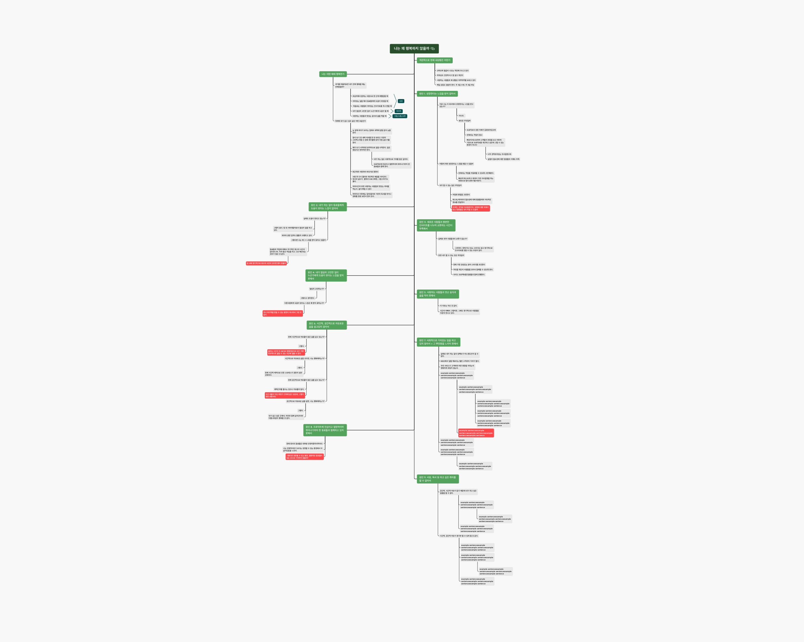

# <마인드트리> 개발자가 말하는 감정에도 분석이 필요한 이유

저는 3년차 소프트웨어 개발자입니다. 개발자에게는 코딩실력, 커뮤니케이션 능력, 문제해결능력, 빠른 학습속도 등 다양한 능력들이 요구되곤 하는데요. 제가 생각하기에 그 모든 능력을 키우는데 가장 근본이 되는 것은 바로 **현상을 분석하는 능력**인 것 같습니다.

**분석은 “얽혀 있거나 복잡한 것을 풀어서 개별적인 요소나 성질로 나누는 행위” 라는 뜻을 가지고 있는데요.** 소프트웨어 개발의 거의 모든 과정은 이러한 분석의 행위가 필요합니다. 기획서를 보며 필요한 API 들을 목록화할 때나 동료 개발자가 적어둔 코드를 파악할 때도, 심지어는 심각한 장애 상황에서 그 원인을 찾아 해결하는 과정에도 꼼꼼한 분석이 반드시 필요하죠.

비록 소프트웨어 개발 과정에서 분석의 중요성을 말씀드렸지만, 사실 분석능력은 이 세상 모든 곳에서 아주 유용한 도구가 되고, 세상의 모든 것은 분석의 대상이 될 수 있습니다. 사람들을 감동시키는 시나 마음을 움직이는 노래도, 좋아하는 사람이나 어제 밤 꾼 꿈까지도 모두 분석의 대상이 될 수 있죠. 심지어는 **인간이 느끼는 감정**까지도요!

### 난생 처음 ‘진짜’ 나의 감정과 마주했을 때

감정을 ‘분석’한다니, 어색하게 들리실지도 모르겠습니다. 일반적으로 감정은 ‘느끼는’ 것이니까요. 하루에도 우리는 수십가지의 감정을 ‘느낍니다’. 눈을 뜨자마자 늦잠잤다는 사실에 당황스러움을 느끼고, 출근길 지하철에서 짜증을 느끼고, 회사에서 성과를 입증했을 때 뿌듯함을 느끼며, 퇴근길 맥주 한 캔에 행복감을 느낍니다. **하지만 하루종일 내가 느끼는 이 감정, 정말 이대로 느끼고 흘러보내기만 해도 괜찮은 걸까요?**

제가 처음 감정을 분석했던 것은 정말 평범한 어느 날이었어요. 남들이 보기에는 분명 문제없이 잘 살아가고 있는데 이상하게 아무 이유없이 우울하거나 가슴이 답답하고 행복하지 않게 하루하루를 버텨낸다는 느낌이 들더라고요. 마음의 무게로 인해 눈이 일찍 떠진 어느 새벽, 저는 조용히 스탠드 조명 하나만 켜놓고 조용한 방안에서 오롯히 혼자가 되어 제가 느끼는 감정들을 써내려가기 시작했습니다. 방법은 다음과 같았어요.

1. 빈 마인드맵의 중심에 “왜 나는 지금 행복하지 않을까”라고 문제상황을 적는다.
2. 행복하지 않다고 느끼는 이유를 생각하며 가지를 뻗는다.
3. 그 이유의 원인에 대해서 또 하나의 가지를 뻗는다.
4. 마지막 진짜 원인을 찾을 때까지 3번의 과정을 반복한다.
5. 진짜 원인에 대한 해결방법을 찾는다.

\
_예시그림_

위와 같은 방법으로 찬찬히 제가 느꼈던 감정을 분석해보니까 정말 신기하게도 처음에 막연하게 생각했던 원인과 전혀 다른 결과가 마지막에 나오더라고요.

처음에는 스스로가 어떤 때에 행복한지 잘 모르기 때문에 우울하다고 느끼는 줄 알았어요. 뭘 할 때 행복한지 나 조차도 모르니까, 어떻게 하면 행복하게 사는지 모른다고 생각했던 것이죠.

그런데 감정을 좀 더 깊이 분석하면서 문제의 원인을 타고타고 내려가니, 저는 행복의 조건을 몰랐던 것이 아니었어요. 오히려 제가 생각하는 행복의 조건들은 여러 가지가 있었는데, 그것들이 서로 상충하는 면이 있으니 그 사이에서 방황을 하는 것이더라고요. 시간과 공간의 제약을 받지 않고 자유롭게 일하는 삶을 살고 싶은데, 동시에 사람들과 공동의 목표를 가지고 밤을 새서 열심히 뭔가를 만들어 내는 것을 재미있어하니 두 가지 행복의 조건 중에서 우선순위를 정해야 하는 것이었죠. 지금 나에게 더 필요한 것, 지금 내가 가장 행복해질 수 있는 것은 두 가지 가치 중에서 어떤 것인지요.

원인 불명의 우울증에 슬럼프인줄 알았던 저는 알고보니 스스로가 생각하는 행복의 조건에 우선순위를 고민하고 있었던 것이었어요. 그냥 우울한 감정을 우울한 것인줄 알고 흘러보냈다면, 절대로 내가 느꼈던 진짜 감정을 눈치채지 못하고 지나가버렸을 거에요. 그랬다면, 아마 같은 문제를 반복하며 계속 우울한 감정에 시달리지 않았을까요.

내가 느끼는 감정과 그 내면의 원인을 찾아서 분석해 해결을 하는 경험을 한번 하고 나니, 그 뒤로 저는 감정의 소용돌이에 휘말리는 경우가 훨씬 적어졌어요. **저는 이 과정을 <마인드트리>라고 이름 붙이고 마음이 지칠때마다 실천하고 있어요.**

갑자기 화가나고 우울하고 무기력한 기분이 들 때면, 저는 그냥 평소보다 조금 일찍 일어나 마인드맵과 나만 존재하는 그 공간에서 제가 느끼는 감정을 가만히 분석합니다. “나는 왜 00에게 화나는 감정을 느낄까”, “혹시 그 사람의 행동과 관련 없이 내가 가지고 있는 편견은 아닐까”, “이 감정이 혹시 질투는 아닐까” **끊임없이 물으며 내 감정의 바닥까지 파고들어요. 그러면 정말 거짓말처럼 진짜 감정, 진짜 나 자신과 마주할 수 있더라고요.**

### 타인의 도움 없이 혼자서 감정을 분석하는 것이 중요한 3가지 이유

현대사회를 살아가는 개인은 언제라도 마음이 지치고 힘든 상황을 마주할 수 있습니다. 그런 경우 많은 사람들은 주변 가족이나 지인에게 상담을 하거나 전문적인 상담가나 의사를 찾아가는 방식으로 그 상황을 해결하려고 합니다. 물론 다른 사람들과 함께 고민과 아픔을 나누며 해결하는 것이 얼마나 좋은 위로가 되는지 잘 알고 있습니다. 저도 종종 그렇게 하곤 하니까요.

**하지만 다른 사람의 도움 없이 혼자서 스스로의 감정을 들여다보고 분석하는 것은 그 어떤 외부의 도움보다 강력한 힘을 가질 수 있습니다.** 셀프 감정분석은 왜 중요하고 우리는 이 과정을 통해서 무엇을 얻을 수 있을까요? 그리고 이것은 명상이나 상담과는 어떤 차이점이 있을까요?

#### 1. 자기 객관화

사람들은 살면서 자신을 객관적으로 볼 수 있는 기회가 별로 없습니다. 감정의 경우는 더욱 그러하죠. 기쁘고 슬프고 화나고 외로울 때 그 감정을 찬찬히 살펴보며 뜯어본 경험이 있으신가요? 아마 많은 분들이 그렇지 않을 겁니다. 내가 어떤 때에 기쁜지, 지금 화가 나는데 그 원인이 타인 때문인지, 아니면 나의 내면에 숨겨두었던 상처 때문인지 우리는 깊이 고민하고 분석하지 않습니다. 그냥 그런 감정을 느끼고 어서 지나가기를 바랄 뿐이죠.

당장 화가나고 우울할 때, 내가 느끼는 그 감정을 외부에서 바라본다고 생각해보세요. 그 감정을 중심에 두고 분석해보세요. 나의 감정을 객관적으로 바라볼 수 있는 좋은 기회가 될 것입니다. 자신과 그 감정을 분리해서 객관적으로 바라볼 때,우리는 보다 정확하게 그 감정을 이해하고, 더 나아가 자신까지도 이해할 수 있게 될거에요.

#### 2. 스스로 문제를 해결하는 힘

우울하고 화나는 감정을 주체할 수 없을 때, 다른 사람들과 이야기를 하는 것은 정말 큰 위로가 됩니다. 그런데 **만약 그 사람들과 당장 이야기할 수 없을 때에는 어떻게 할까요? 상담예약이 가능한 날짜까지 기다리거나, 가족/친구가 시간이 날 때까지 기다리시나요?** 타인과 이야기하기 전까지 괴로운 감정을 마음 속에 품고 있어야 한다면, 너무 오랜 시간 괴로울 것 같아요.

자신의 감정을 분석하는 연습은 문제를 스스로 해결하는 힘을 길러줍니다. 당장 괴롭고 힘든 그 순간에 누군가를 기다릴 필요 없이 나의 문제를 직접 마주하고 분석합니다. 그렇게 한 번, 두 번 자신의 감정과 고민을 마주하고 스스로의 힘으로 문제를 해결하다보면, 자신감이 생깁니다. 마음이 괴로울 때, 언제라도 혼자서 해결할 수 있다는 자신감이요. 스스로 고민을 해결해냈다는 성공경험이요. 이런 작은 성공들이 누적되면, 그 이후에는 어떤 문제라도 두렵지 않게 됩니다. 스스로 분석하고 고민하여 문제를 해결해내면 되니까요.

#### 3. 성공 경험 아카이빙

명상을 하거나 상담을 받은 것은 개인이 겪는 정신적, 감정적 문제를 해결하는데 아주 큰 도움이 됩니다. 하지만 한 번 문제를 해결했던 그 경험이 눈에 보이는 무엇인가로 남지는 않죠. 다시 같은 문제를 겪거나 감정을 느꼈을 때, 그때 겪었던 고통스러운 해결의 과정을 다시 반복하기 쉬운 것 같아요.

나의 감정이나 고민, 생각을 직접 손으로 쓰고, 타이핑을 하며 분석을 하는 것은 문제 해결의 과정을 눈으로 확인할 수 있게 해줍니다. 내가 괴로웠던 그 때에 어떤 감정을 느꼈고, 그런 감정의 원인은 무엇이었는지, 그것을 어떻게 해결하기로 했는지 그 과정을 자세히 따라갈 수 있어요. 마침내 하나의 마인드트리를 만들어내 겪고 있던 마음의 문제나 고민을 해결하게 되면, 그것은 나에게 하나의 성공 경험이 됩니다. 스스로 마음의 문제를 타인의 도움없이 직접 해결해 낸 소중한 성공경험이죠. 이러한 경험은 아카이빙되어 나중에 비슷한 문제가 생겼을 때, 다시 꺼내볼 수 있습니다. 그렇다면 같은 문제를 다시 겪게 되었을 때, 이전보다는 훨씬 쉽게 문제를 해결할 수 있을 거에요.

### 함께하기

혹시 위 글을 읽고 <마인드트리> 감정 분석에 관심이 생기셨나요? 한번 해보고는 싶은데, 혼자서 어떻게 해야할 지 모르겠다면, 당신의 첫번째 마인드트리를 저와 함께 만들어봐요😊 일단 한 번 해보고 나면, 그 다음은 혼자서도 잘 하실 수 있을거에요💪

#### 👉 [클릭하여 카카오 오픈챗으로 함께하기](https://bit.ly/3oyGeNF)
